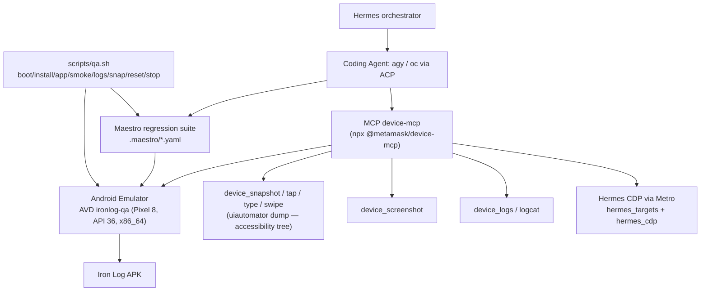

# QA Android Agent-Native — Iron Log

Infraestrutura para agentes (Hermes, agy, oc) implementarem uma issue, subirem o app num emulador
Android, interagirem autonomamente, fazerem QA exploratório, coletarem evidências, corrigirem bugs e
repetirem o ciclo até a feature estar validada.

> **Fato ≠ inferência ≠ opinião.** Onde este doc diz "validado", houve execução real nesta máquina.
> Premissas e expectativas estão marcadas como tal.

## Arquitetura



## Ferramentas escolhidas (e por quê)

| Camada | Ferramenta | Papel |
|---|---|---|
| QA agentic | **@metamask/device-mcp** 0.4.0 | snapshot de accessibility tree, tap/type/swipe semânticos, screenshots, logcat, app state, **Hermes CDP via Metro** |
| Regressão determinística | **Maestro** 2.10.0 | flows YAML em `.maestro/`, executam em minutos e viram gate de PR |
| Emulador | **AVD `ironlog-qa`** (Pixel 8, API 36, Google APIs, x86_64) | headless, porta fixa `emulator-5554`, sem snapshot (boot limpo) |
| Orquestração | Hermes + `scripts/qa.sh` | interface única pra humanos e agentes |

**Descartados:**

- **Google ARTEMIS** — agente LLM autônomo completo (precisa de API keys próprias, venv Python
  pesado). Redundante aqui: nossos agentes (Hermes/agy/oc) já pilotam o device via device-mcp.
  *Opinião:* vale revisitar só se quisermos soak/monkey testing de 10h não-supervisionado.
- **mobile-mcp** — alternativa sólida, mas device-mcp cobre um superconjunto prático pra RN (app
  state, alertas de permissão, Hermes CDP). Mantido como plano B se device-mcp quebrar.
- **Appium** — setup pesado, sem necessidade com Maestro + MCP.

**Fator decisivo do device-mcp:** `hermes_cdp`/`hermes_targets` falam CDP real com o runtime Hermes
via proxy do Metro (WebSocket). Isso permite correlacionar ação na UI + estado JS + logcat — o nível
de observabilidade que o item 5 pedia. Requer **build debug + Metro rodando** (release não expõe
inspector).

## Setup da máquina (feito uma vez)

1. **SDK** em `~/android-sdk` (writable; o `/opt/android-sdk` root-owned continua sendo fallback do
   sistema — `local.properties` e `android-qa.env` apontam pro home).
2. **KVM (obrigatório)**: habilite **SVM/AMD-V na BIOS** e o `kvm_amd` auto-carrega
   (`/dev/kvm` aparece). Sem isso o emulador **não sobe** (ver Limitações).
3. **Java**: builds Android usam `org.gradle.java.home=/usr/lib/jvm/java-17-openjdk` (já no
   `android/gradle.properties`); o Java 26 do sistema é ignorado no build.
4. **Pacotes SDK**: emulator, platform-tools, `system-images;android-36;google_apis;x86_64`.
5. **AVD**: `avdmanager create avd -n ironlog-qa -k "system-images;android-36;google_apis;x86_64" -d pixel_8`
   com GPU `swiftshader_indirect` (render estável em Wayland/NVIDIA sem depender de host GPU),
   animações zeradas no boot (`qa.sh boot` faz isso sozinho).
6. **Maestro**: `~/.maestro/bin` (installer oficial).
7. **MCPs configurados**: Hermes (`~/.hermes/config.yaml` → `mcp_servers.device-mcp`), opencode
   (`~/.config/opencode/opencode.json` → `mcp.device`), agy (`~/.gemini/settings.json` →
   `mcpServers.device`). Todos com `DEVICE_PLATFORM=android` e outputs confinados a
   `.qa-artifacts/`.

## Uso diário

```bash
scripts/qa.sh status   # emulador online? bootado? app instalado/rodando?
scripts/qa.sh boot     # sobe headless e espera sys.boot_completed (sem sleep fixo)
scripts/qa.sh install  # builda assembleDebug se necessário e instala
scripts/qa.sh app      # lança o app
scripts/qa.sh smoke    # roda os flows Maestro
scripts/qa.sh logs     # logcat filtrado (RN + crashes)
scripts/qa.sh snap     # screenshot em .qa-artifacts/
scripts/qa.sh reset    # pm clear (estado limpo)
scripts/qa.sh stop     # desliga o emulador
```

Sobrescrevas úteis: `BOOT_TIMEOUT=300` (máquinas mais lentas), `EMU_PORT=5556` (conflito de porta
raro), `DEVICE_SERIAL=<serial-usb>` (QA em device físico).

## Rotina do coding agent (template de brief)

```text
Implemente a issue X.

Gates (nesta ordem, todos verdes antes de considerar pronto):
1. npm run typecheck && npm run lint && npm test
2. scripts/qa.sh boot && scripts/qa.sh install && scripts/qa.sh app
3. QA funcional da feature via device-mcp:
   - device_snapshot antes de interagir; prefira tap por label/texto a coordenadas
   - happy path + pelo menos 2 edge cases relevantes (input vazio, back mid-flow, rotate não se aplica)
4. QA exploratório: tente quebrar a feature (navegação fora de ordem, dados extremos, undo/back)
5. Qualquer anomalia: scripts/qa.sh snap + scripts/qa.sh logs; se crash, logcat -b crash
6. Corrigiu? rebuild + re-teste do passo 3
7. scripts/qa.sh smoke — 100% verde
8. Cenário novo e valioso? adicione flow .maestro/ (não afrouxe assertion existente sem
   justificativa explícita no diff)
9. Deixe tudo UNCOMMITTED; quem integra revisa e committa.
```

### Correlação de logs (React Native / Hermes)

Com **build debug + Metro** (`npx expo start --dev-client` ou `--port 8081`):

- `hermes_targets` lista os targets debugáveis expostos pelo Metro (`http://localhost:8081/json`).
- `hermes_cdp` avalia JS no runtime do app (ex.: inspecionar store/estado) via CDP real.
- `qa.sh logs` cruza `ReactNativeJS` (console do app) com `AndroidRuntime:E` (crash nativo).

Build de **release/preview** não expõe inspector Hermes — QA por UI/logcat funciona igual.

### Evidências (evidence-driven QA)

Ao encontrar problema, registre em `docs/qa/<data>-<tema>.md`:

- cenário / passos / expected / actual
- screenshot (`.qa-artifacts/screenshot-*.png`)
- trecho de logcat relevante (não o dump inteiro)
- stack trace se houver; device/API (`emulator-5554, API 36`)
- versão do APK (sha do commit usado no build)

### Self-healing com limites

- Agente PODE se recuperar de mudanças óbvias de UI (label mudou → atualizar locator).
- NÃO PODE afrouxar assertion pra teste passar; mudança de comportamento esperado exige
  justificativa explícita no diff/PR (regra registrada no AGENTS.md).

## Paralelismo (agy/oc)

- Divisão natural: **lane A** = implementação/scrips Android (repo), **lane B** = flows Maestro /
  tooling MCP. Não dividir arquivos que ambas editam.
- Worktrees separados por lane + contratos congelados (ver skill `iron-log-sprint-ops`).
- Gates são sempre executados pelo orquestrador (Hermes), nunca confiados ao self-report da lane.

## Limitações conhecidas

### Mapa: o que automatiza vs. o que continua humano (validado empiricamente 2026-09-14)

**Automatizado (agent executa sozinho, já provado):**

| Capacidade | Como |
|---|---|
| Boot/lifecycle do AVD, install, launch, reset | `scripts/qa.sh` (condições reais via ADB, sem sleep) |
| Observar UI estruturada (labels/texto/frames) | `device_snapshot` (a11y tree) |
| Interação semântica (tap/type/swipe/long-press/back/home) | `device_tap_element`, `device_type`, `device_swipe` etc. |
| Screenshot / gravação de vídeo como evidência | `device_screenshot`, `device_screen_recording` |
| Estado/lifecycle do app, permissões (detectar diálogo) | `device_app_state`, `device_get_alert_text`, `device_dismiss_alert` |
| Logcat, crashes, correlação JS | `device_logs`, `qa.sh logs` |
| **Inspeção do runtime JS (Hermes CDP)** | `hermes_targets` + `hermes_cdp` (Runtime.evaluate/Debugger.* — provado com app vivo) |
| Regressão determinística de smoke | Maestro `.maestro/*.yaml` |
| Detecção de bug funcional, screenshot+log+stack, ciclo fix→rebuild→retest | protocolo AGENTS.md |

**Precisa de julgamento (agente executa, humano avalia):**

| Capacidade | Por quê |
|---|---|
| "Está bonito/legível?" — layout, contraste, hierarquia visual | screenshot o agente tira; *julgamento estético* é seu |
| Aceitação de produto ("esse fluxo faz sentido pra usar na academia?") | critério é seu, não do agente |
| Ferida de UX subjetiva (haptics, timing, animação "cansa") | só sentindo no device físico |

**Humano no device físico (irredutível, hoje):**

| Capacidade | Por quê |
|---|---|
| Sensores reais: GPS, barômetro, acelerômetro em movimento | emulador simula, não reproduz |
| Notificações/push em condições reais (Doze, battery killer do fabricante) | comportamento OEM não existe no AOSP emulator |
| Desempenho percebido (jank, térmica, bateria) | swiftshader ≠ GPU real |
| Integrações com contas/contatos/sistema (share targets, Drive OAuth) | ambiente de conta real |

**Regra de bolso:** ~85-90% do ciclo issue→PR roda sem você. O humano entra em 3 pontos:
(1) definir *o que* é aceitável (critério), (2) validar *como parece* (estética/UX), (3) o que só
existe fora do emulador (sensores/OEM/desempenho).

### Limitações técnicas

- **KVM é hard requirement.** Emulador x86_64 (r37+) aborta sem `/dev/kvm` —
  "x86_64 emulation currently requires hardware acceleration". `SVM` precisa estar **habilitado na
  BIOS** (AMD); `kvm_amd` então auto-carrega. Sem isso `qa.sh boot` falha com
  "emulator died during boot" (correto — os scripts não esperam pra sempre).
- `qa.sh install` usa APK debug existente ou builda do zero (primeira vez: vários minutos).
- Flows `smoke-create-workout.yaml` usam `optional:` nos passos pós-CTA — são smoke de navegação,
  não assertion forte de criação de treino; endurecer após primeiro QA exploratório real.
- device-mcp em Android usa `uiautomator dump`: componentes RN sem `accessibilityLabel`/`text`
  aparecem genéricos no snapshot. Adicionar `accessibilityLabel` nos componentes-chave é
  contribuição de baixo custo e alto retorno pra QA agentic.
- Metro + Hermes CDP exigem build debug; QA de build release fica restrito a UI + logcat.
- GPU é `swiftshader_indirect` (software): suficiente pra QA; performance de animações no emulador
  não representa device físico.
- **`device_type` no backend Android NÃO limpa o campo** (descreve que limpa; 0.4.0 não faz) —
  vira concatenação. Limpar antes via foco+deletes ou usar ADB `input text`. Issue upstream.
- **Snackbar dev "Open debugger to view warnings" cobre a barra de ação** e engole taps nos CTAs
  (visto 2×). Fechar pelo X antes de interagir com a parte de baixo da tela; só existe em debug.
- Multi-página Hermes: app com state restoration expõe 2 targets; `hermes_cdp` escolhe o `-1`
  (primeiro). Se um dia avaliar runtime errado, conferir `hermes_targets` antes.

## Troubleshooting

| Sintoma | Causa provável | Ação |
|---|---|---|
| `emulator: OFFLINE` eterno | KVM ausente ou AVD corrompido | `tail .qa-artifacts/emulator.log`; confira `/dev/kvm` |
| `emulator died during boot` | KVM ausente (SVM off) ou GPU | habilite SVM; log em `.qa-artifacts/emulator.log` |
| `adb devices` vazio com qemu vivo | adb server stale | `adb kill-server && adb start-server` |
| Maestro falha no launch | app não instalado | `qa.sh install` antes |
| `device_snapshot`/tools com helper: "unexpected certificate" de forma intermitente | device-mcp fixa o pin do cert do helper **por processo de server** (TOFU); reinstalar o helper sob servers vivos deixa pins antigos inválidos → aceita/rejeita alternando entre processos | **não reinstale o helper com a sessão viva**; se precisar: reinstall com `adb install --no-incremental -t -r` (o modo incremental corrompe a verificação) e reinicie a sessão MCP (restart do desktop app) — server fresco fixa pin novo e volta a funcionar |
| Instalação manual do helper falha: `INSTALL_FAILED_TEST_ONLY` | APK do helper é test-only | `adb install --no-incremental -t -r <apk>` (APK em `dist/android/` do pacote npm); **`--no-incremental` é obrigatório** |
| MCP device-mcp "awaiting selection" | >1 device conectado | `device_select_device` com `emulator-5554` |
| Emulator não abre janela no uso manual | scripts sobem `-no-window` | para sessão interativa: `emulator -avd ironlog-qa` direto |
