# Iron Log — Sprint Trust Closure: playbook AGY / OC

**Status: proposta de planejamento, NÃO autorização de implementação.**
**Base única:** `supersprint/s12-trust-before-breadth` @ `2ddf41328eef0c7a963d14f48e99234f80c71507`.
**Snapshot:** 2026-09-12; 68 issues abertas e 17 comentários, com paginação/conferência de contagem. Executor futuro: coordenador GLM 5.3 Flash; implementadores AGY/OC.

> Este documento prevalece como retrato desta análise, não revoga decisões do Lucca nem transforma planos antigos em autorização. O pacote `tasks.json` é a especificação operacional; `backlog.json`, `schedule.json` e `validation.json` permitem conferir o handoff mecanicamente. Caminhos marcados **NOVO PROPOSTO** não existiam na auditoria e são entregáveis planejados, não evidência de implementação.

## 1. Executive Summary

**Recomendação:** sprint de encerramento de lacunas de confiança, seguida de expansão explicitamente aprovada. Não perseguir “zero issues” mediante fechamento de slices incompletos.

- **FATO:** backup/restore #102 continua P0; o digest anterior diz resolvido, mas checkpoint/snapshot engolem erro, o live DB é apagado antes de cópia segura e o cleanup pode excluir sessões legítimas sem sets.
- **FATO:** #140/#141, #115/#116/#104, #117/#118/#125 e inputs decimais ainda têm lacunas no caminho real de uso.
- **FATO:** #85 tem argumentos invertidos; Strong aceita libras sem converter; archiveProgram ignora o ID. Testes verdes não detectaram esses gaps.
- **FATO:** a base tem código útil de occurrence identity, e1RM/provenance, heatmap, imports, share, manifest, variance e reminders. Boa parte é parcial, não ausente nem concluída.
- **OPINIÃO/recomendação:** executar **36 tasks core**, com até **3 writers simultâneos**, e manter **4 pacotes de investigação de expansão** fora da alocação core. Correção e teste do mesmo comportamento pertencem à mesma task; separar ambos só criaria retrabalho.
- **Estimativa, não benchmark de agente:** esforço total core de **132 horas-equivalentes**; caminho crítico lógico **43h**; simulação de três slots na seção 10. Estimativas incluem implementação+teste focal+review/integração local da lane; esperas de usuário/credenciais/build remoto não estão incluídas.
- **Decisões necessárias:** escopo core; dev build SDK54 vs upgrade; semânticas de PR/legado explicitadas abaixo. Não pressupor SDK57 disponível/suportado só porque aparece no título #112.

**Thesis:** paralelizar domínios independentes reduz tempo total.
**Counter-thesis:** sessão, History, AnalyticsService, schema e translations são hotspots; 10 agentes mexendo neles não produzem 10x throughput.
**Truth proposta:** três writers, DAG de contratos, fila por arquivo e integração contínua. Não criar framework de cache, nova engine de sessão ou mega-migration para fechar bugs localizados.

### Decisão de corte de escopo

O core inclui integridade, gaps de wiring, queries/UX locais testáveis e QA. **Não inclui** implementar #79–#84, #64/#66, agenda/reschedule completa, unidades imperiais, catálogo externo, health/nutrition/readiness/risco de lesão, PDF ou write-back Hermes/Obsidian. Elas continuam na matriz, priorizadas e com discovery brief; implementar alternativas não decididas seria inventar especificação.

Se 132h-equivalentes não couberem na capacidade aprovada, o coordenador deve apresentar corte explícito antes de dispatch — candidato: retirar T22/T23/T24/T25 e a expansão de busca de T21, preservando correção de histórico/#90. **Não aplicar o corte automaticamente:** remover tasks exige regenerar DAG/aceites/estados e recalcular caminho crítico. Não chamar pacote reduzido de sprint completa.

## 2. Estado atual do projeto

### Git e limpeza já executada

- Worktree preservada: `/home/lucca/Projects/iron-log`.
- Removida worktree local `/home/lucca/Projects/iron-log-wt/lean-performance-workflow`.
- Removidas branches **locais** `audit/lean-performance-workflow` e `master`, com autorização solicitada pelo terminal e concedida.
- Readback confirmou **uma worktree e uma branch local**, a linha indicada acima. Nenhum commit, merge, push ou PR foi feito. Nenhum código do app foi alterado.
- **Remotas não foram apagadas:** `origin/master` e `origin/audit/lean-performance-workflow` permanecem no servidor. Não entram no planejamento. Limpeza remota/default branch é operação externa separada; não foi inferida deste pedido de limpeza local.
- Preservados os quatro itens locais preexistentes: `.omh/`, `docs/plans/2026-08-27-open-issues-sprint-12.md`, `docs/plans/2026-08-27-zero-backlog-supersprint.md`, `docs/qa/2026-08-27-sprint-12-runbook.md`.
- Worktrees novas na execução futura serão apenas isolamento efêmero de lanes derivadas desta base/tip. Não são retomada das linhas descartadas. Se Lucca proibir também worktrees futuras, parar e repropor isolamento; não usar vários writers no mesmo checkout.

### Arquitetura e boundaries verificados

React Native/Expo SDK54, React19.1/RN0.81.5, Expo Router, Drizzle+SQLite WAL local, i18n pt/en/es/zh. Schema em `src/db/schema.ts`; client singleton em `src/db/client.ts`; fixture DDL manual em `__tests__/fixtures/database.ts`. Migrations em `drizzle/`; occurrence identity já existe desde 0021; muscle group/equipment em 0022/0023.

Hotspots:
- Sessão: `app/session/*`, `hooks/use-exercise-sets.ts`, `hooks/use-session-persistence.ts`, `hooks/use-session-undo.ts`.
- Derivados: `hooks/use-personal-records.ts`, `services/AnalyticsService.ts`, `services/program/*`.
- Telas pesadas: History, Analytics e Bio/evolution.
- Integrações: DatabaseBackupService, exporters, importers, NotificationService. Export Alexandria não é cliente inbound de health.

### Baseline executado nesta análise

| Gate | Resultado real |
|---|---|
| Node | v22.23.2, dentro do engine declarado |
| npm global | 12.0.2, fora do engine; gates executados com `npx --yes npm@10.9.7` |
| Typecheck | PASS |
| Lint `--max-warnings=0` | **FAIL: 22 warnings**, imports de `app/_layout.tsx` |
| Jest coverage | **141 suites PASS; 1083 testes PASS, 1 skipped, 1084 total** |
| Cobertura configurada | Apenas `src/utils/**/*`; 89.91% statements, 82.68% branches, 95.48% functions, 92.93% lines |
| Skip | Benchmark opt-in em `__tests__/services/analytics-database.test.ts:106`, depois executado separadamente |
| Export Android | PASS: bundle Hermes `.hbc` gerado e verificado |
| Audit high | **FAIL: 10 high, 28 moderate, 2 low, 0 critical**; blockers `@xmldom/xmldom`, `js-yaml` |
| Audit omit dev | Também 10 high; **isso não prova reachability no bundle** nem permite alegar que tudo é dev-only |
| `git diff --check` | PASS |
| Android launcher dry-run | SDK `/opt/android-sdk` / adb localizado |
| APK / Android físico / cloud E2E | **NÃO EXECUTADOS nesta análise** |

`.github/workflows/quality.yml:43-53` já usa lint estrito, coverage serial e export Android; não planejar adicionar gate que já existe. O `npm run verify` local/documentação divergem nas flags: T01 alinha isso sem afrouxar CI.

### Benchmark de volume realmente executado

Três trials, 25 samples por dataset/trial, três warmups; helper/serviço real e SQLite host. **Não é benchmark de UI/device nem prova de #132/#130.**

| Trial | 50 sessões × 20 sets: median / p95 ms | 500 × 20: median / p95 ms |
|---|---|---|
| 1 | 6.147 / 8.334 | 54.921 / 68.969 |
| 2 | 6.331 / 7.655 | 58.372 / 81.641 |
| 3 | 5.644 / 12.006 | 60.025 / 72.277 |

Hash estável entre trials por dataset; valores completos nos logs. **Refazer baseline após correções de semântica T09 antes de otimizar T22**: comparar com saída antiga incorreta conservaria bugs.

## 3. Backlog analisado

Leitura integral de **todas as issues abertas e todos os comentários**, dividida entre quatro auditorias read-only e consolidada pelo coordenador. Snapshot JSON e texto integral das 68 issues acompanham o pacote. Issues foram conferidas por listagem e API paginada, não por primeiro resultado parcial.

**Estados usados:** ausente; parcial; implementada com validação pendente; resolvida no escopo original. “Parcial” nunca equivale a pronta para fechar. A tabela abaixo cobre cada issue uma única vez; os links remetem ao GitHub, que não foi alterado.

| Issue | Estado real | Task(s) | Motivo/evidência |
|---|---|---|---|
| [#141](https://github.com/BenedettiLucca/iron-log/issues/141) | Parcial; dirty não reconciliado com commit | T05,T06,T27 | Série fantasma contamina histórico/PR; alto risco — `app/session/exercise.tsx:280-351; src/utils/session-trust.ts:8-13` |
| [#140](https://github.com/BenedettiLucca/iron-log/issues/140) | Ausente; resume abre exercício sem parent | T04,T27 | Bloqueia navegação recuperada; não duplicar sessão — `app/_layout.tsx:245-263; app/(tabs)/index.tsx:165-180` |
| [#139](https://github.com/BenedettiLucca/iron-log/issues/139) | Ausente; só soft-delete | T08,T27 | UX alto ganho; não trivial antes de PR consistente — `app/(tabs)/history.tsx:120-133` |
| [#138](https://github.com/BenedettiLucca/iron-log/issues/138) | Ausente | T21,T27 | Não depende de agenda futura; esforço médio — `app/(tabs)/history.tsx:135-188` |
| [#137](https://github.com/BenedettiLucca/iron-log/issues/137) | Aberta; fetch total para preview10 | T19 | Performance linear; leitura limitada isolável — `hooks/use-body-metrics.ts:14-38; app/(tabs)/bio.tsx:371-374` |
| [#136](https://github.com/BenedettiLucca/iron-log/issues/136) | Ausente | D03 | Cross-cutting grande; storage kg/cm não pode mudar — `src/db/schema.ts:93-99; app/(tabs)/settings.tsx:449-522` |
| [#135](https://github.com/BenedettiLucca/iron-log/issues/135) | Aberta; ganho ainda não medido | T25 | Índice sem EXPLAIN não é melhoria demonstrada — `src/db/schema.ts:173-182` |
| [#134](https://github.com/BenedettiLucca/iron-log/issues/134) | Aberta; N+1 e writes não atômicos | T12 | Import pode persistir rotina parcial e mascarar erro — `app/(tabs)/routines.tsx:130-201` |
| [#133](https://github.com/BenedettiLucca/iron-log/issues/133) | Ausente; todas fotos montadas | T24,T27 | Performance cresce com acervo; não depende de imperial — `app/bio/evolution.tsx:345-423; components/CheckinGallery.tsx:12-46` |
| [#132](https://github.com/BenedettiLucca/iron-log/issues/132) | Aberta; scans repetidos | T09,T22 | Primeiro corrigir oracle; otimização depois — `services/AnalyticsService.ts:182-194; app/bio/analytics.tsx:98-173` |
| [#131](https://github.com/BenedettiLucca/iron-log/issues/131) | Aberta; calendário fetch total | T21 | Mesma screen de busca/Undo; ownership único — `app/(tabs)/history.tsx:86-101` |
| [#130](https://github.com/BenedettiLucca/iron-log/issues/130) | Aberta; loadData após mutação | T23 | Performance hot path; serial após mutação/PR — `hooks/use-exercise-sets.ts:124-203,302-313` |
| [#129](https://github.com/BenedettiLucca/iron-log/issues/129) | Aberta; rejeição/truncamento decimal | T02,T04,T05,T08,T19,T20,T28 | Alto impacto pt-BR; parser sozinho não basta — `src/validators/forms.ts:8-57; app/session/[routineId].tsx:197-206` |
| [#128](https://github.com/BenedettiLucca/iron-log/issues/128) | Aberta; longest=1 vazio | T09 | Quick Win simples junto analytics correctness — `services/AnalyticsService.ts:314-326` |
| [#127](https://github.com/BenedettiLucca/iron-log/issues/127) | Aberta em dashboard e Home | T10 | Quick Win; regra única antes do início — `services/program/dashboard.ts:15-20; services/TodayWorkoutService.ts:29-34` |
| [#126](https://github.com/BenedettiLucca/iron-log/issues/126) | Aberta; ID usado como epoch | T09 | Legado sumindo da janela; mesma causa em dois métodos — `services/AnalyticsService.ts:432-449,551-553` |
| [#125](https://github.com/BenedettiLucca/iron-log/issues/125) | Aberta; volume conta set morto | T10 | Quick Win de confiança alta — `services/program/dashboard.ts:45-94` |
| [#124](https://github.com/BenedettiLucca/iron-log/issues/124) | Aberta; clone fora de transação | T12 | Agrupar mesmo domínio de import atômico — `hooks/use-routines.ts:45-69` |
| [#123](https://github.com/BenedettiLucca/iron-log/issues/123) | Aberta; testes são cópias locais | T15,T16,T28 | False green demonstrado; três superfícies — `__tests__/services/alexandria-export.test.ts:1-18; __tests__/screens/routine-preview.test.ts:1-66` |
| [#122](https://github.com/BenedettiLucca/iron-log/issues/122) | Aberta; compartilha apenas sessionsPath | T15,T27 | Promessa de export-all incompleta — `services/CsvExportService.ts:151-183` |
| [#121](https://github.com/BenedettiLucca/iron-log/issues/121) | Aberta; teste protege UTC indevido | T15 | Quick Win isolado no pacote export — `src/utils/date-utils.ts:33-37; __tests__/utils/date-utils.test.ts:36-48` |
| [#120](https://github.com/BenedettiLucca/iron-log/issues/120) | Aberta; PR reps sem carga | T07 | Correção depende de semântica explícita, não coluna nova automática — `hooks/use-personal-records.ts:55-73,150-178` |
| [#119](https://github.com/BenedettiLucca/iron-log/issues/119) | Aberta; LIMIT antes da ordenação | T05 | Quick Win no mesmo hook da mutation — `hooks/use-exercise-sets.ts:205-225` |
| [#118](https://github.com/BenedettiLucca/iron-log/issues/118) | Aberta; sets sem filtro da sessão | T09 | Analytics falso após History delete — `services/AnalyticsService.ts:432-449,519-530` |
| [#117](https://github.com/BenedettiLucca/iron-log/issues/117) | Aberta; qualquer sessão conclui semana | T10 | Progresso falso; mesma population em todos helpers — `services/program/dashboard.ts:148-185` |
| [#116](https://github.com/BenedettiLucca/iron-log/issues/116) | Aberta; finish/discard writes independentes | T08 | Risco de persistência parcial — `app/session/finish.tsx:208-275` |
| [#115](https://github.com/BenedettiLucca/iron-log/issues/115) | Aberta; length+1 reaproveita número | T05 | Invariante de dados e output — `hooks/use-exercise-sets.ts:287-300` |
| [#114](https://github.com/BenedettiLucca/iron-log/issues/114) | QA app morto pendente | T17A,T17B,T17C,T18,T27 | Blocker de validação #89; não garantia impossível — `services/NotificationService.ts:440-479; docs/qa/2026-09-05-sprint-13-qa-findings.md:19-20` |
| [#113](https://github.com/BenedettiLucca/iron-log/issues/113) | Ausente no HEAD; comentário stale | T17A,T17B,T17C,T27 | Native agenda sem pedir permissão — `services/NotificationService.ts:63-96` |
| [#112](https://github.com/BenedettiLucca/iron-log/issues/112) | Decisão/canal nativo pendentes | T18,T27 | Dev build SDK54 recomendado; major upgrade separado — `package.json:33; eas.json:5-10` |
| [#109](https://github.com/BenedettiLucca/iron-log/issues/109) | Create corrigido; lifecycle/UI parcial | T11 | Archive ignora id; delete/weeks sem atomicidade — `services/program/crud.ts:69-85,110-143; services/program/weeks.ts:69-83` |
| [#107](https://github.com/BenedettiLucca/iron-log/issues/107) | Scheduling/i18n existem; edição não resync | T17A,T17B,T17C,T27 | Wiring faltante no app aberto — `hooks/use-supplements.ts:86-106; services/NotificationService.ts:259-365` |
| [#106](https://github.com/BenedettiLucca/iron-log/issues/106) | Bug de unidade do token corrigido | T03A,T03B,T27 | Não reimplementar helper; E2E ainda sem prova — `src/utils/google-token.ts:10-20; app/(tabs)/settings.tsx:148-155` |
| [#105](https://github.com/BenedettiLucca/iron-log/issues/105) | Escopo original resolvido | T09,T26,T29 | Scores filtram endTime; outras superfícies não — `services/AnalyticsService.ts:205-214,285-293` |
| [#104](https://github.com/BenedettiLucca/iron-log/issues/104) | Parcial em set mutation; falta sessão inteira | T07,T08 | Reconcile existe mas não garante todos caminhos — `hooks/use-personal-records.ts:82-183; app/session/finish.tsx:208-220` |
| [#103](https://github.com/BenedettiLucca/iron-log/issues/103) | Correção de ocorrência implementada; QA final pendente | T04,T26,T27 | P0 original corrigido; não refazer identidade — `hooks/use-session-persistence.ts:27-47; app/_layout.tsx:249-262` |
| [#102](https://github.com/BenedettiLucca/iron-log/issues/102) | Parcial insegura; risco de perda persiste | T03A,T03B,T27 | Bloqueador principal; digest anterior incorreto — `services/DatabaseBackupService.ts:16-24,165-221; src/db/client.ts:6-17` |
| [#100](https://github.com/BenedettiLucca/iron-log/issues/100) | Mecanismo existe; viewport sem prova | T20,T27 | Entrada de série potencialmente bloqueada; promovida acima cosmética — `app/session/exercise.tsx:447-470,549-553` |
| [#99](https://github.com/BenedettiLucca/iron-log/issues/99) | Parcial; painel segue denso | T20,T27 | Mesmo owner/tela de #100 — `components/SetCard.tsx:149-179; app/session/exercise.tsx:541-564` |
| [#98](https://github.com/BenedettiLucca/iron-log/issues/98) | Estrutura parcial; QA visual pendente | T20,T27 | Quick validation, evitar refactor especulativo — `components/session/ExerciseHeader.tsx:107-119` |
| [#97](https://github.com/BenedettiLucca/iron-log/issues/97) | Fix presente; retest pendente após FAIL antigo | T26,T27 | Bloqueio de formulário; não reimplementar sem repro — `components/FolderManagerModal.tsx:72-83,159-166,312-326` |
| [#95](https://github.com/BenedettiLucca/iron-log/issues/95) | Ausente | D01 | Não altera startTime para fingir dia planejado — `src/db/schema.ts:42-54; src/db/schema.ts:148-159` |
| [#93](https://github.com/BenedettiLucca/iron-log/issues/93) | CSV parcial com bug de unidade/UI | T14,T27,D04 | Strong lbs contamina kg; saúde é outro produto — `services/importers/StrongImporter.ts:54-55; services/importers/TrackerImportService.ts:21-29` |
| [#92](https://github.com/BenedettiLucca/iron-log/issues/92) | Serviço só de rotina; UI/semana ausentes | D01 | Manifest não substitui payload humano — `services/RoutineShareService.ts:7-24,79-125,144-291` |
| [#91](https://github.com/BenedettiLucca/iron-log/issues/91) | e1RM cap/provenance presente; calculadora ausente | T09,D03 | Não fechar por card e1RM existente — `services/AnalyticsService.ts:88-165; app/bio/analytics.tsx:714-738` |
| [#90](https://github.com/BenedettiLucca/iron-log/issues/90) | Heatmap presente; tap perde dia | T21,T27 | Wiring gap pequeno junto History — `components/ActivityHeatmap.tsx:82-91; services/ActivityHeatmapService.ts:50-227` |
| [#89](https://github.com/BenedettiLucca/iron-log/issues/89) | Background PASS; app morto não provado | T17A,T17B,T17C,T18,T27 | Não duplicar implementação schedule existente — `hooks/use-exercise-sets.ts:336-341; services/NotificationService.ts:440-479` |
| [#88](https://github.com/BenedettiLucca/iron-log/issues/88) | Implementada + QA anterior PASS | T26,T29 | Sem novo código necessário — `hooks/use-keep-awake-setting.ts:1-40; docs/qa/2026-09-05-sprint-13-qa-findings.md:12-13` |
| [#87](https://github.com/BenedettiLucca/iron-log/issues/87) | Home/peso presentes; diário e prefill incompletos | T04,T05,T10,D01 | Treino da semana não equivale a agenda diária — `services/TodayWorkoutService.ts:15-64; hooks/use-exercise-sets.ts:164-174` |
| [#86](https://github.com/BenedettiLucca/iron-log/issues/86) | Schema existe; consumers/custom incompletos | T09,T22,D03 | Coluna vence nome; NULL precisa outros — `src/db/schema.ts:21-24; app/bio/analytics.tsx:38-43,166-173` |
| [#85](https://github.com/BenedettiLucca/iron-log/issues/85) | Parcial; bug de argumentos confirmado | T13,D03 | Quick Win alto benefício; não confundir com feature inteira — `app/routines/editor.tsx:748-763; src/utils/exercise-filter.ts:75-89` |
| [#84](https://github.com/BenedettiLucca/iron-log/issues/84) | Ausente | D02 | Semântica de reps total deve ser decidida — `src/db/schema.ts:19-26,57-74` |
| [#83](https://github.com/BenedettiLucca/iron-log/issues/83) | Ausente no fluxo real | D02 | Validar bodyweight sem peso fictício e adição separada — `src/utils/session-contract.ts:77-93; src/db/schema.ts:56-70` |
| [#82](https://github.com/BenedettiLucca/iron-log/issues/82) | Ausente; duration não é cardio | D02 | Modelo novo com raio amplo; não blocker atual — `src/db/schema.ts:19-26; app/session/exercise.tsx:564-579` |
| [#81](https://github.com/BenedettiLucca/iron-log/issues/81) | Ausente | D02 | Fundação de freestyle; P0 feature original reclassificado — `app/session/[routineId].tsx:117-167; src/db/schema.ts:29-40` |
| [#80](https://github.com/BenedettiLucca/iron-log/issues/80) | Ausente; schema permite null mas UI não | D02 | Sem rotina não significa criar rotina fantasma — `app/(tabs)/routines.tsx:126-128; src/db/schema.ts:43-54` |
| [#79](https://github.com/BenedettiLucca/iron-log/issues/79) | Ausente | D02 | Alto conflito timer/editor/summary; não emergência P0 — `src/db/schema.ts:29-40; app/session/exercise.tsx:353-399` |
| [#76](https://github.com/BenedettiLucca/iron-log/issues/76) | Issue histórica stale; gate atual FAIL | T01,T18 | 10 high atuais; não 51; alcance a revalidar — `scripts/audit-high.js:96-113; evidence/baseline-audit.log` |
| [#75](https://github.com/BenedettiLucca/iron-log/issues/75) | Ausente; segurança/copy não definida | D04 | Não emitir diagnóstico nem promessa de risco clínico — `services/progression.ts:30-100; src/db/schema.ts:76-90` |
| [#74](https://github.com/BenedettiLucca/iron-log/issues/74) | Ausente; progression não é plateau | D04 | Local, não depende obrigatoriamente de nutrition — `services/progression.ts:11-106` |
| [#72](https://github.com/BenedettiLucca/iron-log/issues/72) | Ausente; health adapter inexistente | D04 | Sem freshness/endpoint não há score confiável — `services/AlexandriaExportService.ts:391-412` |
| [#71](https://github.com/BenedettiLucca/iron-log/issues/71) | Backend variance local parcial; UI/sono ausentes | D04,D01 | Relatório atual não usa serviço existente — `services/TrainingVarianceService.ts:221-285; app/reports/weekly.tsx:31-46` |
| [#70](https://github.com/BenedettiLucca/iron-log/issues/70) | Ausente; só export Alexandria | D04 | Não confundir export local com ingestão real — `app/(tabs)/settings.tsx:449-468; services/AlexandriaExportService.ts:391-412` |
| [#67](https://github.com/BenedettiLucca/iron-log/issues/67) | Ausente; lanes/due/re-entry sem modelo | D01 | Streak não substitui drift; micro não é dependência rígida — `src/db/schema.ts:134-159; services/program/dashboard.ts:169-271` |
| [#66](https://github.com/BenedettiLucca/iron-log/issues/66) | Ausente | D02 | Feature larga em fluxo crítico; sem necessidade urgente comprovada — `src/db/schema.ts:3-10,56-74; app/session/[routineId].tsx:140-626` |
| [#65](https://github.com/BenedettiLucca/iron-log/issues/65) | Manifest programa presente; daily truth ausente | D01 | Automação não pode usar due-state inventado — `services/ScheduleManifestService.ts:101-114,238-398` |
| [#64](https://github.com/BenedettiLucca/iron-log/issues/64) | Ausente; delete físico existente | D03 | Não confundir routine archive com program isActive — `hooks/use-routines.ts:29-43; src/db/schema.ts:3-10` |
| [#20](https://github.com/BenedettiLucca/iron-log/issues/20) | Comparação/overlay/tap parcialmente mortos | T17A,T17B,T17C,T24,T27 | Mídia e notificação são owners diferentes; gate conjunto — `components/MonthlyCheckinComparison.tsx:12-104; app/bio/evolution.tsx:535-542` |

### Obsolescência, duplicação e decomposição

- #102, #104, #109 e #113: descrições/comentários/digests contêm claims que já mudaram ou são contraditos pelo HEAD; manter problema residual explícito, não repetir fix antigo.
- #105: scores do escopo original corrigidos; residual transversal vira F04, não “reabrir” implementação já correta.
- #103: identidade propagada, mas #140 stack e #141 draft são **defeitos distintos**, não duplicatas. QA A/B/A precisa cobrir os três.
- #89/#114: um comportamento, duas camadas (implementação e prova app morto). Compartilhar evidência e referenciar follow-up; não fechar um deixando o AC principal sem dono.
- #123: decompor exports T15 + preview T16; parent só fecha com ambos.
- #129: helper T02 e adoção pelos owners das superfícies; parent só fecha com cobertura global T28.
- #109: create já transacional; reativação falta; archive(id)/delete/weeks merecem follow-up explícito F05.
- #93: CSV fase1 vs Apple Health/Google Fit fase2; #92: rotina, semana, share UI e PDF; #91: e1RM card vs calculadora; #65: manifest de programa vs autoridade diária; #71: variance local vs sono/missed/UI. **Separar escopos antes de qualquer fechamento**, com autorização para editar issues.
- Não foi demonstrado que alguma issue inteira de feature ausente deve ser fechada como duplicata/obsolete. Não reduzir contador artificialmente.

## 4. Tabela de prioridades

**Reclassificação proposta**, não alteração de labels remotas: P0=1, P1=22, P2=38, P3=7. P0 = risco atual de perda irreversível/bloqueio de segurança dos dados, não “feature importante”. Por isso #79–#81 não continuam P0 nesta sprint e #97/#100 sobem quando impedem input real.

Escalas de planejamento: A/M/B = alto/médio/baixo. Severidade é expressa pela prioridade e pelo dano da seção 3; esforço refere-se ao pacote principal e é **estimativa, não soma independente por issue**. Risco de regressão pode ser alto mesmo em uma mudança curta. “Arq” = valor de corrigir contrato compartilhado; “Val” = facilidade de comprovar (device/externo reduz); “Par” = pode disputar slot assim que dependências do task principal forem integradas.

| Issue/P | Impacto | Risco / regressão | Esforço pacote principal | Arq / facilidade impl. / val. | Tags / paralelismo |
|---|---|---|---|---|---|
| [#141](https://github.com/BenedettiLucca/iron-log/issues/141) P1 | A | A/A | T05: 6h (pacote) | B/B/B | Blocker, UX, Reliability; Após deps/lock do T05 |
| [#140](https://github.com/BenedettiLucca/iron-log/issues/140) P1 | A | A/A | T04: 4h (pacote) | B/B/B | Blocker, UX, Reliability; Após deps/lock do T04 |
| [#139](https://github.com/BenedettiLucca/iron-log/issues/139) P2 | A | A/A | T08: 5h (pacote) | B/B/B | UX; Após deps/lock do T08 |
| [#138](https://github.com/BenedettiLucca/iron-log/issues/138) P2 | A | M/M | T21: 6h (pacote) | B/M/B | UX, Performance; Após deps/lock do T21 |
| [#137](https://github.com/BenedettiLucca/iron-log/issues/137) P2 | A | M/M | T19: 3h (pacote) | M/M/A | Tech Debt, Performance; Após deps/lock do T19 |
| [#136](https://github.com/BenedettiLucca/iron-log/issues/136) P2 | A | A/A | D03: discovery 3h; código não estimado até decisão | A/B/B | Dependency, UX, Reliability; Após deps/lock do D03 |
| [#135](https://github.com/BenedettiLucca/iron-log/issues/135) P2 | M | M/M | T25: 3h (pacote) | A/M/A | Dependency, Tech Debt, Performance, Reliability; Após deps/lock do T25 |
| [#134](https://github.com/BenedettiLucca/iron-log/issues/134) P1 | A | M/M | T12: 4h (pacote) | A/M/A | Dependency, Tech Debt, Performance, Reliability; Após deps/lock do T12 |
| [#133](https://github.com/BenedettiLucca/iron-log/issues/133) P2 | A | M/M | T24: 5h (pacote) | B/M/B | Performance; Após deps/lock do T24 |
| [#132](https://github.com/BenedettiLucca/iron-log/issues/132) P2 | A | M/M | T09: 4h (pacote) | M/M/A | Tech Debt, Performance; Após deps/lock do T09 |
| [#131](https://github.com/BenedettiLucca/iron-log/issues/131) P2 | A | M/M | T21: 6h (pacote) | M/M/A | Tech Debt, Performance; Após deps/lock do T21 |
| [#130](https://github.com/BenedettiLucca/iron-log/issues/130) P2 | M | M/M | T23: 3h (pacote) | M/M/A | Tech Debt, Performance; Após deps/lock do T23 |
| [#129](https://github.com/BenedettiLucca/iron-log/issues/129) P1 | A | B/B | T02: 2h (pacote) | A/M/A | Blocker, Dependency, UX, Reliability; Após deps/lock do T02 |
| [#128](https://github.com/BenedettiLucca/iron-log/issues/128) P3 | M | M/M | T09: 4h (pacote) | M/A/A | Quick Win, Tech Debt; Após deps/lock do T09 |
| [#127](https://github.com/BenedettiLucca/iron-log/issues/127) P2 | M | M/M | T10: 4h (pacote) | M/A/A | Quick Win, Tech Debt; Após deps/lock do T10 |
| [#126](https://github.com/BenedettiLucca/iron-log/issues/126) P2 | M | M/M | T09: 4h (pacote) | A/M/A | Dependency, Tech Debt, Reliability; Após deps/lock do T09 |
| [#125](https://github.com/BenedettiLucca/iron-log/issues/125) P1 | A | M/M | T10: 4h (pacote) | M/A/A | Quick Win, Tech Debt, Reliability; Após deps/lock do T10 |
| [#124](https://github.com/BenedettiLucca/iron-log/issues/124) P2 | M | M/M | T12: 4h (pacote) | A/M/A | Dependency, Tech Debt, Reliability; Após deps/lock do T12 |
| [#123](https://github.com/BenedettiLucca/iron-log/issues/123) P2 | M | M/M | T15: 5h (pacote) | A/M/A | Dependency, Tech Debt, Reliability, Testing, Documentation; Após deps/lock do T15 |
| [#122](https://github.com/BenedettiLucca/iron-log/issues/122) P2 | M | M/M | T15: 5h (pacote) | B/M/B | ; Após deps/lock do T15 |
| [#121](https://github.com/BenedettiLucca/iron-log/issues/121) P2 | M | M/M | T15: 5h (pacote) | B/A/A | Quick Win; Após deps/lock do T15 |
| [#120](https://github.com/BenedettiLucca/iron-log/issues/120) P2 | M | A/A | T07: 5h (pacote) | A/B/A | Dependency, Reliability; Após deps/lock do T07 |
| [#119](https://github.com/BenedettiLucca/iron-log/issues/119) P2 | M | A/A | T05: 6h (pacote) | B/A/A | Quick Win; Após deps/lock do T05 |
| [#118](https://github.com/BenedettiLucca/iron-log/issues/118) P1 | A | M/M | T09: 4h (pacote) | A/M/A | Dependency, Reliability; Após deps/lock do T09 |
| [#117](https://github.com/BenedettiLucca/iron-log/issues/117) P1 | A | M/M | T10: 4h (pacote) | A/M/A | Dependency, Reliability; Após deps/lock do T10 |
| [#116](https://github.com/BenedettiLucca/iron-log/issues/116) P1 | A | A/A | T08: 5h (pacote) | A/B/A | Blocker, Dependency, Reliability; Após deps/lock do T08 |
| [#115](https://github.com/BenedettiLucca/iron-log/issues/115) P1 | A | A/A | T05: 6h (pacote) | A/B/A | Blocker, Dependency, Reliability; Após deps/lock do T05 |
| [#114](https://github.com/BenedettiLucca/iron-log/issues/114) P1 | A | M/M | T17A: 3h (pacote) | B/M/B | Blocker, UX, Reliability, Testing; Após deps/lock do T17A |
| [#113](https://github.com/BenedettiLucca/iron-log/issues/113) P1 | A | M/M | T17A: 3h (pacote) | B/M/B | Blocker, UX, Reliability; Após deps/lock do T17A |
| [#112](https://github.com/BenedettiLucca/iron-log/issues/112) P1 | A | A/A | T18: 5h (pacote) | B/B/B | Blocker, Reliability, Documentation; Após deps/lock do T18 |
| [#109](https://github.com/BenedettiLucca/iron-log/issues/109) P1 | A | M/M | T11: 4h (pacote) | M/M/A | Tech Debt, Reliability; Após deps/lock do T11 |
| [#107](https://github.com/BenedettiLucca/iron-log/issues/107) P1 | A | M/M | T17A: 3h (pacote) | B/M/B | UX, Reliability; Após deps/lock do T17A |
| [#106](https://github.com/BenedettiLucca/iron-log/issues/106) P2 | M | A/A | T03A: 5h (pacote) | B/B/B | Testing; Após deps/lock do T03A |
| [#105](https://github.com/BenedettiLucca/iron-log/issues/105) P2 | M | M/M | T09: 4h (pacote) | B/A/A | Quick Win, Testing, Documentation; Após deps/lock do T09 |
| [#104](https://github.com/BenedettiLucca/iron-log/issues/104) P1 | A | A/A | T07: 5h (pacote) | A/B/A | Blocker, Dependency, Tech Debt, Reliability; Após deps/lock do T07 |
| [#103](https://github.com/BenedettiLucca/iron-log/issues/103) P1 | A | A/A | T04: 4h (pacote) | B/B/B | Reliability, Testing; Após deps/lock do T04 |
| [#102](https://github.com/BenedettiLucca/iron-log/issues/102) P0 | A | A/A | T03A: 5h (pacote) | A/B/B | Blocker, Dependency, Tech Debt, Reliability, Testing; Após deps/lock do T03A |
| [#100](https://github.com/BenedettiLucca/iron-log/issues/100) P1 | A | M/M | T20: 4h (pacote) | B/M/B | UX, Reliability, Testing; Após deps/lock do T20 |
| [#99](https://github.com/BenedettiLucca/iron-log/issues/99) P2 | M | M/M | T20: 4h (pacote) | B/M/B | UX, Testing; Após deps/lock do T20 |
| [#98](https://github.com/BenedettiLucca/iron-log/issues/98) P3 | M | M/M | T20: 4h (pacote) | B/M/B | UX, Testing; Após deps/lock do T20 |
| [#97](https://github.com/BenedettiLucca/iron-log/issues/97) P1 | A | B/B | T26: 2h (pacote) | B/M/B | UX, Reliability, Testing; Após deps/lock do T26 |
| [#95](https://github.com/BenedettiLucca/iron-log/issues/95) P2 | M | A/A | D01: discovery 3h; código não estimado até decisão | A/B/B | Dependency, UX, Reliability; Após deps/lock do D01 |
| [#93](https://github.com/BenedettiLucca/iron-log/issues/93) P1 | A | M/M | T14: 4h (pacote) | B/B/B | Dependency, UX, Reliability; Após deps/lock do T14 |
| [#92](https://github.com/BenedettiLucca/iron-log/issues/92) P2 | M | A/A | D01: discovery 3h; código não estimado até decisão | B/B/B | Dependency, UX; Após deps/lock do D01 |
| [#91](https://github.com/BenedettiLucca/iron-log/issues/91) P2 | M | M/M | T09: 4h (pacote) | B/B/B | Dependency, UX; Após deps/lock do T09 |
| [#90](https://github.com/BenedettiLucca/iron-log/issues/90) P2 | M | M/M | T21: 6h (pacote) | B/M/B | UX; Após deps/lock do T21 |
| [#89](https://github.com/BenedettiLucca/iron-log/issues/89) P1 | A | M/M | T17A: 3h (pacote) | B/M/B | UX, Reliability; Após deps/lock do T17A |
| [#88](https://github.com/BenedettiLucca/iron-log/issues/88) P3 | M | B/B | T26: 2h (pacote) | B/A/A | Quick Win, UX, Testing, Documentation; Após deps/lock do T26 |
| [#87](https://github.com/BenedettiLucca/iron-log/issues/87) P2 | M | A/A | T04: 4h (pacote) | B/B/B | Dependency, UX; Após deps/lock do T04 |
| [#86](https://github.com/BenedettiLucca/iron-log/issues/86) P2 | M | M/M | T09: 4h (pacote) | B/B/B | Dependency; Após deps/lock do T09 |
| [#85](https://github.com/BenedettiLucca/iron-log/issues/85) P1 | A | B/B | T13: 1h (pacote) | B/A/B | Quick Win, Dependency, UX, Reliability; Após deps/lock do T13 |
| [#84](https://github.com/BenedettiLucca/iron-log/issues/84) P2 | M | A/A | D02: discovery 4h; código não estimado até decisão | A/B/B | Dependency, UX, Reliability; Após deps/lock do D02 |
| [#83](https://github.com/BenedettiLucca/iron-log/issues/83) P2 | M | A/A | D02: discovery 4h; código não estimado até decisão | A/B/B | Dependency, UX, Reliability; Após deps/lock do D02 |
| [#82](https://github.com/BenedettiLucca/iron-log/issues/82) P2 | M | A/A | D02: discovery 4h; código não estimado até decisão | A/B/B | Dependency, UX, Reliability; Após deps/lock do D02 |
| [#81](https://github.com/BenedettiLucca/iron-log/issues/81) P2 | M | A/A | D02: discovery 4h; código não estimado até decisão | A/B/B | Dependency, UX, Reliability; Após deps/lock do D02 |
| [#80](https://github.com/BenedettiLucca/iron-log/issues/80) P2 | M | A/A | D02: discovery 4h; código não estimado até decisão | A/B/B | Dependency, UX, Reliability; Após deps/lock do D02 |
| [#79](https://github.com/BenedettiLucca/iron-log/issues/79) P2 | M | A/A | D02: discovery 4h; código não estimado até decisão | A/B/B | Dependency, UX, Reliability; Após deps/lock do D02 |
| [#76](https://github.com/BenedettiLucca/iron-log/issues/76) P1 | A | M/M | T01: 3h (pacote) | M/M/A | Blocker, Tech Debt, Reliability, Documentation; Após deps/lock do T01 |
| [#75](https://github.com/BenedettiLucca/iron-log/issues/75) P3 | M | A/A | D04: discovery 3h; código não estimado até decisão | B/B/B | Dependency, UX; Após deps/lock do D04 |
| [#74](https://github.com/BenedettiLucca/iron-log/issues/74) P2 | M | A/A | D04: discovery 3h; código não estimado até decisão | B/B/B | Dependency, UX; Após deps/lock do D04 |
| [#72](https://github.com/BenedettiLucca/iron-log/issues/72) P3 | M | A/A | D04: discovery 3h; código não estimado até decisão | B/B/B | Dependency, UX; Após deps/lock do D04 |
| [#71](https://github.com/BenedettiLucca/iron-log/issues/71) P2 | M | A/A | D04: discovery 3h; código não estimado até decisão | B/B/B | Dependency, UX, Documentation; Após deps/lock do D04 |
| [#70](https://github.com/BenedettiLucca/iron-log/issues/70) P3 | M | A/A | D04: discovery 3h; código não estimado até decisão | B/B/B | Dependency, UX; Após deps/lock do D04 |
| [#67](https://github.com/BenedettiLucca/iron-log/issues/67) P2 | M | A/A | D01: discovery 3h; código não estimado até decisão | B/B/B | Dependency, UX; Após deps/lock do D01 |
| [#66](https://github.com/BenedettiLucca/iron-log/issues/66) P3 | M | A/A | D02: discovery 4h; código não estimado até decisão | B/B/B | Dependency, UX; Após deps/lock do D02 |
| [#65](https://github.com/BenedettiLucca/iron-log/issues/65) P2 | M | A/A | D01: discovery 3h; código não estimado até decisão | A/B/B | Dependency, UX, Reliability, Documentation; Após deps/lock do D01 |
| [#64](https://github.com/BenedettiLucca/iron-log/issues/64) P2 | M | A/A | D03: discovery 3h; código não estimado até decisão | A/B/B | Dependency, UX, Reliability; Após deps/lock do D03 |
| [#20](https://github.com/BenedettiLucca/iron-log/issues/20) P2 | M | M/M | T17A: 3h (pacote) | B/M/B | UX; Após deps/lock do T17A |

Desempate: P0 primeiro; depois dano de dados, caminho crítico/desbloqueio e quick wins reais. Facilidade de implementar não supera risco de perda. Jobs P2 não podem manter P0 pronto parado na fila.

## 5. Quick Wins

| Issue/finding | Benefício | Esforço aproximado incremental | Risco | Arquivos/owner | Validação | Pode começar já/paralelo? |
|---|---|---|---|---|---|---|
| F02 / #85 argumentos | Restaura filtro hoje quebrado | 0.5–1h | B | editor + exercise-filter / T13 | Picker real chip+texto; inverter args deve falhar | Sim após preflight, separado dos outros módulos |
| #128 streak vazio | Métrica honesta no zero | 0.25–0.5h | B | AnalyticsService / T09 | Serviço real, 0/1/semanas separadas | Sim; agrupar T09, não outra lane no mesmo arquivo |
| #125 sets apagados | Corrige volume de programa | 0.5–1h | B/M | program/dashboard / T10 | SQLite live/deleted/warmup | Sim com T09/T13; mesmo owner de #117/#127 |
| #127 semana negativa | Home/dashboard válidos antes do início | 0.5–1h | B | dashboard + TodayWorkout / T10 | Clock futuro/início/fim | Sim, agrupado T10 |
| #119 order-before-limit | Histórico realmente recente | 0.5–1h | B | use-exercise-sets / T05 | 21+ sets, ordem embaralhada/empates | Não como lane concorrente com T05/T07 |
| F03 / Strong lbs | Evita carga corrompida no import | 0.5–1h | B/M | StrongImporter / T14 | Fixture kg/lb equivalentes | Sim; UI de erro fica mesmo owner Settings |
| #121 data local | Evita troca de dia no export | 0.5–1h | M | date-utils + exporters / T15 | TZ+ e TZ-, consumidores reais | Código pequeno; espera Settings T14 para pacote coeso |
| F11 lint root | Desbloqueia lint estrito | 0.25–0.5h | B | app/_layout / T04 | strict lint zero | Não criar root writer paralelo; junto recovery |
| #88/#105 triagem | Evita reimplementar pronto | 0.5–1h QA/docs | B | T26 | Código+tests+evidência original | Sim read-only; GitHub permanece intacto |

#139 Undo é bom ganho de UX, **não é quick win independente** enquanto delete/PR/restore não forem coerentes; fica em T08. Nenhuma estimativa acima é duração de agente medida.

## 6. Findings não documentados

| Finding | Evidência verificada | Prioridade / dono | Deve virar issue? |
|---|---|---|---|
| F01 — segurança de backup falsamente aprovada por regex | `backup-integrity-contract.test.ts:10-25` só busca strings; `DatabaseBackupService.ts:165-221` apaga antes da cópia e rollback não cobre tudo | P0 / T03B | Estender #102 com matriz de falhas; guardrail comportamental como follow-up de #123, sem duplicar bug |
| F02 — filtro com argumentos invertidos | editor:748-754 vs exercise-filter:75-89 | P1 / T13 | Subtask/comentário em #85 |
| F03 — Strong lbs + erro unsupported mascarado | StrongImporter:54-55; TrackerImportService:21-29 vs Settings:228-240 | P1 / T14 | Subtasks de #93; fase Health separada |
| F04 — predicado de sessão válida divergente | AnalyticsService:357-370; CsvExportService:37-40; AlexandriaExportService:309-312; History:86-101; prefill hook:164-174 | P1 / T05/T09/T15/T21 | **Sim**, follow-up transversal de #105 com exceções/legado explícitos |
| F05 — archiveProgram ignora ID e outros writes não atômicos | crud:110-143; weeks:69-83 | P1 / T11 | **Sim**, follow-up de #109, separado de archive de rotinas #64 |
| F06 — import JSON usa LIKE wildcard e continua após falha | routines:167,176-179 | P1 / T12 | Incluir no escopo #134 |
| F07 — closing handle não comprova fechar singleton; cleanup apaga sessão vazia | client:6-17; DatabaseBackupService:29-52 | P0 / T03B | Subcasos obrigatórios de #102 |
| F08 — payload de notificação sem listener/initial-response routing | NotificationService:222-237,461-464; root:192-199 | P1 / T17C | Follow-up compartilhado #20/#114; um owner |
| F09 — dedupe só por startTime pode colidir; import sem endTime conflita com métricas | importers/db-executor:42-64 | P1 potencial / T14 | **NEEDS VERIFICATION:** escrever fixture de colisão real/legado antes de promover nova issue; não corrigir por suposição |
| F10 — npm runtime e docs de verify divergem | package scripts:15-23 vs agent-workflow:52-62; npm global12 | P2 / T01 | Finding de Documentation/Testing, issue opcional agrupada QA |
| F11 — lint strict quebrado no root | baseline-lint.log:6-33 | P1 gate / T04 | Não precisa issue isolada; anexar ao owner recovery |
| F12 — progressão dupla e muscle-group repetem inconsistência de sessão/tempo | progression:41-49; AnalyticsService:551-553 | P1/P2 / T09 | Follow-up de #118/#126, não feature #74 |

“Não documentado” aqui significa subcaso não representado adequadamente na issue de origem; os achados não são todos novas issues independentes. Findings de serviço existente sem wiring (#20/#65/#71/#92) já estão na matriz do backlog.

## 7. Dependency Graph

Setas sólidas = resultado/contrato necessário; setas marcadas `lock` = serialização por arquivo, não dependência de produto. Traduções têm um único integrador rolling. O grafo completo é gerado de `tasks.json` e verificado acíclico.

```mermaid
graph TD
  T00["T00 Preflight, contratos e locks"]
  T01["T01 Remediar security gate e alinhar QA documentado"]
  T02["T02 Parser decimal de produção e validators"]
  T03A["T03A SQLite lifecycle e snapshot consistente"]
  T03B["T03B Backup/export/restore fail-closed sobre snapshot"]
  T04["T04 Recovery de navegação, input inicial e lint root"]
  T05["T05 Set mutation: numeração, idempotência e histórico correto"]
  T06["T06 Recovery de draft sem série fantasma"]
  T07["T07 PRs derivados consistentes e reps com carga comparável"]
  T08["T08 Lifecycle transacional e Undo de treino histórico"]
  T09["T09 Analytics trust: sessões, timestamps e grupo muscular"]
  T10["T10 Program dashboard: pertencimento, volume e semana"]
  T11["T11 Program lifecycle: ID, rollback e reativação"]
  T12["T12 Rotinas: import JSON e clone atômicos"]
  T13["T13 Quick win: filtro equipamento ligado corretamente"]
  T14["T14 Import trackers: unidades, erros e completude"]
  T15["T15 Exports completos, data local e testes reais"]
  T16["T16 Routine preview: testes ligados à produção"]
  T17A["T17A Notification runtime e API de permissão"]
  T17B["T17B Supplement reminders: resync imediato e IDs isolados"]
  T17C["T17C Notification UI e response routing cold/warm"]
  T18["T18 Canal de QA nativo SDK54 — condicional"]
  T19["T19 Bio: queries recentes e decimais"]
  T20["T20 Session UI: teclado, painel e badge"]
  T21["T21 Histórico por janela, busca e heatmap-to-day"]
  T22["T22 Analytics por refresh e distribuição canônica"]
  T23["T23 Hot path de sets sem rehidratação estrutural"]
  T24["T24 Bio media virtualizada e comparação utilizável"]
  T25["T25 Índices dirigidos às queries finais"]
  T26["T26 Revalidar entregas existentes e reconciliar docs"]
  T27["T27 Agregação dos gates físicos"]
  T27A["T27A QA física: sessão, SQLite e recovery"]
  T27B["T27B QA física: notifications, import/export e cloud"]
  T27C["T27C QA física: teclado, History e mídia"]
  T28["T28 Integração adversarial e gates finais"]
  T29["T29 Disposition final e handoff das issues"]
  D01["D01 Decisão de agenda diária, reschedule e contratos de plano"]
  D02["D02 Decisão de composição de sessão e modos de medição"]
  D03["D03 Decisões de biblioteca, archive, unidades e calculadora"]
  D04["D04 Contratos externos e segurança de coaching"]
  T00 --> T01
  T00 --> T02
  T00 --> T03A
  T03A --> T03B
  T02 --> T04
  T02 --> T05
  T05 --> T06
  T05 --> T07
  T07 --> T08
  T02 --> T08
  T00 --> T09
  T00 --> T10
  T00 --> T11
  T00 --> T12
  T00 --> T13
  T00 --> T14
  T14 -->|lock/contrato| T15
  T00 --> T16
  T00 --> T17A
  T17A -->|lock/contrato| T17B
  T04 -->|lock/contrato| T17C
  T17A --> T17C
  T01 -->|lock/contrato| T18
  T02 --> T19
  T06 -->|lock/contrato| T20
  T02 --> T20
  T08 -->|lock/contrato| T21
  T09 -->|lock/contrato| T22
  T07 -->|lock/contrato| T23
  T19 --> T24
  T05 -->|lock/contrato| T25
  T21 --> T25
  T22 --> T25
  T23 --> T25
  T19 --> T25
  T00 --> T26
  T27A --> T27
  T27B --> T27
  T27C --> T27
  T28 --> T27A
  T18 --> T27A
  T27A -->|lock/contrato| T27B
  T27B -->|lock/contrato| T27C
  T01 --> T28
  T03A --> T28
  T03B --> T28
  T04 --> T28
  T06 --> T28
  T08 --> T28
  T10 --> T28
  T11 --> T28
  T12 --> T28
  T13 --> T28
  T15 --> T28
  T16 --> T28
  T17A --> T28
  T17B --> T28
  T17C --> T28
  T20 --> T28
  T21 --> T28
  T22 --> T28
  T23 --> T28
  T24 --> T28
  T25 --> T28
  T26 --> T28
  T27 --> T29
  T00 --> D01
  T00 --> D02
  T00 --> D03
  T00 --> D04
  classDef critical fill:#fff2d5,stroke:#ad7300,color:#222
  class T00,T02,T05,T07,T08,T21,T25,T28,T27A,T27B,T27C,T27,T29 critical
```



### Dependências recusadas (importante para o executor)

- #138 busca/History **não espera** #95 agenda nova; usar data real atual.
- #133/#20 fotos **não esperam** #136 imperial; manter unidades canônicas explícitas.
- #93 import de libras **não espera** preferência imperial.
- #122 export CSV **não espera** backup SQLite #102 para ser corrigido; gate final de confiança exige ambos, implementação é independente.
- #113 implementação **não espera** dev build; somente validação nativa espera T18.
- #72 readiness **não depende automaticamente** de nutrition #70; precisa dos sinais aprovados e do adapter real correspondente.
- #79 superset requer fundação de composição/identidade, não obrigatoriamente o UX freestyle #80.
- Mudar queries e adicionar índices não são duas lanes independentes de migration: T25 espera shapes finais, por integração/medição.

## 8. Estratégia de paralelização

### Pool e scheduler

**ASSUMPTION de capacidade:** até 3 writers (pool sugerido 2 OC + 1 AGY); atribuição é preferência, não alegação de benchmark comparativo. Um reviewer read-only pode trabalhar enquanto writers executam, mas respeitar CPU/memória reais e não rodar quatro suítes completas simultâneas.

1. T00 primeiro. Primeiros três dispatches recomendados: **T03A snapshot**, **T02 parser**, **T01 security**. P0 não fica esperando otimização.
2. Ao liberar um slot, selecionar task com dependências **integradas**, contrato publicado e lock livre; priorizar dano de dados e maior caminho restante até o gate.
3. Tasks pequenas da mesma região estão agrupadas; não criar outro agente para #119 dentro de T05 ou #128 dentro de T09.
4. Código+teste focal pertencem ao mesmo writer; reviewer independente valida o resultado sem editar a mesma região.
5. T28 integra traduções e verifica cada lane desde cedo. A marca final de T28 espera todas as dependências; isso não significa esperar o fim para integrar.
6. D01–D04 ficam **off por padrão** e não consomem slot do core sem escolha do Lucca. São discovery read-only, não “sprint extra escondida”.

### Contratos que T00 congela antes dos consumidores

- **C1 — sessão/sets válidos:** analytics histórico usa sessão live+concluída e set live, warmup conforme métrica. Recovery continua exibindo sessão ativa; PR durante treino pode ser provisional e não deve desaparecer por aplicar endTime cegamente. Exports de histórico precisam política explícita para incompletas; backup SQLite contém todo estado. **ASSUMPTION a aprovar:** linhas legadas/importadas sem endTime não são automaticamente concluídas nem apagadas; T14 documenta/prova origem, e comportamento visível/aviso vai ao review antes de mudar essa população. Sem decisão, corrigir só soft-delete inequívoco, marcar residual bloqueado e não fechar F04.
- **C2 — decimal:** aceitar vírgula ou ponto simples; rejeitar separadores mistos/ambíguos e lixo; nunca inferir milhar; retornar resultado distinguindo inválido/vazio. Validators e boundary inputs consomem a mesma função; reps/RIR seguem inteiros. T02 publica assinatura exata antes de dispatch consumidores.
- **C3 — mutação idempotente:** operation ID estável gerado/persistido antes do save; DB guarda consumo no mesmo commit do set; retry da operação retorna o set existente, valores iguais com operação diferente continuam válidos. Coluna nullable e índice único aditivos são **proposta**, não arquivo existente; T05 confirma menor solução com review. Legado sem token exige decisão explícita, nunca dedupe por carga/reps.
- **C4 — PR e rollback:** uma API tx-aware serve mutações e lifecycle. Reps PR usa carga comparável conforme contrato da issue; **ASSUMPTION proposta para Lucca**: reconstruir promoções cronologicamente (startTime/createdAt/id determinísticos), promover reps estritamente maiores com carga >= referência vigente, guardar provenance em setDetails; fixar caso legado sem referência e desempates antes de implementar. Não escolher um máximo lexicográfico que viole a regra.
- **C5 — programa:** pertencimento por rotina planejada da semana atual e janela; outra rotina não conclui semana; rotina nula é ausência de planejamento, não wildcard. Antes do início, semana nunca negativa e Home não oferece treino futuro como “hoje”. Modelo diário não faz parte desta correção.
- **C6 — rotina/import:** validar antes de escrever; lookup normalizado exato; mesma operação bloqueia double-tap, nova importação deliberada segue conflito/nome explícito sem overwrite. Clone preserva ocorrência. Não usar LIKE como identidade.
- **C7 — tempo/data:** timestamps preservados como instantes; date key é calendário local para UI/Notion/Alexandria; limites SQL start-inclusive/end-exclusive; helpers UTC intencionais não são alterados. createdAt ausente recai em sessions.startTime, nunca ID.
- **C8 — notificações/exports:** IDs por categoria, runtime Go/native gate e allowlist de destinos; cold response processada uma vez após boot pronto. Compartilhamento registra arquivo oferecido/erro/cancelamento conhecido, **não comprova recebimento remoto**. Force-stop de Settings é limite do OS, não bug a contornar.

Se uma decisão alterar schema/API/esforço de task, pausar só consumidores afetados, atualizar `tasks.json`/brief e recalcular DAG. Não deixar o GLM reconstruir contrato de uma conversa antiga.

### AGY / OC / ACP

- **OC:** persistência, lifecycle, idempotência, query semantics e bugs cirúrgicos. Contexto bem delimitado, allowlist e oracle explícitos.
- **AGY:** UI bounded, wiring, i18n, refactor mínimo de teste, docs e build runbook. Não entregar “implemente o backlog” sem contrato.
- **Coordenador direto:** inventário, decisões, locks, testes, inspeção de diff, integração autorizada, QA com usuário e ledger. **Não implementa silenciosamente correções**; devolve ao owner.
- **ACP:** recomendado para OC em T03B/T05/T06/T07/T08/T22 (steering/continuação longa), opcional para outras lanes OC. **Não é requisito de paralelismo**: worktree + processo background já isolam.
- **AGY direto/headless:** padrão; **ACP: não necessário** salvo retomada/steering demonstravelmente útil. Docs, QA e integrações do coordenador: **ACP: não necessário**.
- Não fixar nomes de modelos de execução não verificados. GLM5.3Flash é o coordenador solicitado; AGY/OC model IDs passam pelo smoke real em T00. Catálogo ou `--version` não prova rota funcionando.

### Dispatch reproduzível (exemplos, NÃO executados nesta análise)

As flags abaixo foram conferidas por `--help` no host atual. Os tokens `WORKTREE`, `BRIEF`, `MODEL`, `STATE` são placeholders a resolver em T00, nunca enviar literalmente.

```bash
# OC ACP: command bare; cada argumento ACP é separado
python3 /home/lucca/.hermes/scripts/run_acp_lane.py \
  --command opencode --arg=acp --arg="--cwd=$WORKTREE" \
  --cwd "$WORKTREE" --brief "$BRIEF" --model-hint "$MODEL" \
  --turn-timeout 1800 > "$STATE/task.out.json" 2> "$STATE/task.err.log"

# OC direto quando steering ACP não agrega valor
opencode run --dir "$WORKTREE" --model "$MODEL" --format json \
  --file "$BRIEF" 'Execute apenas o briefing anexado; deixe alterações sem commit.' \
  > "$STATE/task.out.json" 2> "$STATE/task.err.log"

# AGY direto/headless
python3 /home/lucca/.hermes/scripts/run_agy_headless_lane.py \
  --cwd "$WORKTREE" --brief "$BRIEF" --model "$MODEL" \
  --mode accept-edits --output-format stream-json \
  > "$STATE/task.out.json" 2> "$STATE/task.err.log"
```

Usar `terminal(background=true, notify=true)` para lanes longas; não foreground com timeout destrutivo. Brief/workdir sempre absolutos. Não usar flags de aprovação irrestrita por conveniência; permissões limitadas à allowlist. Log vazio/exit de wrapper não prova que agente terminou; verificar PID real, stderr/heartbeat, diff e arquivos não rastreados antes de matar/reiniciar. Duas falhas determinísticas de provider: smoke nova rota/fallback, não redispatch infinito. Gates independentes do self-report são obrigatórios.

## 9. Sprint Waves

Waves são **camadas lógicas**, não barreiras globais. `deps` e locks em `tasks.json` mandam; uma lane pode iniciar assim que suas dependências forem integradas. Não esperar todas as tasks de uma wave se não existir aresta. Máximo 3 writers; listas longas abaixo são filas de elegíveis, não ordem para iniciar tudo simultaneamente.

### Wave 0 — preparação

- T00 Preflight, contratos e locks

Checkpoint: testes focais dos resultados integrados, locks liberados somente após revisão; G1/G2/G3 no tip do checkpoint. G4/G5 se dependências/native/export mudaram; G1–G6 completos no final.

### Wave 1 — liberação por dependências

- T01 Remediar security gate e alinhar QA documentado
- T02 Parser decimal de produção e validators
- T03A SQLite lifecycle e snapshot consistente
- T09 Analytics trust: sessões, timestamps e grupo muscular
- T10 Program dashboard: pertencimento, volume e semana
- T11 Program lifecycle: ID, rollback e reativação
- T12 Rotinas: import JSON e clone atômicos
- T13 Quick win: filtro equipamento ligado corretamente
- T14 Import trackers: unidades, erros e completude
- T16 Routine preview: testes ligados à produção
- T17A Notification runtime e API de permissão
- T26 Revalidar entregas existentes e reconciliar docs

Checkpoint: testes focais dos resultados integrados, locks liberados somente após revisão; G1/G2/G3 no tip do checkpoint. G4/G5 se dependências/native/export mudaram; G1–G6 completos no final.

### Wave 2 — liberação por dependências

- T03B Backup/export/restore fail-closed sobre snapshot
- T04 Recovery de navegação, input inicial e lint root
- T05 Set mutation: numeração, idempotência e histórico correto
- T15 Exports completos, data local e testes reais
- T17B Supplement reminders: resync imediato e IDs isolados
- T18 Canal de QA nativo SDK54 — condicional
- T19 Bio: queries recentes e decimais
- T22 Analytics por refresh e distribuição canônica

Checkpoint: testes focais dos resultados integrados, locks liberados somente após revisão; G1/G2/G3 no tip do checkpoint. G4/G5 se dependências/native/export mudaram; G1–G6 completos no final.

### Wave 3 — liberação por dependências

- T06 Recovery de draft sem série fantasma
- T07 PRs derivados consistentes e reps com carga comparável
- T17C Notification UI e response routing cold/warm
- T24 Bio media virtualizada e comparação utilizável

Checkpoint: testes focais dos resultados integrados, locks liberados somente após revisão; G1/G2/G3 no tip do checkpoint. G4/G5 se dependências/native/export mudaram; G1–G6 completos no final.

### Wave 4 — liberação por dependências

- T08 Lifecycle transacional e Undo de treino histórico
- T20 Session UI: teclado, painel e badge
- T23 Hot path de sets sem rehidratação estrutural

Checkpoint: testes focais dos resultados integrados, locks liberados somente após revisão; G1/G2/G3 no tip do checkpoint. G4/G5 se dependências/native/export mudaram; G1–G6 completos no final.

### Wave 5 — liberação por dependências

- T21 Histórico por janela, busca e heatmap-to-day

Checkpoint: testes focais dos resultados integrados, locks liberados somente após revisão; G1/G2/G3 no tip do checkpoint. G4/G5 se dependências/native/export mudaram; G1–G6 completos no final.

### Wave 6 — liberação por dependências

- T25 Índices dirigidos às queries finais

Checkpoint: testes focais dos resultados integrados, locks liberados somente após revisão; G1/G2/G3 no tip do checkpoint. G4/G5 se dependências/native/export mudaram; G1–G6 completos no final.

### Wave 7 — fechamento/gates

- T28 Integração adversarial e gates finais

Checkpoint: testes focais dos resultados integrados, locks liberados somente após revisão; G1/G2/G3 no tip do checkpoint. G4/G5 se dependências/native/export mudaram; G1–G6 completos no final.

### Wave 8 — fechamento/gates

- T27A QA física: sessão, SQLite e recovery

Checkpoint: testes focais dos resultados integrados, locks liberados somente após revisão; G1/G2/G3 no tip do checkpoint. G4/G5 se dependências/native/export mudaram; G1–G6 completos no final.

### Wave 9 — fechamento/gates

- T27B QA física: notifications, import/export e cloud

Checkpoint: testes focais dos resultados integrados, locks liberados somente após revisão; G1/G2/G3 no tip do checkpoint. G4/G5 se dependências/native/export mudaram; G1–G6 completos no final.

### Wave 10 — fechamento/gates

- T27C QA física: teclado, History e mídia

Checkpoint: testes focais dos resultados integrados, locks liberados somente após revisão; G1/G2/G3 no tip do checkpoint. G4/G5 se dependências/native/export mudaram; G1–G6 completos no final.

### Wave 11 — fechamento/gates

- T27 Agregação dos gates físicos

Checkpoint: testes focais dos resultados integrados, locks liberados somente após revisão; G1/G2/G3 no tip do checkpoint. G4/G5 se dependências/native/export mudaram; G1–G6 completos no final.

### Wave 12 — fechamento/gates

- T29 Disposition final e handoff das issues

Checkpoint: testes focais dos resultados integrados, locks liberados somente após revisão; G1/G2/G3 no tip do checkpoint. G4/G5 se dependências/native/export mudaram; G1–G6 completos no final.

### Decomposição após review adversarial

T03A (lifecycle/snapshot, 5h) → T03B (backup/restore/exports, 8h). T17A (runtime/permissão, 3h) → T17B (reminders, 3h); T17C (UI/response, 3h) espera T17A+T04 e pode rodar junto T17B. QA usa três janelas seriais no mesmo aparelho: T27A (core, 4h), T27B (integrações, 4h), T27C (UI/mídia, 3h); T27 é agregador 0h, não trabalho de teste instantâneo. T25 não espera T10: queries de programa não estão no seu escopo. Residual F04 tem writers explícitos T09/T15/T21 e decisão C1; #105 só fecha no escopo original.

### Checkpoints operacionais por família

- **Bootstrap:** T00; abrir T03A/T02/T01. T01/T03B independentes do parser; security não altera schema, backup não altera package.
- **Correções paralelas:** T04 navegação, T05 mutação, T09 analytics, T10 dashboard, T11 CRUD programa, T12 rotinas, T13 filtro, T14 trackers, T16 preview, T19 Bio, T26 closure read-only — apenas quando seus deps liberarem.
- **Dependências:** T05 libera T06 e T07 paralelos (screen/draft vs mutation/PR); T07 libera T08 lifecycle e T23 hot-path paralelos (API congelada). T00 libera T17A; T17A libera T17B e T17C (este também espera T04); T14 libera T15; T09 libera T22; T19 libera T24; T06 libera T20; T08 libera T21.
- **Schema final:** T25 recebe queries finais/fixture da T05. Nenhuma migration concorrente.
- **Infra paralela:** T18 depois T01 e da decisão #112; pode compilar enquanto domínios avançam. Mudança package sempre serial ao T01.
- **Integração rolling:** revisão/locale fragments/gates depois de cada lane. T28 é o gate host final, não a primeira vez que se integra.
- **Validação física:** T27 depois do host gate e APK T18 sobre tip final; T29 disposition. Falha devolve ao owner, repete gates afetados e smoke, não expande escopo.
- **Expansão:** D01–D04 independentes como investigação após T00, mas off por padrão; suas decisões não impedem corrigir bugs inequívocos do core.

## 10. Critical Path

**Caminho crítico lógico:** `T00 → T02 → T05 → T07 → T08 → T21 → T25 → T28 → T27A → T27B → T27C → T27 → T29` = **43 horas-equivalentes**.

| Task no caminho | Duração estimada h | Final mais cedo h, slots ilimitados |
|---|---|---|
| T00 | 1 | 1 |
| T02 | 2 | 3 |
| T05 | 6 | 9 |
| T07 | 5 | 14 |
| T08 | 5 | 19 |
| T21 | 6 | 25 |
| T25 | 3 | 28 |
| T28 | 3 | 31 |
| T27A | 4 | 35 |
| T27B | 4 | 39 |
| T27C | 3 | 42 |
| T27 | 0 | 42 |
| T29 | 1 | 43 |

**Capacidade/agenda:** soma core 132h; limite puramente de capacidade 44.0h com 3 slots. List scheduling que inicia T03A/T02/T01 e depois prioriza caminho restante resulta em **54h-equivalentes**. Em blocos de 7h produtivas, com buffer de 20–35%, isso dá aproximadamente **10–11 dias úteis**, condicionado à capacidade assumida. Não é previsão de 7h de tokens nem SLA de modelo.

| Slot | Task | Início h | Fim h |
|---|---|---|---|
| 1 | T00 | 0 | 1 |
| 1 | T03A | 1 | 6 |
| 2 | T02 | 1 | 3 |
| 3 | T01 | 1 | 4 |
| 2 | T05 | 3 | 9 |
| 3 | T09 | 4 | 8 |
| 1 | T03B | 6 | 14 |
| 3 | T14 | 8 | 12 |
| 2 | T07 | 9 | 14 |
| 3 | T06 | 12 | 17 |
| 1 | T08 | 14 | 19 |
| 2 | T19 | 14 | 17 |
| 2 | T22 | 17 | 22 |
| 3 | T04 | 17 | 21 |
| 1 | T21 | 19 | 25 |
| 3 | T17A | 21 | 24 |
| 2 | T23 | 22 | 25 |
| 3 | T15 | 24 | 29 |
| 1 | T24 | 25 | 30 |
| 2 | T10 | 25 | 29 |
| 2 | T11 | 29 | 33 |
| 3 | T12 | 29 | 33 |
| 1 | T20 | 30 | 34 |
| 2 | T17B | 33 | 36 |
| 3 | T17C | 33 | 36 |
| 1 | T25 | 34 | 37 |
| 2 | T18 | 36 | 41 |
| 3 | T26 | 36 | 38 |
| 1 | T16 | 37 | 39 |
| 3 | T13 | 38 | 39 |
| 1 | T28 | 39 | 42 |
| 1 | T27A | 42 | 46 |
| 1 | T27B | 46 | 50 |
| 1 | T27C | 50 | 53 |
| 1 | T27 | 53 | 53 |
| 1 | T29 | 53 | 54 |

**Leitura correta:** o limite lógico ignora contenção de três slots; a simulação limitada a três slots é uma agenda viável de referência, não prova matemática de ótimo nem previsão de duração real dos modelos. Ambas pressupõem todas decisões e credenciais liberadas. Não somar durações de tasks sobrepostas duas vezes.

**Prioridade de agentes:** T03A inicia imediatamente e libera T03B por severidade, mesmo fora do caminho crítico lógico. Na cadeia de entrega, proteger T02→T05→T07→T08→T21 e o slot de integração T28. Não usar esses owners em discovery opcional enquanto o caminho estiver pronto para executar.

**Fora do caminho crítico lógico:** security/build nativo, backup, program CRUD/dashboard, import/exports, library filter, notification wiring, Bio/media e recovery draft/UI podem avançar paralelamente. Mesmo assim, seus gates finais são obrigatórios; atraso suficiente transforma qualquer uma em caminho crítico real.

**Bloqueios que podem atrasar toda entrega:**
1. #112 sem escolha ou APK não instalável; bloqueia device, não host gate.
2. #102 sem solução segura para handle/WAL; P0 não pode ser dispensado.
3. Contrato C3/C4 refeito depois dos consumidores; por isso publicar antes de dispatch.
4. Credencial/cloud ou aparelho indisponível; #106/#102 integração específica fica BLOCKED, nunca “PASS por mock”.
5. Audit novo exige major SDK; não fazer upgrade emergencial sem repropor escopo.
6. Router/native comportamento não reproduzível nos testes host; reservar QA cedo e repetir no build final.
7. Integração/i18n atrasadas ou allowlist violada; bloquear lane, não introduzir writer concorrente.

## 11. Agent Assignment Matrix

| Task | Tipo / prioridade | Agente | ACP | Deps integradas | Entregável |
|---|---|---|---|---|---|
| T00 Preflight, contratos e locks | investigação / P0 | coordenador | não necessário | nenhuma | preflight.json, decisions.md e ledger.json fora do repo |
| T01 Remediar security gate e alinhar QA documentado | implementação / P1 | OC | Opcional; direto mais simples | T00 | diff mínimo de dependências, relatório de alcance e gates |
| T02 Parser decimal de produção e validators | implementação / P1 | OC | Opcional; direto mais simples | T00 | parser testado + contrato C2 publicado |
| T03A SQLite lifecycle e snapshot consistente | implementação / P0 | OC | Recomendado (OC ACP; steering) | T00 | API de snapshot/lifecycle congelada + testes WAL para consumidor T03B |
| T03B Backup/export/restore fail-closed sobre snapshot | implementação / P0 | OC | Recomendado (OC ACP; steering) | T03A | implementação + matriz de preservação por falha e decisão técnica do lifecycle |
| T04 Recovery de navegação, input inicial e lint root | implementação / P1 | OC | Opcional; direto mais simples | T02 | recovery navigation testado + lint root verde |
| T05 Set mutation: numeração, idempotência e histórico correto | implementação / P1 | OC | Recomendado (OC ACP; steering) | T02 | API de mutação C3 publicada com testes + migration se necessária |
| T06 Recovery de draft sem série fantasma | implementação / P1 | OC | Recomendado (OC ACP; steering) | T05 | recovery idempotente + matriz de crash window |
| T07 PRs derivados consistentes e reps com carga comparável | implementação / P1 | OC | Recomendado (OC ACP; steering) | T05 | API de reconciliação C4 + testes comportamentais |
| T08 Lifecycle transacional e Undo de treino histórico | implementação / P1 | OC | Recomendado (OC ACP; steering) | T07, T02 | lifecycle serviço real + undo UX e testes |
| T09 Analytics trust: sessões, timestamps e grupo muscular | implementação / P1 | OC | Opcional; direto mais simples | T00 | queries corretas e oracle congelado para T22 |
| T10 Program dashboard: pertencimento, volume e semana | implementação / P1 | OC | Opcional; direto mais simples | T00 | program oracle C5 e queries corretas |
| T11 Program lifecycle: ID, rollback e reativação | implementação / P1 | AGY | não necessário | T00 | lifecycle testado + UI reativação |
| T12 Rotinas: import JSON e clone atômicos | implementação / P1 | OC | Opcional; direto mais simples | T00 | import/clone de produção com teste de falhas |
| T13 Quick win: filtro equipamento ligado corretamente | implementação / P1 | OC | Opcional; direto mais simples | T00 | diff pequeno de wiring + regressão |
| T14 Import trackers: unidades, erros e completude | implementação / P1 | OC | Opcional; direto mais simples | T00 | CSV fase1 confiável + limitações/proposta de follow-up Health fase2 |
| T15 Exports completos, data local e testes reais | implementação / P2 | AGY | não necessário | T14 | exports e testes ligados à produção; decisão de entrega dos dois arquivos documentada |
| T16 Routine preview: testes ligados à produção | implementação / P2 | AGY | não necessário | T00 | suíte honesta de preview; #123 completa junto de T15 |
| T17A Notification runtime e API de permissão | implementação / P1 | AGY | não necessário | T00 | API runtime/permission congelada e testes |
| T17B Supplement reminders: resync imediato e IDs isolados | implementação / P1 | AGY | não necessário | T17A | wiring de reminder + teste de isolamento |
| T17C Notification UI e response routing cold/warm | implementação / P1 | AGY | não necessário | T04, T17A | UI de permissão e navegação de notifications testadas |
| T18 Canal de QA nativo SDK54 — condicional | infraestrutura / P1 | AGY | não necessário | T01 | APK + runbook + decisão #112 |
| T19 Bio: queries recentes e decimais | implementação / P2 | AGY | não necessário | T02 | queries limitadas + call sites decimais + testes |
| T20 Session UI: teclado, painel e badge | implementação / P1 | AGY | não necessário | T06, T02 | layout corrigido ou evidência de já correto + matriz visual |
| T21 Histórico por janela, busca e heatmap-to-day | implementação / P2 | AGY | não necessário | T08 | History com consultas limitadas e filtros + day routing |
| T22 Analytics por refresh e distribuição canônica | implementação / P2 | OC | Recomendado (OC ACP; steering) | T09 | relatório de performance + serviço/screen alinhados |
| T23 Hot path de sets sem rehidratação estrutural | implementação / P2 | OC | Opcional; direto mais simples | T07 | hook otimizado com budget verificável |
| T24 Bio media virtualizada e comparação utilizável | implementação / P2 | AGY | não necessário | T19 | media list + viewer usados e medidos |
| T25 Índices dirigidos às queries finais | implementação condicional à medição / P2 | OC | Opcional; direto mais simples | T05, T21, T22, T23, T19 | evidência e migration somente se justificada |
| T26 Revalidar entregas existentes e reconciliar docs | validação/documentação / P1 | AGY | não necessário | T00 | closure matrix preliminar para T27/T29 |
| T27 Agregação dos gates físicos | validação / P1 | coordenador + Lucca | não necessário | T27A, T27B, T27C | matriz PASS/FAIL/BLOCKED + evidência por AC e build |
| T27A QA física: sessão, SQLite e recovery | validação / P1 | coordenador + Lucca | não necessário | T28, T18 | gate device-core PASS/FAIL/BLOCKED por AC |
| T27B QA física: notifications, import/export e cloud | validação / P1 | coordenador + Lucca | não necessário | T27A | gate device-integrations e cloud PASS/FAIL/BLOCKED |
| T27C QA física: teclado, History e mídia | validação / P1 | coordenador + Lucca | não necessário | T27B | gate device-ui/mídia com evidências |
| T28 Integração adversarial e gates finais | integração/validação / P0 | coordenador; AGY reviewer read-only | não necessário | T01, T03A, T03B, T04, T06, T08, T10, T11, T12, T13, T15, T16, T17A, T17B, T17C, T20, T21, T22, T23, T24, T25, T26 | integration ledger, relatórios completos e candidato exato a T27 |
| T29 Disposition final e handoff das issues | documentação / P2 | coordenador | não necessário | T27 | closure ledger final + payloads propostos sem enviar |
| D01 Decisão de agenda diária, reschedule e contratos de plano | investigação/decisão — fora do core / P2 | OC + coordenador/Lucca | não necessário | T00 | ADR proposto + briefs futuros derivados SOMENTE após decisão |
| D02 Decisão de composição de sessão e modos de medição | investigação/decisão — fora do core / P2 | OC + coordenador/Lucca | não necessário | T00 | ADRs separados e matriz de compatibilidade; nenhuma implementação |
| D03 Decisões de biblioteca, archive, unidades e calculadora | investigação/decisão — fora do core / P2 | AGY + coordenador/Lucca | não necessário | T00 | pacote de briefs opcionais após escopo aprovado, pendências de decisão listadas |
| D04 Contratos externos e segurança de coaching | investigação/decisão — fora do core / P3 | OC research + coordenador/Lucca | não necessário | T00 | integration decision packet; blockers e follow-ups de #71/#93 registrados |

**Handoff obrigatório de cada lane:** `task_id`, `base_sha`, lista changed/new files, escopo cumprido vs faltante, comandos+exit codes, testes RED/GREEN e regressões, decisões/assumptions, locale fragment e chaves pedidas, riscos residuais, confirmação `left_uncommitted`. Self-report não fecha task.

## 12. Riscos de merge/conflito

| Hotspot compartilhado | Ordem de escrita obrigatória | Como evitar conflito |
|---|---|---|
| `app/_layout.tsx` | T04 → T17C | Recovery+imports primeiro; notifications adapta ao contrato pronto |
| `app/session/exercise.tsx` | T06 → T20 | Primeiro state/draft; depois layout/input, sem tocar API |
| `hooks/use-exercise-sets.ts` | T05 → T07 → T23 | Mutation/numbering/history → PR wiring → otimização |
| `app/(tabs)/history.tsx` | T08 → T21 | Lifecycle/Undo antes de query/UI; preservar comandos existentes |
| `services/AnalyticsService.ts` + test DB | T09 → T22 | Correctness antes de performance; novo baseline corrigido |
| `app/(tabs)/settings.tsx` | T14 → T15 | Tracker UI antes export; nenhuma lane de unidades simultânea |
| `package.json`/lock | T01 → T18 | Dependency baseline antes native client; dedicated node_modules |
| schema/migrations/fixture | T05 → T25 | Reservar migration writer; gerar em tip atual, nunca copiar SQL de branch antiga |
| `use-body-metrics.ts` consumidores | T19 → T24 | Publicar retorno explícito antes de evolution/media |
| `src/i18n/translations/*.ts` | T28 integrador rolling único | Lanes produzem fragments fora repo; aplicar/testar durante cada integração |
| Documentos de closure | T26 → T29 | Matriz preliminar antes de disposition final |

T10 e T11 estão no mesmo domínio programa, **mas arquivos de escrita separados** (dashboard/TodayWorkout vs crud/weeks/hooks/screens); não impor sequência artificial. T06 e T07 têm forte contexto compartilhado mas arquivos separados após C3: podem executar juntos sem reinventar assinatura.

Arquivo novo de util/teste não é liberdade para refactor: owner confirma imports/usages antes de criar. Se uma task precisar de arquivo fora da allowlist, registrar `NEEDS_SCOPE_CHANGE`, pausar a edição e pedir ao coordenador. Ele verifica locks, atualiza grafo/brief e só então libera. Nunca resolver conflito Git com `ours/theirs` cego.

O validador do pacote checa interseção **exata** de paths sem ordenação. Ele não substitui review semântico de imports, globs, componentes reutilizados ou novas alterações na execução.

## 13. Plano de integração

### Preparação e isolamento

1. Confirmar branch/HEAD/status; preservar os documentos não rastreados e o novo plano. Não `stash`, `reset --hard`, `clean` ou checkout destrutivo.
2. Após autorização de execução, cada lane nasce do **tip integrado atual** desta linha. Worktree+branch efêmera: `sprint/trust-Txx` e diretório absoluto sob `iron-log-wt/`. Nenhuma lane parte de `origin/master` ou branch descartada.
3. Usar `npm ci` dedicado por worktree com Node compatível e npm10.9.7. Não compartilhar node_modules mutável; separar installs/export caches/outputs. No gate final repetir clean install para provar reprodutibilidade.
4. Agents não fazem commit/stage/push/PR nem mexem em issues. Coordenador revisa+integra **somente se autorização futura cobrir essas ações**; pedido atual não cobre nenhuma delas.

### Ritual por lane

1. Teste de regressão RED escrito pelo owner com falha correta, revisão de contrato antes da mudança maior. Não usar regex nova como oracle de dados.
2. Implementação mínima e teste focal GREEN; tsc/lint touched paths; `git diff --check`.
3. Self-report→`REPORTED`, não DONE. Coordenador lê diff completo, arquivos novos/untracked, verifica ausência de alteração fora da allowlist e que HEAD não avançou por commit do agente.
4. Integrador AGY único aplica locale fragment nos quatro arquivos de tradução e roda checks de keys/comportamento. Lane não é aceita sem strings coerentes, mesmo que código compile com chave ausente.
5. Reexecutar testes focais e contrato no candidato de integração, depois host gates G1–G6 conforme checkpoint. Rebase/merge **só depois** de mudanças e commits autorizados; não incorporar bases antigas.
6. Marcar `INTEGRATED_HOST_VERIFIED` com SHA exato. Dependentes só agora cortam worktree do tip e começam. Se gate quebrar, corrigir na mesma lane ou nova continuação bounded com owner, nunca passar a próxima dependência como se estivesse pronta.
7. Remover worktree/branch efêmera somente após changes+untracked revisados e integrados, gates e artefatos preservados. `git branch -d` conservador; não apagar trabalho não integrado.

### Ordem de merge

A agenda de referência de `schedule.json` propõe ordem de conclusão, mas **DAG+locks são canônicos**. Entre tasks independentes, integrar primeira pronta, começando por P0 e destravadoras. Não esperar “merge em bloco da wave”.

Checkpoints exigem:
- Após T01: audit e export, lock reprodutível.
- Após T03B: matriz WAL/FS/restore, não só suite geral.
- Após T05/T07/T08: invariantes de set/PR/session e fixtures/migrations.
- Após T09/T10/T22: oracle de dados, datas, pertencimento e performance pós-fix.
- Após T04/T06/T17C/T20: router/draft/native effects host regression + agenda de device.
- Após T15/T16: testes reais de export/preview e anti-cópia.
- Após T25: migration fresh+existing e queries idênticas.
- Tip final: T28 completo; APK correto e T27 físico; T29 disposition.

### Review adversarial sem expandir escopo

Reviewer recebe contrato, diff e evidência — não convite para redesign. Verificar perda de dados, cache de PR incoerente, conversão dupla, queries sem predicates, atomicidade falsa, AsyncStorage dentro de tx SQLite, rota que cria outra sessão, source tests falsos, i18n faltante, duplicated helpers, cache global dispensável, cancel-all de notifications, package override perigoso. Classificar `BLOCKER / FOLLOW-UP / NO FINDING` com path:line e repro. Sugestões cosméticas ou descobertas independentes viram finding separado; não sequestrar lane que entregou seu aceite.

## 14. Plano de testes e validação

### Comandos canônicos (no workdir correto)

```bash
# G1 — Typecheck
npx --yes npm@10.9.7 run typecheck
# G2 — Lint estrito, sem autofix silencioso
npx --yes npm@10.9.7 run lint -- --max-warnings=0
# G3 — Unit + integration host + coverage configurada
npx --yes npm@10.9.7 run test:coverage -- --runInBand --watchAll=false
# G4 — Security fail-closed
npx --yes npm@10.9.7 run audit:high
# G5 — Bundle export; NÃO APK
npx --yes npm@10.9.7 run export:android
npx --yes npm@10.9.7 run verify:android-export
# G6 — Hygiene
git diff --check
git status --short --branch
```

Durante desenvolvimento usar `npx --yes npm@10.9.7 test -- <arquivo-verificado> --runInBand --watchAll=false`. Não inserir path de teste novo como existente: o briefing marca **NOVO PROPOSTO** e a lane deve criá-lo antes do comando. Para migrations, `npx drizzle-kit generate` somente após schema diff; review dos arquivos gerados e fixture sincronizada.

### Matriz de validação por camada

| Camada | Critérios obrigatórios |
|---|---|
| Pure/domain | decimal/invalid/empty/integer; date key local vs UTC; PR comparability/legado; empty streak; week start/end |
| SQLite integração | Soft-delete session+set/warmup/open; A/B/A; setNumber+undo; operation-id idempotente; program membership; rollback de import/clone/finish/discard/archive |
| FS/backup | WAL não checkpointado; checkpoint busy/error; staging/copy/rename failure; schema alienígena/truncado; rollback/reopen; sessão sem set preservada |
| React/wiring | Picker args, tracker error até Settings, History day param, query budgets, parser nos call sites, recovery parents/draft, notification initial response |
| Exports | Ler arquivos realmente passados a share; sessões E métricas; TZ em subprocessos; imports reais nos tests Alexandria/CSV/preview |
| Migration | Fresh + banco existente com dados sintéticos; ordem/journal/fixture; FK check; nullable/backcompat; sem destruição |
| Performance | 3 trials antes+3 depois, >=25samples, warmups, median/p95/hash, query counts/linhas; ganho >=2/3, sem regressão pequeno; rebaseline após correctness |
| Build | `.hbc` export + verifier, depois APK nativo instalável distinto, package/version/hash/logs |
| Android físico | Teclado, safe areas, light/dark, A/B/A/back/resume/process death, timer/undo/finish, check-in/gallery/tap, permissions, backup/import/share |
| Integração externa | OAuth/Drive teste controlado e readback exato; sem credencial disponível = BLOCKED, não mock E2E |

### Notificações: aceite possível, não promessa impossível

“App morto” deve ser dividido em: app background; processo eliminado pelo OS/ação suportada; swipe-away (comportamento OEM a medir); cold-start por toque; Doze com latência registrada; **Force Stop em Settings**. A documentação Android15 registra cancelamento de todos PendingIntents no stopped state. Portanto **não exigir que um timer sobreviva a force-stop explícito** nem contornar escolha do usuário.

Fontes oficiais consultadas:
- https://developer.android.com/about/versions/15/behavior-changes-all — package stopped state/PendingIntents.
- https://developer.android.com/develop/background-work/services/fgs/handle-user-stopping — Task Manager stop é caso distinto.
- https://docs.expo.dev/develop/development-builds/introduction/ — dev build é app próprio com controle nativo.

Se #89/#114 estiverem formuladas como garantia absoluta, preparar comentário/reframe e pedir autorização antes de mudar issue. Nunca marcar FAIL do app porque o OS cumpre force-stop, nem marcar PASS por ter testado somente Expo Go background.

### Segurança de QA

Fixtures sintéticas apenas. Não ler/copiar DB, fotos ou .env reais. Não publicar logs de token ou dados de saúde. Confirmar alvo Android e janela antes de install/uninstall/reset; default é não destruir app em uso. Rollback de teste usa dataset isolado, não banco do Lucca. Export/Drive são side effects e exigem consentimento e leitura posterior do alvo controlado.

## 15. Definition of Done da sprint

- [ ] Escopo core e decisões C1–C8/#112 aprovados; bloqueios declarados.
- [ ] T00–T29 cumpridas no escopo aprovado; discovery Dxx não conta como implementação de feature.
- [ ] #102 preserva dados sob matriz de falhas host e no fluxo nativo; nenhum cleanup destrutivo ou checkpoint best-effort vendido como sucesso.
- [ ] Recovery/back/draft, setNumber, lifecycle/PR, dados válidos e decimal validados nos caminhos reais.
- [ ] Todos gates G1–G6 verdes no tip integrado, incluindo strict lint e audit; skips identificados individualmente.
- [ ] Clean install/worktree reproduzível; migrations fresh+existing/fixture/FKs verificadas quando alteradas.
- [ ] Export `.hbc`, APK e QA física tratados como gates distintos; build+device associados ao mesmo candidato final.
- [ ] Nenhuma duplicação de lógica nos testes de #123; source contracts não são única prova de integridade/native behavior.
- [ ] Sem conflito semântico entre agentes, helpers duplicados, workarounds sem necessidade, i18n incompleta ou mudanças fora do escopo.
- [ ] Não há claimed success de cloud/share/notifications sem o nível de evidência adequado.
- [ ] Cada issue tem resolved/partial/blocked/deferred/superseded/follow-up com AC e evidência; nenhuma fechada parcialmente.
- [ ] Commits, merges, PRs, pushes e alterações GitHub só se autorizados em execução futura; readback de qualquer write externo.
- [ ] Artefatos/ledger preservados; worktrees novas limpas só depois de integração verificada; linhas antigas não ressuscitadas.

**DoD bloqueada não significa sprint concluída:** se aparelho/credenciais/decisão não vierem, entregar `HOST_READY / DEVICE_BLOCKED` ou `PARTIAL`, com lista exata. Não substituir os checkboxes pendentes por “o resto é manual”.

## 16. Briefing individual de cada task

Todos os briefs abaixo também estão em arquivos individuais no diretório `briefs/`. O coordenador substitui placeholders e inclui a versão congelada dos contratos antes de dispatch. Cada um é autocontido quanto a objetivo, scope, paths, aceite, testes e dependências; a lane não precisa reconstruir as 68 issues para começar.

**Regra transversal:** ler AGENTS mais próximo e source atual antes de editar; somente allowlist; sem git/issue writes; devolver testes reais e alterações sem commit. Novos arquivos propostos não são imports a presumir existentes. Testes e integração da própria superfície fazem parte do trabalho.

### T00 — Preflight, contratos e locks

```text
TASK: T00 — Preflight, contratos e locks

OBJECTIVE:
Revalidar HEAD/status/issues, aprovar escopo core e gates condicionais, congelar contratos C1–C8 do playbook e allowlists. Ler snapshots sem usar planos antigos como autorização. Registrar modelos AGY/OC disponíveis e smoke ACK read-only. Planejar chaves de i18n e owner serial de aplicação.

CONTEXT:
Repo: /home/lucca/Projects/iron-log. Base auditada 2ddf41328eef0c7a963d14f48e99234f80c71507, branch supersprint/s12-trust-before-breadth. WORKDIR, BASE_SHA integrado e MODEL devem ser preenchidos pelo coordenador antes de dispatch. Ler AGENTS.md. Expo SDK54/Drizzle SQLite WAL; dados sintéticos apenas. Baseline: typecheck e 141 suites/1083 testes PASS, 1 benchmark skip; strict lint 22 warnings root e audit blockers xmldom/js-yaml, export Hermes PASS. Não existe autorização neste plano para iniciar implementação.

RELATED ISSUE:
Preparação/integração transversal; não criar issue artificial.

SCOPE:
Somente arquivos abaixo; NOVO PROPOSTO é arquivo a criar se necessário, não existente. Translations ficam EXCLUSIVAMENTE com integrador T28: entregar locale fragment externo, nunca editar os quatro arquivos concorrente.
Natureza: investigação. Prioridade: P0. Owner sugerido: coordenador. ACP: não necessário.

DO NOT:
- Não commitar, stagear, fazer push/PR, alterar issues, secrets, .env, banco/fotos reais ou linhas descartadas.
- Não modificar fora da allowlist nem APIs de outro owner sem lock/contrato atualizado.
- Não alterar testes para esconder bug; não aceitar regex/source presence como único aceite de behavior/dados.
- Não expandir para feature/SDK/refactor que não está no escopo; bloqueio = reportar, não inventar solução/evidência.

FILES / MODULES TO INSPECT:
- Git metadata, snapshots de issues, AGENTS.md e ledger; nenhum código sob ownership.

IMPLEMENTATION NOTES:
Aprovação deste plano autoriza apenas o escopo explicitamente escolhido; commits/integração futura precisam de autorização própria. Nenhuma nova branch remota.
**C1 — sessão/sets válidos:** analytics histórico usa sessão live+concluída e set live, warmup conforme métrica. Recovery continua exibindo sessão ativa; PR durante treino pode ser provisional e não deve desaparecer por aplicar endTime cegamente. Exports de histórico precisam política explícita para incompletas; backup SQLite contém todo estado. **ASSUMPTION a aprovar:** linhas legadas/importadas sem endTime não são automaticamente concluídas nem apagadas; T14 documenta/prova origem, e comportamento visível/aviso vai ao review antes de mudar essa população. Sem decisão, corrigir só soft-delete inequívoco, marcar residual bloqueado e não fechar F04.

**C2 — decimal:** aceitar vírgula ou ponto simples; rejeitar separadores mistos/ambíguos e lixo; nunca inferir milhar; retornar resultado distinguindo inválido/vazio. Validators e boundary inputs consomem a mesma função; reps/RIR seguem inteiros. T02 publica assinatura exata antes de dispatch consumidores.

**C3 — mutação idempotente:** operation ID estável gerado/persistido antes do save; DB guarda consumo no mesmo commit do set; retry da operação retorna o set existente, valores iguais com operação diferente continuam válidos. Coluna nullable e índice único aditivos são **proposta**, não arquivo existente; T05 confirma menor solução com review. Legado sem token exige decisão explícita, nunca dedupe por carga/reps.

**C4 — PR e rollback:** uma API tx-aware serve mutações e lifecycle. Reps PR usa carga comparável conforme contrato da issue; **ASSUMPTION proposta para Lucca**: reconstruir promoções cronologicamente (startTime/createdAt/id determinísticos), promover reps estritamente maiores com carga >= referência vigente, guardar provenance em setDetails; fixar caso legado sem referência e desempates antes de implementar. Não escolher um máximo lexicográfico que viole a regra.

**C5 — programa:** pertencimento por rotina planejada da semana atual e janela; outra rotina não conclui semana; rotina nula é ausência de planejamento, não wildcard. Antes do início, semana nunca negativa e Home não oferece treino futuro como “hoje”. Modelo diário não faz parte desta correção.

**C6 — rotina/import:** validar antes de escrever; lookup normalizado exato; mesma operação bloqueia double-tap, nova importação deliberada segue conflito/nome explícito sem overwrite. Clone preserva ocorrência. Não usar LIKE como identidade.

**C7 — tempo/data:** timestamps preservados como instantes; date key é calendário local para UI/Notion/Alexandria; limites SQL start-inclusive/end-exclusive; helpers UTC intencionais não são alterados. createdAt ausente recai em sessions.startTime, nunca ID.

**C8 — notificações/exports:** IDs por categoria, runtime Go/native gate e allowlist de destinos; cold response processada uma vez após boot pronto. Compartilhamento registra arquivo oferecido/erro/cancelamento conhecido, **não comprova recebimento remoto**. Force-stop de Settings é limite do OS, não bug a contornar.

ACCEPTANCE CRITERIA:
- Branch atual preservada; nenhum trabalho descartado reaparece
- Ledger tem base SHA, owner, allowlist e contrato por task
- Decisões sem aprovação ficam BLOCKED, nunca presumidas

VALIDATION:
- git status --short --branch; git worktree list --porcelain; gh issue list --state open --limit 1000 --json number,title
- node --version; npx --yes npm@10.9.7 --version; conferir CLI --help e smoke ACK sem edição
- Em implementação: teste afetado RED→GREEN; tsc; lint de touched files; git diff --check. Coordenador reexecuta full gates independentemente.
- Em investigação: só evidência read-only; não rodar builds/installs destrutivos nem modificar produção para fabricar prova.
- Qualquer gate indisponível registra NOT RUN/BLOCKED com motivo; nenhuma simulação conta como E2E.

DEPENDENCIES:
Nenhuma além de autorização explícita. — precisam estar INTEGRADAS_HOST_VERIFIED, não apenas reportadas pelo agente.
Pode coexistir, se ready e locks livres: nenhuma lane de escrita core liberada nesta fase.
Contratos sem aprovação bloqueiam apenas consumidores correspondentes. Dxx não participa do core sem decisão de escopo.

EXPECTED OUTPUT:
preflight.json, decisions.md e ledger.json fora do repo
Reportar task_id/base_sha, changed/new files, comandos+exit codes, testes RED/GREEN, escopo faltante, risks/assumptions e locale fragment. Alterações UNCOMMITTED. Esforço estimado 1h-equivalentes; risco baixo. Self-report SUCCESS não é aceite.
```

### T01 — Remediar security gate e alinhar QA documentado

```text
TASK: T01 — Remediar security gate e alinhar QA documentado

OBJECTIVE:
Triar audit atual, corrigir @xmldom/xmldom e as duas linhas de js-yaml somente se houver atualização compatível demonstrada; caso contrário registrar BLOCKED com reachability/risco e plano de plataforma separado. Preservar allowlist exata e fail-closed. Alinhar scripts/documentação sobre max-warnings e runInBand; não esconder warnings. Não atualizar Expo major.

CONTEXT:
Repo: /home/lucca/Projects/iron-log. Base auditada 2ddf41328eef0c7a963d14f48e99234f80c71507, branch supersprint/s12-trust-before-breadth. WORKDIR, BASE_SHA integrado e MODEL devem ser preenchidos pelo coordenador antes de dispatch. Ler AGENTS.md. Expo SDK54/Drizzle SQLite WAL; dados sintéticos apenas. Baseline: typecheck e 141 suites/1083 testes PASS, 1 benchmark skip; strict lint 22 warnings root e audit blockers xmldom/js-yaml, export Hermes PASS. Não existe autorização neste plano para iniciar implementação.

RELATED ISSUE:
#76 — /home/lucca/.local/state/iron-log-sprint-plan-2026-09-12/issues/issue-76.md

SCOPE:
Somente arquivos abaixo; NOVO PROPOSTO é arquivo a criar se necessário, não existente. Translations ficam EXCLUSIVAMENTE com integrador T28: entregar locale fragment externo, nunca editar os quatro arquivos concorrente.
Natureza: implementação. Prioridade: P1. Owner sugerido: OC. ACP: Opcional; direto mais simples.

DO NOT:
- Não commitar, stagear, fazer push/PR, alterar issues, secrets, .env, banco/fotos reais ou linhas descartadas.
- Não modificar fora da allowlist nem APIs de outro owner sem lock/contrato atualizado.
- Não alterar testes para esconder bug; não aceitar regex/source presence como único aceite de behavior/dados.
- Não expandir para feature/SDK/refactor que não está no escopo; bloqueio = reportar, não inventar solução/evidência.

FILES / MODULES TO INSPECT:
- package.json
- package-lock.json
- scripts/audit-high.js
- docs/qa/agent-workflow.md
- __tests__/quality/jest-coverage-config.test.ts

IMPLEMENTATION NOTES:
Não usar npm audit fix --force; não adicionar advisory à allowlist para tornar CI verde. Strict lint global continuará bloqueado por T04 até sua integração.
**C1 — sessão/sets válidos:** analytics histórico usa sessão live+concluída e set live, warmup conforme métrica. Recovery continua exibindo sessão ativa; PR durante treino pode ser provisional e não deve desaparecer por aplicar endTime cegamente. Exports de histórico precisam política explícita para incompletas; backup SQLite contém todo estado. **ASSUMPTION a aprovar:** linhas legadas/importadas sem endTime não são automaticamente concluídas nem apagadas; T14 documenta/prova origem, e comportamento visível/aviso vai ao review antes de mudar essa população. Sem decisão, corrigir só soft-delete inequívoco, marcar residual bloqueado e não fechar F04.

**C2 — decimal:** aceitar vírgula ou ponto simples; rejeitar separadores mistos/ambíguos e lixo; nunca inferir milhar; retornar resultado distinguindo inválido/vazio. Validators e boundary inputs consomem a mesma função; reps/RIR seguem inteiros. T02 publica assinatura exata antes de dispatch consumidores.

**C3 — mutação idempotente:** operation ID estável gerado/persistido antes do save; DB guarda consumo no mesmo commit do set; retry da operação retorna o set existente, valores iguais com operação diferente continuam válidos. Coluna nullable e índice único aditivos são **proposta**, não arquivo existente; T05 confirma menor solução com review. Legado sem token exige decisão explícita, nunca dedupe por carga/reps.

**C4 — PR e rollback:** uma API tx-aware serve mutações e lifecycle. Reps PR usa carga comparável conforme contrato da issue; **ASSUMPTION proposta para Lucca**: reconstruir promoções cronologicamente (startTime/createdAt/id determinísticos), promover reps estritamente maiores com carga >= referência vigente, guardar provenance em setDetails; fixar caso legado sem referência e desempates antes de implementar. Não escolher um máximo lexicográfico que viole a regra.

**C5 — programa:** pertencimento por rotina planejada da semana atual e janela; outra rotina não conclui semana; rotina nula é ausência de planejamento, não wildcard. Antes do início, semana nunca negativa e Home não oferece treino futuro como “hoje”. Modelo diário não faz parte desta correção.

**C6 — rotina/import:** validar antes de escrever; lookup normalizado exato; mesma operação bloqueia double-tap, nova importação deliberada segue conflito/nome explícito sem overwrite. Clone preserva ocorrência. Não usar LIKE como identidade.

**C7 — tempo/data:** timestamps preservados como instantes; date key é calendário local para UI/Notion/Alexandria; limites SQL start-inclusive/end-exclusive; helpers UTC intencionais não são alterados. createdAt ausente recai em sessions.startTime, nunca ID.

**C8 — notificações/exports:** IDs por categoria, runtime Go/native gate e allowlist de destinos; cold response processada uma vez após boot pronto. Compartilhamento registra arquivo oferecido/erro/cancelamento conhecido, **não comprova recebimento remoto**. Force-stop de Settings é limite do OS, não bug a contornar.

ACCEPTANCE CRITERIA:
- audit:high sem blocker novo; relatório pacote/advisory/reachability registrado
- npm ci com npm 10.9.7 funciona; lockfile coerente
- Documentação não diz que npm run verify passa flags inexistentes; cobertura utilitária não é chamada de cobertura total

VALIDATION:
- npx --yes npm@10.9.7 audit --json; npm explain dos dois pacotes via npm pin
- npx --yes npm@10.9.7 ci em worktree dedicada; typecheck, testes, export e verify-export
- Testar audit fail-closed com relatório desconhecido/erro usando os testes existentes localizados antes da edição
- Em implementação: teste afetado RED→GREEN; tsc; lint de touched files; git diff --check. Coordenador reexecuta full gates independentemente.
- Em investigação: só evidência read-only; não rodar builds/installs destrutivos nem modificar produção para fabricar prova.
- Qualquer gate indisponível registra NOT RUN/BLOCKED com motivo; nenhuma simulação conta como E2E.

DEPENDENCIES:
T00 — precisam estar INTEGRADAS_HOST_VERIFIED, não apenas reportadas pelo agente.
Pode coexistir, se ready e locks livres: T02, T03A, T03B, T04, T05, T06, T07, T08, T09, T10, T11, T12, T13, T14, T15, T16, T17A, T17B, T17C, T19, T20, T21, T22, T23, T24, T25, T26.
Contratos sem aprovação bloqueiam apenas consumidores correspondentes. Dxx não participa do core sem decisão de escopo.

EXPECTED OUTPUT:
diff mínimo de dependências, relatório de alcance e gates
Reportar task_id/base_sha, changed/new files, comandos+exit codes, testes RED/GREEN, escopo faltante, risks/assumptions e locale fragment. Alterações UNCOMMITTED. Esforço estimado 3h-equivalentes; risco médio. Self-report SUCCESS não é aceite.
```

### T02 — Parser decimal de produção e validators

```text
TASK: T02 — Parser decimal de produção e validators

OBJECTIVE:
Criar um parser decimal de borda reutilizável e fazer validators consumirem-no. Publicar export e retorno exatos no ledger antes das lanes de UI. Não editar call sites de sessão/Bio nesta task.

CONTEXT:
Repo: /home/lucca/Projects/iron-log. Base auditada 2ddf41328eef0c7a963d14f48e99234f80c71507, branch supersprint/s12-trust-before-breadth. WORKDIR, BASE_SHA integrado e MODEL devem ser preenchidos pelo coordenador antes de dispatch. Ler AGENTS.md. Expo SDK54/Drizzle SQLite WAL; dados sintéticos apenas. Baseline: typecheck e 141 suites/1083 testes PASS, 1 benchmark skip; strict lint 22 warnings root e audit blockers xmldom/js-yaml, export Hermes PASS. Não existe autorização neste plano para iniciar implementação.

RELATED ISSUE:
#129 — /home/lucca/.local/state/iron-log-sprint-plan-2026-09-12/issues/issue-129.md

SCOPE:
Somente arquivos abaixo; NOVO PROPOSTO é arquivo a criar se necessário, não existente. Translations ficam EXCLUSIVAMENTE com integrador T28: entregar locale fragment externo, nunca editar os quatro arquivos concorrente.
Natureza: implementação. Prioridade: P1. Owner sugerido: OC. ACP: Opcional; direto mais simples.

DO NOT:
- Não commitar, stagear, fazer push/PR, alterar issues, secrets, .env, banco/fotos reais ou linhas descartadas.
- Não modificar fora da allowlist nem APIs de outro owner sem lock/contrato atualizado.
- Não alterar testes para esconder bug; não aceitar regex/source presence como único aceite de behavior/dados.
- Não expandir para feature/SDK/refactor que não está no escopo; bloqueio = reportar, não inventar solução/evidência.

FILES / MODULES TO INSPECT:
- src/validators/forms.ts
- src/utils/localized-decimal.ts [NOVO PROPOSTO]
- __tests__/utils/localized-decimal.test.ts [NOVO PROPOSTO]

IMPLEMENTATION NOTES:
#129 só fecha depois dos call sites de T04/T05/T08/T19/T20 e auditoria global T28; helper sozinho não resolve a issue.
**C2 — decimal:** aceitar vírgula ou ponto simples; rejeitar separadores mistos/ambíguos e lixo; nunca inferir milhar; retornar resultado distinguindo inválido/vazio. Validators e boundary inputs consomem a mesma função; reps/RIR seguem inteiros. T02 publica assinatura exata antes de dispatch consumidores.

ACCEPTANCE CRITERIA:
- 72,5 e 72.5 resultam no mesmo decimal; nunca truncar via parseFloat
- Vazio/null seguem opcionalidade do campo; misturas ambíguas, infinito e lixo são rejeitados
- Reps/RIR continuam inteiros; não confundir locale com sistema de unidades

VALIDATION:
- Tabela de inputs pt/en/es/zh, whitespace, zero, negativos conforme domínio e separadores mistos
- Testes importam parser e validators reais; tsc e lint de arquivos alterados
- Em implementação: teste afetado RED→GREEN; tsc; lint de touched files; git diff --check. Coordenador reexecuta full gates independentemente.
- Em investigação: só evidência read-only; não rodar builds/installs destrutivos nem modificar produção para fabricar prova.
- Qualquer gate indisponível registra NOT RUN/BLOCKED com motivo; nenhuma simulação conta como E2E.

DEPENDENCIES:
T00 — precisam estar INTEGRADAS_HOST_VERIFIED, não apenas reportadas pelo agente.
Pode coexistir, se ready e locks livres: T01, T03A, T03B, T09, T10, T11, T12, T13, T14, T15, T16, T17A, T17B, T18, T22, T26.
Contratos sem aprovação bloqueiam apenas consumidores correspondentes. Dxx não participa do core sem decisão de escopo.

EXPECTED OUTPUT:
parser testado + contrato C2 publicado
Reportar task_id/base_sha, changed/new files, comandos+exit codes, testes RED/GREEN, escopo faltante, risks/assumptions e locale fragment. Alterações UNCOMMITTED. Esforço estimado 2h-equivalentes; risco baixo. Self-report SUCCESS não é aceite.
```

### T03A — SQLite lifecycle e snapshot consistente

```text
TASK: T03A — SQLite lifecycle e snapshot consistente

OBJECTIVE:
Definir e implementar o menor lifecycle seguro do handle real e geração central de snapshot consistente. Conferir API expo-sqlite instalada. Expor contrato de snapshot validado/close/reopen para T03B; manter interface db usada pelo app ou propor restart controlado com review antes de mudança ampla.

CONTEXT:
Repo: /home/lucca/Projects/iron-log. Base auditada 2ddf41328eef0c7a963d14f48e99234f80c71507, branch supersprint/s12-trust-before-breadth. WORKDIR, BASE_SHA integrado e MODEL devem ser preenchidos pelo coordenador antes de dispatch. Ler AGENTS.md. Expo SDK54/Drizzle SQLite WAL; dados sintéticos apenas. Baseline: typecheck e 141 suites/1083 testes PASS, 1 benchmark skip; strict lint 22 warnings root e audit blockers xmldom/js-yaml, export Hermes PASS. Não existe autorização neste plano para iniciar implementação.

RELATED ISSUE:
#102 — /home/lucca/.local/state/iron-log-sprint-plan-2026-09-12/issues/issue-102.md

SCOPE:
Somente arquivos abaixo; NOVO PROPOSTO é arquivo a criar se necessário, não existente. Translations ficam EXCLUSIVAMENTE com integrador T28: entregar locale fragment externo, nunca editar os quatro arquivos concorrente.
Natureza: implementação. Prioridade: P0. Owner sugerido: OC. ACP: Recomendado (OC ACP; steering).

DO NOT:
- Não commitar, stagear, fazer push/PR, alterar issues, secrets, .env, banco/fotos reais ou linhas descartadas.
- Não modificar fora da allowlist nem APIs de outro owner sem lock/contrato atualizado.
- Não alterar testes para esconder bug; não aceitar regex/source presence como único aceite de behavior/dados.
- Não expandir para feature/SDK/refactor que não está no escopo; bloqueio = reportar, não inventar solução/evidência.

FILES / MODULES TO INSPECT:
- src/db/client.ts
- services/DatabaseSnapshotService.ts [NOVO PROPOSTO]
- __tests__/services/database-snapshot.test.ts [NOVO PROPOSTO]

IMPLEMENTATION NOTES:
Não substituir banco nem implementar Drive/import UI nesta lane. Escolher menor API instalada; parar antes de proxy global/redesign sem review. Contrato publicado inclui caminho/validade/cleanup de snapshot e estado do handle em falha.
**C1 — sessão/sets válidos:** analytics histórico usa sessão live+concluída e set live, warmup conforme métrica. Recovery continua exibindo sessão ativa; PR durante treino pode ser provisional e não deve desaparecer por aplicar endTime cegamente. Exports de histórico precisam política explícita para incompletas; backup SQLite contém todo estado. **ASSUMPTION a aprovar:** linhas legadas/importadas sem endTime não são automaticamente concluídas nem apagadas; T14 documenta/prova origem, e comportamento visível/aviso vai ao review antes de mudar essa população. Sem decisão, corrigir só soft-delete inequívoco, marcar residual bloqueado e não fechar F04.

ACCEPTANCE CRITERIA:
- Writes recentes em WAL presentes no snapshot; busy/error abortam sem sucesso falso
- Handle realmente usado pelo Drizzle é controlado; nenhum close de handle arbitrário como prova
- API congelada inclui erros e recuperação/reabertura segura para T03B; consumers atuais não quebram

VALIDATION:
- SQLite real WAL e fault injection checkpoint/busy/close/reopen
- Testes importam helper/client reais com boundary expo-sqlite explícito; tsc/full suite
- Prova expo-sqlite física em T27A; mock host não prova lifecycle nativo
- Em implementação: teste afetado RED→GREEN; tsc; lint de touched files; git diff --check. Coordenador reexecuta full gates independentemente.
- Em investigação: só evidência read-only; não rodar builds/installs destrutivos nem modificar produção para fabricar prova.
- Qualquer gate indisponível registra NOT RUN/BLOCKED com motivo; nenhuma simulação conta como E2E.

DEPENDENCIES:
T00 — precisam estar INTEGRADAS_HOST_VERIFIED, não apenas reportadas pelo agente.
Pode coexistir, se ready e locks livres: T01, T02, T04, T05, T06, T07, T08, T09, T10, T11, T12, T13, T14, T15, T16, T17A, T17B, T17C, T18, T19, T20, T21, T22, T23, T24, T25, T26.
Contratos sem aprovação bloqueiam apenas consumidores correspondentes. Dxx não participa do core sem decisão de escopo.

EXPECTED OUTPUT:
API de snapshot/lifecycle congelada + testes WAL para consumidor T03B
Reportar task_id/base_sha, changed/new files, comandos+exit codes, testes RED/GREEN, escopo faltante, risks/assumptions e locale fragment. Alterações UNCOMMITTED. Esforço estimado 5h-equivalentes; risco alto. Self-report SUCCESS não é aceite.
```

### T03B — Backup/export/restore fail-closed sobre snapshot

```text
TASK: T03B — Backup/export/restore fail-closed sobre snapshot

OBJECTIVE:
Centralizar snapshot consistente usado por export local, snapshot pré-import e Drive. Tornar restore fail-closed e preservar original em cada falha. Inspecionar API expo-sqlite instalada antes de escolher backup/checkpoint e lifecycle; expor fechamento real, não um handle arbitrário. Retirar cleanup que elimina sessões legítimas vazias.

CONTEXT:
Repo: /home/lucca/Projects/iron-log. Base auditada 2ddf41328eef0c7a963d14f48e99234f80c71507, branch supersprint/s12-trust-before-breadth. WORKDIR, BASE_SHA integrado e MODEL devem ser preenchidos pelo coordenador antes de dispatch. Ler AGENTS.md. Expo SDK54/Drizzle SQLite WAL; dados sintéticos apenas. Baseline: typecheck e 141 suites/1083 testes PASS, 1 benchmark skip; strict lint 22 warnings root e audit blockers xmldom/js-yaml, export Hermes PASS. Não existe autorização neste plano para iniciar implementação.

RELATED ISSUE:
#102 — /home/lucca/.local/state/iron-log-sprint-plan-2026-09-12/issues/issue-102.md

SCOPE:
Somente arquivos abaixo; NOVO PROPOSTO é arquivo a criar se necessário, não existente. Translations ficam EXCLUSIVAMENTE com integrador T28: entregar locale fragment externo, nunca editar os quatro arquivos concorrente.
Natureza: implementação. Prioridade: P0. Owner sugerido: OC. ACP: Recomendado (OC ACP; steering).

DO NOT:
- Não commitar, stagear, fazer push/PR, alterar issues, secrets, .env, banco/fotos reais ou linhas descartadas.
- Não modificar fora da allowlist nem APIs de outro owner sem lock/contrato atualizado.
- Não alterar testes para esconder bug; não aceitar regex/source presence como único aceite de behavior/dados.
- Não expandir para feature/SDK/refactor que não está no escopo; bloqueio = reportar, não inventar solução/evidência.

FILES / MODULES TO INSPECT:
- services/DatabaseBackupService.ts
- __tests__/quality/backup-integrity-contract.test.ts
- __tests__/services/backup-failure-matrix.test.ts [NOVO PROPOSTO]

IMPLEMENTATION NOTES:
Consumir API T03A sem editar src/db/client.ts ou DatabaseSnapshotService. Se contrato faltar, devolver ao owner e re-gate T03A antes de continuar. Converter teste que exige orphan cleanup em preservação de sessão legítima vazia. Native acceptance em T27A; cloud em T27B.
**C1 — sessão/sets válidos:** analytics histórico usa sessão live+concluída e set live, warmup conforme métrica. Recovery continua exibindo sessão ativa; PR durante treino pode ser provisional e não deve desaparecer por aplicar endTime cegamente. Exports de histórico precisam política explícita para incompletas; backup SQLite contém todo estado. **ASSUMPTION a aprovar:** linhas legadas/importadas sem endTime não são automaticamente concluídas nem apagadas; T14 documenta/prova origem, e comportamento visível/aviso vai ao review antes de mudar essa população. Sem decisão, corrigir só soft-delete inequívoco, marcar residual bloqueado e não fechar F04.

**C8 — notificações/exports:** IDs por categoria, runtime Go/native gate e allowlist de destinos; cold response processada uma vez após boot pronto. Compartilhamento registra arquivo oferecido/erro/cancelamento conhecido, **não comprova recebimento remoto**. Force-stop de Settings é limite do OS, não bug a contornar.

ACCEPTANCE CRITERIA:
- Falha/busy no checkpoint ou snapshot aborta sem sucesso falso
- Backup candidato tem schema compatível e integrity_check antes de substituir live DB
- Falhas em staging/copy/rename/close/reopen/validation mantêm ou restauram banco original e dados WAL
- Sessões vazias e dados locais legítimos permanecem; app reabre com client funcional
- Todos os três caminhos de backup usam o mesmo mecanismo consistente

VALIDATION:
- Teste de SQLite real WAL com write não checkpointado e round-trip
- Fault injection em cada boundary FS/SQLite, schema alienígena, arquivo truncado, ENOSPC, snapshot indisponível
- Regression tests importam serviço de produção; não aceitar regex como prova
- Device SQLite real fica obrigatório em T27
- Em implementação: teste afetado RED→GREEN; tsc; lint de touched files; git diff --check. Coordenador reexecuta full gates independentemente.
- Em investigação: só evidência read-only; não rodar builds/installs destrutivos nem modificar produção para fabricar prova.
- Qualquer gate indisponível registra NOT RUN/BLOCKED com motivo; nenhuma simulação conta como E2E.

DEPENDENCIES:
T03A — precisam estar INTEGRADAS_HOST_VERIFIED, não apenas reportadas pelo agente.
Pode coexistir, se ready e locks livres: T01, T02, T04, T05, T06, T07, T08, T09, T10, T11, T12, T13, T14, T15, T16, T17A, T17B, T17C, T18, T19, T20, T21, T22, T23, T24, T25, T26.
Contratos sem aprovação bloqueiam apenas consumidores correspondentes. Dxx não participa do core sem decisão de escopo.

EXPECTED OUTPUT:
implementação + matriz de preservação por falha e decisão técnica do lifecycle
Reportar task_id/base_sha, changed/new files, comandos+exit codes, testes RED/GREEN, escopo faltante, risks/assumptions e locale fragment. Alterações UNCOMMITTED. Esforço estimado 8h-equivalentes; risco alto. Self-report SUCCESS não é aceite.
```

### T04 — Recovery de navegação, input inicial e lint root

```text
TASK: T04 — Recovery de navegação, input inicial e lint root

OBJECTIVE:
Unificar resume modal/banner reconstruindo parent da sessão existente, sem novo insert. Preservar routineExerciseId. Usar parser C2 no peso inicial e eliminar 22 warnings de imports no root sem mudar política LogBox/Expo Go.

CONTEXT:
Repo: /home/lucca/Projects/iron-log. Base auditada 2ddf41328eef0c7a963d14f48e99234f80c71507, branch supersprint/s12-trust-before-breadth. WORKDIR, BASE_SHA integrado e MODEL devem ser preenchidos pelo coordenador antes de dispatch. Ler AGENTS.md. Expo SDK54/Drizzle SQLite WAL; dados sintéticos apenas. Baseline: typecheck e 141 suites/1083 testes PASS, 1 benchmark skip; strict lint 22 warnings root e audit blockers xmldom/js-yaml, export Hermes PASS. Não existe autorização neste plano para iniciar implementação.

RELATED ISSUE:
#140 — /home/lucca/.local/state/iron-log-sprint-plan-2026-09-12/issues/issue-140.md, #103 — /home/lucca/.local/state/iron-log-sprint-plan-2026-09-12/issues/issue-103.md, #129 — /home/lucca/.local/state/iron-log-sprint-plan-2026-09-12/issues/issue-129.md

SCOPE:
Somente arquivos abaixo; NOVO PROPOSTO é arquivo a criar se necessário, não existente. Translations ficam EXCLUSIVAMENTE com integrador T28: entregar locale fragment externo, nunca editar os quatro arquivos concorrente.
Natureza: implementação. Prioridade: P1. Owner sugerido: OC. ACP: Opcional; direto mais simples.

DO NOT:
- Não commitar, stagear, fazer push/PR, alterar issues, secrets, .env, banco/fotos reais ou linhas descartadas.
- Não modificar fora da allowlist nem APIs de outro owner sem lock/contrato atualizado.
- Não alterar testes para esconder bug; não aceitar regex/source presence como único aceite de behavior/dados.
- Não expandir para feature/SDK/refactor que não está no escopo; bloqueio = reportar, não inventar solução/evidência.

FILES / MODULES TO INSPECT:
- app/_layout.tsx
- app/(tabs)/index.tsx
- app/session/[routineId].tsx
- __tests__/quality/routine-occurrence-resume.test.ts
- __tests__/screens/session-recovery-navigation.test.tsx [NOVO PROPOSTO]

IMPLEMENTATION NOTES:
Não resolver draft em app/session/exercise.tsx aqui. A rota parent hoje inicializa sessão: simplesmente empilhá-la é incorreto.
**C2 — decimal:** aceitar vírgula ou ponto simples; rejeitar separadores mistos/ambíguos e lixo; nunca inferir milhar; retornar resultado distinguindo inválido/vazio. Validators e boundary inputs consomem a mesma função; reps/RIR seguem inteiros. T02 publica assinatura exata antes de dispatch consumidores.

**C3 — mutação idempotente:** operation ID estável gerado/persistido antes do save; DB guarda consumo no mesmo commit do set; retry da operação retorna o set existente, valores iguais com operação diferente continuam válidos. Coluna nullable e índice único aditivos são **proposta**, não arquivo existente; T05 confirma menor solução com review. Legado sem token exige decisão explícita, nunca dedupe por carga/reps.

ACCEPTANCE CRITERIA:
- Back físico retorna à lista da MESMA sessão; sessões e sets não aumentam ao retomar
- Resume modal e Home preservam ocorrência A/B/A, startTime e progresso
- Fluxo normal continua criando exatamente uma sessão
- Peso inicial 72,5 não vira 72; root lint zero-warning

VALIDATION:
- Navigation test com parent ausente e contagem de inserts
- Teste A/B/A com modal e banner, fluxo normal, finish e saída
- Device Back/gesture e kill/reopen em T27
- Em implementação: teste afetado RED→GREEN; tsc; lint de touched files; git diff --check. Coordenador reexecuta full gates independentemente.
- Em investigação: só evidência read-only; não rodar builds/installs destrutivos nem modificar produção para fabricar prova.
- Qualquer gate indisponível registra NOT RUN/BLOCKED com motivo; nenhuma simulação conta como E2E.

DEPENDENCIES:
T02 — precisam estar INTEGRADAS_HOST_VERIFIED, não apenas reportadas pelo agente.
Pode coexistir, se ready e locks livres: T01, T03A, T03B, T05, T06, T07, T08, T09, T10, T11, T12, T13, T14, T15, T16, T17A, T17B, T18, T19, T20, T21, T22, T23, T24, T25, T26.
Contratos sem aprovação bloqueiam apenas consumidores correspondentes. Dxx não participa do core sem decisão de escopo.

EXPECTED OUTPUT:
recovery navigation testado + lint root verde
Reportar task_id/base_sha, changed/new files, comandos+exit codes, testes RED/GREEN, escopo faltante, risks/assumptions e locale fragment. Alterações UNCOMMITTED. Esforço estimado 4h-equivalentes; risco alto. Self-report SUCCESS não é aceite.
```

### T05 — Set mutation: numeração, idempotência e histórico correto

```text
TASK: T05 — Set mutation: numeração, idempotência e histórico correto

OBJECTIVE:
Corrigir setNumber por ocorrência, SQL ORDER BY antes de LIMIT, prefill de sessão válida e parser de carga. Publicar contrato idempotente save de T06: operation ID persistido antes do save e no set, com coluna nullable/índice único aditivo se confirmado em review. Uma única lane possui migration/fixture.

CONTEXT:
Repo: /home/lucca/Projects/iron-log. Base auditada 2ddf41328eef0c7a963d14f48e99234f80c71507, branch supersprint/s12-trust-before-breadth. WORKDIR, BASE_SHA integrado e MODEL devem ser preenchidos pelo coordenador antes de dispatch. Ler AGENTS.md. Expo SDK54/Drizzle SQLite WAL; dados sintéticos apenas. Baseline: typecheck e 141 suites/1083 testes PASS, 1 benchmark skip; strict lint 22 warnings root e audit blockers xmldom/js-yaml, export Hermes PASS. Não existe autorização neste plano para iniciar implementação.

RELATED ISSUE:
#115 — /home/lucca/.local/state/iron-log-sprint-plan-2026-09-12/issues/issue-115.md, #119 — /home/lucca/.local/state/iron-log-sprint-plan-2026-09-12/issues/issue-119.md, #141 — /home/lucca/.local/state/iron-log-sprint-plan-2026-09-12/issues/issue-141.md, #129 — /home/lucca/.local/state/iron-log-sprint-plan-2026-09-12/issues/issue-129.md, #87 — /home/lucca/.local/state/iron-log-sprint-plan-2026-09-12/issues/issue-87.md

SCOPE:
Somente arquivos abaixo; NOVO PROPOSTO é arquivo a criar se necessário, não existente. Translations ficam EXCLUSIVAMENTE com integrador T28: entregar locale fragment externo, nunca editar os quatro arquivos concorrente.
Natureza: implementação. Prioridade: P1. Owner sugerido: OC. ACP: Recomendado (OC ACP; steering).

DO NOT:
- Não commitar, stagear, fazer push/PR, alterar issues, secrets, .env, banco/fotos reais ou linhas descartadas.
- Não modificar fora da allowlist nem APIs de outro owner sem lock/contrato atualizado.
- Não alterar testes para esconder bug; não aceitar regex/source presence como único aceite de behavior/dados.
- Não expandir para feature/SDK/refactor que não está no escopo; bloqueio = reportar, não inventar solução/evidência.

FILES / MODULES TO INSPECT:
- hooks/use-exercise-sets.ts
- src/db/schema.ts
- src/types/index.ts
- drizzle/ [nova migration gerada]
- __tests__/fixtures/database.ts
- __tests__/services/session-mutation.test.ts [NOVO PROPOSTO]

IMPLEMENTATION NOTES:
Não depender de comparar carga/reps para deduplicar. MAX deve considerar tombstones quando undo puder restaurá-los; não adicionar unique setNumber em dados antigos sem reparação aprovada. src/types/index.ts foi localizado; Session/Set são inferidos do schema.
**C1 — sessão/sets válidos:** analytics histórico usa sessão live+concluída e set live, warmup conforme métrica. Recovery continua exibindo sessão ativa; PR durante treino pode ser provisional e não deve desaparecer por aplicar endTime cegamente. Exports de histórico precisam política explícita para incompletas; backup SQLite contém todo estado. **ASSUMPTION a aprovar:** linhas legadas/importadas sem endTime não são automaticamente concluídas nem apagadas; T14 documenta/prova origem, e comportamento visível/aviso vai ao review antes de mudar essa população. Sem decisão, corrigir só soft-delete inequívoco, marcar residual bloqueado e não fechar F04.

**C2 — decimal:** aceitar vírgula ou ponto simples; rejeitar separadores mistos/ambíguos e lixo; nunca inferir milhar; retornar resultado distinguindo inválido/vazio. Validators e boundary inputs consomem a mesma função; reps/RIR seguem inteiros. T02 publica assinatura exata antes de dispatch consumidores.

**C3 — mutação idempotente:** operation ID estável gerado/persistido antes do save; DB guarda consumo no mesmo commit do set; retry da operação retorna o set existente, valores iguais com operação diferente continuam válidos. Coluna nullable e índice único aditivos são **proposta**, não arquivo existente; T05 confirma menor solução com review. Legado sem token exige decisão explícita, nunca dedupe por carga/reps.

**C7 — tempo/data:** timestamps preservados como instantes; date key é calendário local para UI/Notion/Alexandria; limites SQL start-inclusive/end-exclusive; helpers UTC intencionais não são alterados. createdAt ausente recai em sessions.startTime, nunca ID.

ACCEPTANCE CRITERIA:
- Delete intermediário/add/restore não duplica números no escopo session+occurrence; null legado tratado sem atribuir A/B/A errado
- 21+ sets embaralhados retornam os 20 mais recentes em ordem determinística
- Prefill não usa sessão apagada; política concluída/legado C1 respeitada
- Retry da mesma operação não insere segundo set; operação diferente com mesmos valores é permitida
- Parser elimina NaN/truncamento; migration preserva dados existentes e fixtures

VALIDATION:
- SQLite integration para delete #2 de #1/#2/#3, add, undo/restore e A/B/A
- Repetir operation ID e simular crash entre commit e AsyncStorage clear
- npx drizzle-kit generate somente se schema mudou; revisar SQL/journal/snapshot e testes de migration fresh+existing
- Historico/prefill: sessões live/deleted/open, empate temporal e createdAt nulo
- Em implementação: teste afetado RED→GREEN; tsc; lint de touched files; git diff --check. Coordenador reexecuta full gates independentemente.
- Em investigação: só evidência read-only; não rodar builds/installs destrutivos nem modificar produção para fabricar prova.
- Qualquer gate indisponível registra NOT RUN/BLOCKED com motivo; nenhuma simulação conta como E2E.

DEPENDENCIES:
T02 — precisam estar INTEGRADAS_HOST_VERIFIED, não apenas reportadas pelo agente.
Pode coexistir, se ready e locks livres: T01, T03A, T03B, T04, T09, T10, T11, T12, T13, T14, T15, T16, T17A, T17B, T17C, T18, T19, T22, T24, T26.
Contratos sem aprovação bloqueiam apenas consumidores correspondentes. Dxx não participa do core sem decisão de escopo.

EXPECTED OUTPUT:
API de mutação C3 publicada com testes + migration se necessária
Reportar task_id/base_sha, changed/new files, comandos+exit codes, testes RED/GREEN, escopo faltante, risks/assumptions e locale fragment. Alterações UNCOMMITTED. Esforço estimado 6h-equivalentes; risco alto. Self-report SUCCESS não é aceite.
```

### T06 — Recovery de draft sem série fantasma

```text
TASK: T06 — Recovery de draft sem série fantasma

OBJECTIVE:
Consumir API idempotente C3 e persistir operation ID antes de save. Reconciliar draft recuperado com operação já commitada. Navegação após recovery não transforma isDirty legado em save silencioso: oferecer continuar/salvar/descartar quando houver draft real/ambíguo.

CONTEXT:
Repo: /home/lucca/Projects/iron-log. Base auditada 2ddf41328eef0c7a963d14f48e99234f80c71507, branch supersprint/s12-trust-before-breadth. WORKDIR, BASE_SHA integrado e MODEL devem ser preenchidos pelo coordenador antes de dispatch. Ler AGENTS.md. Expo SDK54/Drizzle SQLite WAL; dados sintéticos apenas. Baseline: typecheck e 141 suites/1083 testes PASS, 1 benchmark skip; strict lint 22 warnings root e audit blockers xmldom/js-yaml, export Hermes PASS. Não existe autorização neste plano para iniciar implementação.

RELATED ISSUE:
#141 — /home/lucca/.local/state/iron-log-sprint-plan-2026-09-12/issues/issue-141.md

SCOPE:
Somente arquivos abaixo; NOVO PROPOSTO é arquivo a criar se necessário, não existente. Translations ficam EXCLUSIVAMENTE com integrador T28: entregar locale fragment externo, nunca editar os quatro arquivos concorrente.
Natureza: implementação. Prioridade: P1. Owner sugerido: OC. ACP: Recomendado (OC ACP; steering).

DO NOT:
- Não commitar, stagear, fazer push/PR, alterar issues, secrets, .env, banco/fotos reais ou linhas descartadas.
- Não modificar fora da allowlist nem APIs de outro owner sem lock/contrato atualizado.
- Não alterar testes para esconder bug; não aceitar regex/source presence como único aceite de behavior/dados.
- Não expandir para feature/SDK/refactor que não está no escopo; bloqueio = reportar, não inventar solução/evidência.

FILES / MODULES TO INSPECT:
- app/session/exercise.tsx
- src/utils/session-draft.ts
- src/utils/session-trust.ts
- hooks/use-session-persistence.ts
- __tests__/utils/session-draft.test.ts
- __tests__/utils/session-trust.test.ts
- __tests__/screens/session-draft-recovery.test.tsx [NOVO PROPOSTO]

IMPLEMENTATION NOTES:
Não alterar schema/API publicada por T05 sem retornar ao owner; root/back stack pertence a T04.
**C3 — mutação idempotente:** operation ID estável gerado/persistido antes do save; DB guarda consumo no mesmo commit do set; retry da operação retorna o set existente, valores iguais com operação diferente continuam válidos. Coluna nullable e índice único aditivos são **proposta**, não arquivo existente; T05 confirma menor solução com review. Legado sem token exige decisão explícita, nunca dedupe por carga/reps.

ACCEPTANCE CRITERIA:
- Crash após insert antes do clear, recovery repetido e duplo Próximo não aumentam sets
- Draft real não é perdido; usuário vê decisão explícita
- Draft antigo sem token é tratado como ambíguo, sem inventar consumo nem apagá-lo silenciosamente
- Strength/duration e autosave intencional fora de recovery preservados

VALIDATION:
- Fault injection DB commit/AsyncStorage fail, process death em cada ponto, draft legado, A/B/A
- Teste comportamento screen→hook real/mock boundary e duration running/stopped
- T27 mede contagens antes/depois no dispositivo sintético
- Em implementação: teste afetado RED→GREEN; tsc; lint de touched files; git diff --check. Coordenador reexecuta full gates independentemente.
- Em investigação: só evidência read-only; não rodar builds/installs destrutivos nem modificar produção para fabricar prova.
- Qualquer gate indisponível registra NOT RUN/BLOCKED com motivo; nenhuma simulação conta como E2E.

DEPENDENCIES:
T05 — precisam estar INTEGRADAS_HOST_VERIFIED, não apenas reportadas pelo agente.
Pode coexistir, se ready e locks livres: T01, T03A, T03B, T04, T07, T08, T09, T10, T11, T12, T13, T14, T15, T16, T17A, T17B, T17C, T18, T19, T21, T22, T23, T24, T25, T26.
Contratos sem aprovação bloqueiam apenas consumidores correspondentes. Dxx não participa do core sem decisão de escopo.

EXPECTED OUTPUT:
recovery idempotente + matriz de crash window
Reportar task_id/base_sha, changed/new files, comandos+exit codes, testes RED/GREEN, escopo faltante, risks/assumptions e locale fragment. Alterações UNCOMMITTED. Esforço estimado 5h-equivalentes; risco alto. Self-report SUCCESS não é aceite.
```

### T07 — PRs derivados consistentes e reps com carga comparável

```text
TASK: T07 — PRs derivados consistentes e reps com carga comparável

OBJECTIVE:
Uma reconciliação determinística reaproveitável dentro de transação, cobrindo set delete/edit/undo/restore e publicando comando para lifecycle/history. Aplicar regra aprovada C4 para reps PR e carga de referência; usar setDetails existente se suficiente, sem nova migration automática.

CONTEXT:
Repo: /home/lucca/Projects/iron-log. Base auditada 2ddf41328eef0c7a963d14f48e99234f80c71507, branch supersprint/s12-trust-before-breadth. WORKDIR, BASE_SHA integrado e MODEL devem ser preenchidos pelo coordenador antes de dispatch. Ler AGENTS.md. Expo SDK54/Drizzle SQLite WAL; dados sintéticos apenas. Baseline: typecheck e 141 suites/1083 testes PASS, 1 benchmark skip; strict lint 22 warnings root e audit blockers xmldom/js-yaml, export Hermes PASS. Não existe autorização neste plano para iniciar implementação.

RELATED ISSUE:
#104 — /home/lucca/.local/state/iron-log-sprint-plan-2026-09-12/issues/issue-104.md, #120 — /home/lucca/.local/state/iron-log-sprint-plan-2026-09-12/issues/issue-120.md

SCOPE:
Somente arquivos abaixo; NOVO PROPOSTO é arquivo a criar se necessário, não existente. Translations ficam EXCLUSIVAMENTE com integrador T28: entregar locale fragment externo, nunca editar os quatro arquivos concorrente.
Natureza: implementação. Prioridade: P1. Owner sugerido: OC. ACP: Recomendado (OC ACP; steering).

DO NOT:
- Não commitar, stagear, fazer push/PR, alterar issues, secrets, .env, banco/fotos reais ou linhas descartadas.
- Não modificar fora da allowlist nem APIs de outro owner sem lock/contrato atualizado.
- Não alterar testes para esconder bug; não aceitar regex/source presence como único aceite de behavior/dados.
- Não expandir para feature/SDK/refactor que não está no escopo; bloqueio = reportar, não inventar solução/evidência.

FILES / MODULES TO INSPECT:
- hooks/use-personal-records.ts
- hooks/use-exercise-sets.ts
- hooks/use-session-undo.ts
- __tests__/services/personal-record-reconcile.test.ts

IMPLEMENTATION NOTES:
A regra same/higher não define ordenação total: aprovar replay/empates no T00. Não inserir endTime obrigatório no PR durante treino sem modelar provisional, pois quebraria badges ativos.
**C1 — sessão/sets válidos:** analytics histórico usa sessão live+concluída e set live, warmup conforme métrica. Recovery continua exibindo sessão ativa; PR durante treino pode ser provisional e não deve desaparecer por aplicar endTime cegamente. Exports de histórico precisam política explícita para incompletas; backup SQLite contém todo estado. **ASSUMPTION a aprovar:** linhas legadas/importadas sem endTime não são automaticamente concluídas nem apagadas; T14 documenta/prova origem, e comportamento visível/aviso vai ao review antes de mudar essa população. Sem decisão, corrigir só soft-delete inequívoco, marcar residual bloqueado e não fechar F04.

**C4 — PR e rollback:** uma API tx-aware serve mutações e lifecycle. Reps PR usa carga comparável conforme contrato da issue; **ASSUMPTION proposta para Lucca**: reconstruir promoções cronologicamente (startTime/createdAt/id determinísticos), promover reps estritamente maiores com carga >= referência vigente, guardar provenance em setDetails; fixar caso legado sem referência e desempates antes de implementar. Não escolher um máximo lexicográfico que viole a regra.

ACCEPTANCE CRITERIA:
- Live/deleted session+set e warmup seguem C1; cache de PR coincide com recomputação
- 80x10→40x15 não promove; 80x15 e carga maior comparável podem promover
- Dados antigos sem detalhes têm fallback explícito; weight/duration PR não regride
- API tx-aware pronta para T08 e restauração no histórico; mutação e PR não deixam half-state

VALIDATION:
- Fixture de PR downgrade/removal/restore e comparações menor/igual/maior carga
- Replay/recompute determinísticos após várias edições e exclusões
- Cobrir PR provisional de sessão ativa separadamente de PR histórico finalizado
- Em implementação: teste afetado RED→GREEN; tsc; lint de touched files; git diff --check. Coordenador reexecuta full gates independentemente.
- Em investigação: só evidência read-only; não rodar builds/installs destrutivos nem modificar produção para fabricar prova.
- Qualquer gate indisponível registra NOT RUN/BLOCKED com motivo; nenhuma simulação conta como E2E.

DEPENDENCIES:
T05 — precisam estar INTEGRADAS_HOST_VERIFIED, não apenas reportadas pelo agente.
Pode coexistir, se ready e locks livres: T01, T03A, T03B, T04, T06, T09, T10, T11, T12, T13, T14, T15, T16, T17A, T17B, T17C, T18, T19, T20, T22, T24, T26.
Contratos sem aprovação bloqueiam apenas consumidores correspondentes. Dxx não participa do core sem decisão de escopo.

EXPECTED OUTPUT:
API de reconciliação C4 + testes comportamentais
Reportar task_id/base_sha, changed/new files, comandos+exit codes, testes RED/GREEN, escopo faltante, risks/assumptions e locale fragment. Alterações UNCOMMITTED. Esforço estimado 5h-equivalentes; risco alto. Self-report SUCCESS não é aceite.
```

### T08 — Lifecycle transacional e Undo de treino histórico

```text
TASK: T08 — Lifecycle transacional e Undo de treino histórico

OBJECTIVE:
Extrair comandos finish/discard/delete/restore com transação SQLite e reconciliação C4. Limpar AsyncStorage somente após commit, retry idempotente. Adicionar Undo de sessão em janela explícita de 10s preservando tombstones anteriores. Usar parser C2 no peso final.

CONTEXT:
Repo: /home/lucca/Projects/iron-log. Base auditada 2ddf41328eef0c7a963d14f48e99234f80c71507, branch supersprint/s12-trust-before-breadth. WORKDIR, BASE_SHA integrado e MODEL devem ser preenchidos pelo coordenador antes de dispatch. Ler AGENTS.md. Expo SDK54/Drizzle SQLite WAL; dados sintéticos apenas. Baseline: typecheck e 141 suites/1083 testes PASS, 1 benchmark skip; strict lint 22 warnings root e audit blockers xmldom/js-yaml, export Hermes PASS. Não existe autorização neste plano para iniciar implementação.

RELATED ISSUE:
#116 — /home/lucca/.local/state/iron-log-sprint-plan-2026-09-12/issues/issue-116.md, #104 — /home/lucca/.local/state/iron-log-sprint-plan-2026-09-12/issues/issue-104.md, #139 — /home/lucca/.local/state/iron-log-sprint-plan-2026-09-12/issues/issue-139.md, #129 — /home/lucca/.local/state/iron-log-sprint-plan-2026-09-12/issues/issue-129.md

SCOPE:
Somente arquivos abaixo; NOVO PROPOSTO é arquivo a criar se necessário, não existente. Translations ficam EXCLUSIVAMENTE com integrador T28: entregar locale fragment externo, nunca editar os quatro arquivos concorrente.
Natureza: implementação. Prioridade: P1. Owner sugerido: OC. ACP: Recomendado (OC ACP; steering).

DO NOT:
- Não commitar, stagear, fazer push/PR, alterar issues, secrets, .env, banco/fotos reais ou linhas descartadas.
- Não modificar fora da allowlist nem APIs de outro owner sem lock/contrato atualizado.
- Não alterar testes para esconder bug; não aceitar regex/source presence como único aceite de behavior/dados.
- Não expandir para feature/SDK/refactor que não está no escopo; bloqueio = reportar, não inventar solução/evidência.

FILES / MODULES TO INSPECT:
- app/session/finish.tsx
- app/(tabs)/history.tsx
- services/SessionLifecycleService.ts [NOVO PROPOSTO]
- __tests__/services/session-lifecycle.test.ts [NOVO PROPOSTO]

IMPLEMENTATION NOTES:
Preferir tombstone de sessão preservando sets/estados anteriores quando isso satisfaz contrato; nunca restore indiscriminado de sets.deletedAt. Não otimizar queries de History nesta task.
**C1 — sessão/sets válidos:** analytics histórico usa sessão live+concluída e set live, warmup conforme métrica. Recovery continua exibindo sessão ativa; PR durante treino pode ser provisional e não deve desaparecer por aplicar endTime cegamente. Exports de histórico precisam política explícita para incompletas; backup SQLite contém todo estado. **ASSUMPTION a aprovar:** linhas legadas/importadas sem endTime não são automaticamente concluídas nem apagadas; T14 documenta/prova origem, e comportamento visível/aviso vai ao review antes de mudar essa população. Sem decisão, corrigir só soft-delete inequívoco, marcar residual bloqueado e não fechar F04.

**C2 — decimal:** aceitar vírgula ou ponto simples; rejeitar separadores mistos/ambíguos e lixo; nunca inferir milhar; retornar resultado distinguindo inválido/vazio. Validators e boundary inputs consomem a mesma função; reps/RIR seguem inteiros. T02 publica assinatura exata antes de dispatch consumidores.

**C4 — PR e rollback:** uma API tx-aware serve mutações e lifecycle. Reps PR usa carga comparável conforme contrato da issue; **ASSUMPTION proposta para Lucca**: reconstruir promoções cronologicamente (startTime/createdAt/id determinísticos), promover reps estritamente maiores com carga >= referência vigente, guardar provenance em setDetails; fixar caso legado sem referência e desempates antes de implementar. Não escolher um máximo lexicográfico que viole a regra.

ACCEPTANCE CRITERIA:
- Falha entre writes rollback total; finish retry não duplica bodyMetric
- Delete/discard remove PR derivado; restore recalcula sem reviver sets previamente deletados
- Undo restaura exatamente sessão/estado/dia; expiração não altera dados
- Erros de persistência aparecem; 72,5 é mantido no finish; nenhuma transação async inválida

VALIDATION:
- Fault injection por write em finish/discard/delete/restore; AsyncStorage fail depois do commit
- Fake timers 10s e UI snackbar/a11y/erro
- SQLite oracle de conjuntos vivos e PRs antes/depois de restore
- Em implementação: teste afetado RED→GREEN; tsc; lint de touched files; git diff --check. Coordenador reexecuta full gates independentemente.
- Em investigação: só evidência read-only; não rodar builds/installs destrutivos nem modificar produção para fabricar prova.
- Qualquer gate indisponível registra NOT RUN/BLOCKED com motivo; nenhuma simulação conta como E2E.

DEPENDENCIES:
T07, T02 — precisam estar INTEGRADAS_HOST_VERIFIED, não apenas reportadas pelo agente.
Pode coexistir, se ready e locks livres: T01, T03A, T03B, T04, T06, T09, T10, T11, T12, T13, T14, T15, T16, T17A, T17B, T17C, T18, T19, T20, T22, T23, T24, T26.
Contratos sem aprovação bloqueiam apenas consumidores correspondentes. Dxx não participa do core sem decisão de escopo.

EXPECTED OUTPUT:
lifecycle serviço real + undo UX e testes
Reportar task_id/base_sha, changed/new files, comandos+exit codes, testes RED/GREEN, escopo faltante, risks/assumptions e locale fragment. Alterações UNCOMMITTED. Esforço estimado 5h-equivalentes; risco alto. Self-report SUCCESS não é aceite.
```

### T09 — Analytics trust: sessões, timestamps e grupo muscular

```text
TASK: T09 — Analytics trust: sessões, timestamps e grupo muscular

OBJECTIVE:
Corrigir joins de sessão em e1RM/progressão/volume e regra temporal fallback createdAt→sessions.startTime, nunca id epoch. Fixar longestStreak vazio=0; muscleGroup NULL vai a outros. Alinhar progressão dupla com sessões válidas sem implementar plateau.

CONTEXT:
Repo: /home/lucca/Projects/iron-log. Base auditada 2ddf41328eef0c7a963d14f48e99234f80c71507, branch supersprint/s12-trust-before-breadth. WORKDIR, BASE_SHA integrado e MODEL devem ser preenchidos pelo coordenador antes de dispatch. Ler AGENTS.md. Expo SDK54/Drizzle SQLite WAL; dados sintéticos apenas. Baseline: typecheck e 141 suites/1083 testes PASS, 1 benchmark skip; strict lint 22 warnings root e audit blockers xmldom/js-yaml, export Hermes PASS. Não existe autorização neste plano para iniciar implementação.

RELATED ISSUE:
#118 — /home/lucca/.local/state/iron-log-sprint-plan-2026-09-12/issues/issue-118.md, #126 — /home/lucca/.local/state/iron-log-sprint-plan-2026-09-12/issues/issue-126.md, #128 — /home/lucca/.local/state/iron-log-sprint-plan-2026-09-12/issues/issue-128.md, #105 — /home/lucca/.local/state/iron-log-sprint-plan-2026-09-12/issues/issue-105.md, #86 — /home/lucca/.local/state/iron-log-sprint-plan-2026-09-12/issues/issue-86.md

SCOPE:
Somente arquivos abaixo; NOVO PROPOSTO é arquivo a criar se necessário, não existente. Translations ficam EXCLUSIVAMENTE com integrador T28: entregar locale fragment externo, nunca editar os quatro arquivos concorrente.
Natureza: implementação. Prioridade: P1. Owner sugerido: OC. ACP: Opcional; direto mais simples.

DO NOT:
- Não commitar, stagear, fazer push/PR, alterar issues, secrets, .env, banco/fotos reais ou linhas descartadas.
- Não modificar fora da allowlist nem APIs de outro owner sem lock/contrato atualizado.
- Não alterar testes para esconder bug; não aceitar regex/source presence como único aceite de behavior/dados.
- Não expandir para feature/SDK/refactor que não está no escopo; bloqueio = reportar, não inventar solução/evidência.

FILES / MODULES TO INSPECT:
- services/AnalyticsService.ts
- services/progression.ts
- __tests__/services/analytics-database.test.ts
- __tests__/services/analytics-e1rm-provenance.test.ts
- __tests__/services/analytics.test.ts

IMPLEMENTATION NOTES:
#105 original já corrigida; não reimplementar scores. Este pacote trata residual separado F04.
**C1 — sessão/sets válidos:** analytics histórico usa sessão live+concluída e set live, warmup conforme métrica. Recovery continua exibindo sessão ativa; PR durante treino pode ser provisional e não deve desaparecer por aplicar endTime cegamente. Exports de histórico precisam política explícita para incompletas; backup SQLite contém todo estado. **ASSUMPTION a aprovar:** linhas legadas/importadas sem endTime não são automaticamente concluídas nem apagadas; T14 documenta/prova origem, e comportamento visível/aviso vai ao review antes de mudar essa população. Sem decisão, corrigir só soft-delete inequívoco, marcar residual bloqueado e não fechar F04.

**C7 — tempo/data:** timestamps preservados como instantes; date key é calendário local para UI/Notion/Alexandria; limites SQL start-inclusive/end-exclusive; helpers UTC intencionais não são alterados. createdAt ausente recai em sessions.startTime, nunca ID.

ACCEPTANCE CRITERIA:
- Sessão apagada não contribui em nenhuma métrica revisada; warmup/set deleted excluídos onde contrato exige
- Sessões abertas fora de analytics histórico C1; legacy handling documentado sem backfill inventado
- Set legado createdAt null entra pela data da sessão
- Zero sessões: longest/current=0; grupo explicitamente armazenado prevalece sobre nome

VALIDATION:
- Fixtures de limites temporais, sessão deleted/open/completed, timestamps nulos
- Oracle de e1RM/progressão/volume/grupos e fixture conflitante coluna vs nome
- Não comparar hash antigo contendo bug como critério para preservar o bug
- Em implementação: teste afetado RED→GREEN; tsc; lint de touched files; git diff --check. Coordenador reexecuta full gates independentemente.
- Em investigação: só evidência read-only; não rodar builds/installs destrutivos nem modificar produção para fabricar prova.
- Qualquer gate indisponível registra NOT RUN/BLOCKED com motivo; nenhuma simulação conta como E2E.

DEPENDENCIES:
T00 — precisam estar INTEGRADAS_HOST_VERIFIED, não apenas reportadas pelo agente.
Pode coexistir, se ready e locks livres: T01, T02, T03A, T03B, T04, T05, T06, T07, T08, T10, T11, T12, T13, T14, T15, T16, T17A, T17B, T17C, T18, T19, T20, T21, T23, T24, T26.
Contratos sem aprovação bloqueiam apenas consumidores correspondentes. Dxx não participa do core sem decisão de escopo.

EXPECTED OUTPUT:
queries corretas e oracle congelado para T22
Reportar task_id/base_sha, changed/new files, comandos+exit codes, testes RED/GREEN, escopo faltante, risks/assumptions e locale fragment. Alterações UNCOMMITTED. Esforço estimado 4h-equivalentes; risco médio. Self-report SUCCESS não é aceite.
```

### T10 — Program dashboard: pertencimento, volume e semana

```text
TASK: T10 — Program dashboard: pertencimento, volume e semana

OBJECTIVE:
Aplicar mesma regra de programa/rotina/janela a completion, sessões e volume. Excluir sets deleted/warmup e sessões inválidas C1. Corrigir semana antes do início tanto dashboard quanto TodayWorkout; não inventar agenda diária.

CONTEXT:
Repo: /home/lucca/Projects/iron-log. Base auditada 2ddf41328eef0c7a963d14f48e99234f80c71507, branch supersprint/s12-trust-before-breadth. WORKDIR, BASE_SHA integrado e MODEL devem ser preenchidos pelo coordenador antes de dispatch. Ler AGENTS.md. Expo SDK54/Drizzle SQLite WAL; dados sintéticos apenas. Baseline: typecheck e 141 suites/1083 testes PASS, 1 benchmark skip; strict lint 22 warnings root e audit blockers xmldom/js-yaml, export Hermes PASS. Não existe autorização neste plano para iniciar implementação.

RELATED ISSUE:
#117 — /home/lucca/.local/state/iron-log-sprint-plan-2026-09-12/issues/issue-117.md, #125 — /home/lucca/.local/state/iron-log-sprint-plan-2026-09-12/issues/issue-125.md, #127 — /home/lucca/.local/state/iron-log-sprint-plan-2026-09-12/issues/issue-127.md, #87 — /home/lucca/.local/state/iron-log-sprint-plan-2026-09-12/issues/issue-87.md

SCOPE:
Somente arquivos abaixo; NOVO PROPOSTO é arquivo a criar se necessário, não existente. Translations ficam EXCLUSIVAMENTE com integrador T28: entregar locale fragment externo, nunca editar os quatro arquivos concorrente.
Natureza: implementação. Prioridade: P1. Owner sugerido: OC. ACP: Opcional; direto mais simples.

DO NOT:
- Não commitar, stagear, fazer push/PR, alterar issues, secrets, .env, banco/fotos reais ou linhas descartadas.
- Não modificar fora da allowlist nem APIs de outro owner sem lock/contrato atualizado.
- Não alterar testes para esconder bug; não aceitar regex/source presence como único aceite de behavior/dados.
- Não expandir para feature/SDK/refactor que não está no escopo; bloqueio = reportar, não inventar solução/evidência.

FILES / MODULES TO INSPECT:
- services/program/dashboard.ts
- services/TodayWorkoutService.ts
- __tests__/services/program.test.ts
- __tests__/services/today-workout.test.ts
- __tests__/services/program-dashboard.test.ts [NOVO PROPOSTO]

IMPLEMENTATION NOTES:
#87 segue parcial por agenda diária; esta task só corrige pre-start/pertencimento, não muda programa semanal para diário.
**C1 — sessão/sets válidos:** analytics histórico usa sessão live+concluída e set live, warmup conforme métrica. Recovery continua exibindo sessão ativa; PR durante treino pode ser provisional e não deve desaparecer por aplicar endTime cegamente. Exports de histórico precisam política explícita para incompletas; backup SQLite contém todo estado. **ASSUMPTION a aprovar:** linhas legadas/importadas sem endTime não são automaticamente concluídas nem apagadas; T14 documenta/prova origem, e comportamento visível/aviso vai ao review antes de mudar essa população. Sem decisão, corrigir só soft-delete inequívoco, marcar residual bloqueado e não fechar F04.

**C5 — programa:** pertencimento por rotina planejada da semana atual e janela; outra rotina não conclui semana; rotina nula é ausência de planejamento, não wildcard. Antes do início, semana nunca negativa e Home não oferece treino futuro como “hoje”. Modelo diário não faz parte desta correção.

**C7 — tempo/data:** timestamps preservados como instantes; date key é calendário local para UI/Notion/Alexandria; limites SQL start-inclusive/end-exclusive; helpers UTC intencionais não são alterados. createdAt ausente recai em sessions.startTime, nunca ID.

ACCEPTANCE CRITERIA:
- Rotina B na janela de A não completa A; semana sem rotina não completa por treino arbitrário
- Volume weekly/average não conta sets apagados e tem mesma população que completion
- Semana não sai de 1..duration; Home não oferece treino antes do início, usando estado existente compatível ou retorno explicitamente publicado
- Sem N+1 novo; registrar query count sem refactor especulativo

VALIDATION:
- SQLite fixtures A/B/open/deleted/null routine, weekly boundaries e set warmup/deleted
- Fake clock futuro/início/fim/1 semana, dashboard e TodayWorkout juntos
- Tests usam serviço de produção, não cópia do algoritmo
- Em implementação: teste afetado RED→GREEN; tsc; lint de touched files; git diff --check. Coordenador reexecuta full gates independentemente.
- Em investigação: só evidência read-only; não rodar builds/installs destrutivos nem modificar produção para fabricar prova.
- Qualquer gate indisponível registra NOT RUN/BLOCKED com motivo; nenhuma simulação conta como E2E.

DEPENDENCIES:
T00 — precisam estar INTEGRADAS_HOST_VERIFIED, não apenas reportadas pelo agente.
Pode coexistir, se ready e locks livres: T01, T02, T03A, T03B, T04, T05, T06, T07, T08, T09, T11, T12, T13, T14, T15, T16, T17A, T17B, T17C, T18, T19, T20, T21, T22, T23, T24, T25, T26.
Contratos sem aprovação bloqueiam apenas consumidores correspondentes. Dxx não participa do core sem decisão de escopo.

EXPECTED OUTPUT:
program oracle C5 e queries corretas
Reportar task_id/base_sha, changed/new files, comandos+exit codes, testes RED/GREEN, escopo faltante, risks/assumptions e locale fragment. Alterações UNCOMMITTED. Esforço estimado 4h-equivalentes; risco médio. Self-report SUCCESS não é aceite.
```

### T11 — Program lifecycle: ID, rollback e reativação

```text
TASK: T11 — Program lifecycle: ID, rollback e reativação

OBJECTIVE:
Corrigir archiveProgram(id), transacionar deleteProgram/setAllWeeks e ligar activateProgram existente na UI. Preservar createProgram já transacional; validar ID alvo antes de desativar atual.

CONTEXT:
Repo: /home/lucca/Projects/iron-log. Base auditada 2ddf41328eef0c7a963d14f48e99234f80c71507, branch supersprint/s12-trust-before-breadth. WORKDIR, BASE_SHA integrado e MODEL devem ser preenchidos pelo coordenador antes de dispatch. Ler AGENTS.md. Expo SDK54/Drizzle SQLite WAL; dados sintéticos apenas. Baseline: typecheck e 141 suites/1083 testes PASS, 1 benchmark skip; strict lint 22 warnings root e audit blockers xmldom/js-yaml, export Hermes PASS. Não existe autorização neste plano para iniciar implementação.

RELATED ISSUE:
#109 — /home/lucca/.local/state/iron-log-sprint-plan-2026-09-12/issues/issue-109.md

SCOPE:
Somente arquivos abaixo; NOVO PROPOSTO é arquivo a criar se necessário, não existente. Translations ficam EXCLUSIVAMENTE com integrador T28: entregar locale fragment externo, nunca editar os quatro arquivos concorrente.
Natureza: implementação. Prioridade: P1. Owner sugerido: AGY. ACP: não necessário.

DO NOT:
- Não commitar, stagear, fazer push/PR, alterar issues, secrets, .env, banco/fotos reais ou linhas descartadas.
- Não modificar fora da allowlist nem APIs de outro owner sem lock/contrato atualizado.
- Não alterar testes para esconder bug; não aceitar regex/source presence como único aceite de behavior/dados.
- Não expandir para feature/SDK/refactor que não está no escopo; bloqueio = reportar, não inventar solução/evidência.

FILES / MODULES TO INSPECT:
- services/program/crud.ts
- services/program/weeks.ts
- hooks/use-programs.ts
- app/programs/index.tsx
- app/programs/detail.tsx
- __tests__/services/program-lifecycle.test.ts [NOVO PROPOSTO]

IMPLEMENTATION NOTES:
F05 deve virar follow-up de #109, não ser escondido sob #64 archive de rotinas. Não editar dashboard.ts nem implementar agenda.
**C5 — programa:** pertencimento por rotina planejada da semana atual e janela; outra rotina não conclui semana; rotina nula é ausência de planejamento, não wildcard. Antes do início, semana nunca negativa e Home não oferece treino futuro como “hoje”. Modelo diário não faz parte desta correção.

ACCEPTANCE CRITERIA:
- Archive afeta somente ID informado; ID inexistente não desativa programa vigente
- Delete e replace de weeks têm rollback; no máximo um programa ativo
- UI reativa arquivado e atualiza estado; create atual não regride

VALIDATION:
- Fault injection nos writes de CRUD/weeks, 0/1/2 ativos sintéticos, IDs ausentes
- Screen test reativação/erro; smoke Home/programa depois do toggle
- Em implementação: teste afetado RED→GREEN; tsc; lint de touched files; git diff --check. Coordenador reexecuta full gates independentemente.
- Em investigação: só evidência read-only; não rodar builds/installs destrutivos nem modificar produção para fabricar prova.
- Qualquer gate indisponível registra NOT RUN/BLOCKED com motivo; nenhuma simulação conta como E2E.

DEPENDENCIES:
T00 — precisam estar INTEGRADAS_HOST_VERIFIED, não apenas reportadas pelo agente.
Pode coexistir, se ready e locks livres: T01, T02, T03A, T03B, T04, T05, T06, T07, T08, T09, T10, T12, T13, T14, T15, T16, T17A, T17B, T17C, T18, T19, T20, T21, T22, T23, T24, T25, T26.
Contratos sem aprovação bloqueiam apenas consumidores correspondentes. Dxx não participa do core sem decisão de escopo.

EXPECTED OUTPUT:
lifecycle testado + UI reativação
Reportar task_id/base_sha, changed/new files, comandos+exit codes, testes RED/GREEN, escopo faltante, risks/assumptions e locale fragment. Alterações UNCOMMITTED. Esforço estimado 4h-equivalentes; risco médio. Self-report SUCCESS não é aceite.
```

### T12 — Rotinas: import JSON e clone atômicos

```text
TASK: T12 — Rotinas: import JSON e clone atômicos

OBJECTIVE:
Validar integralmente JSON antes de escrever, lookup em lote por identidade normalizada exata (não LIKE com wildcard), persistência atômica e UI busy. Clone com transação preserva ocorrências/targets/rest/notes. Reusar helper existente do share apenas se contratos forem equivalentes, sem editar RoutineShareService nesta lane.

CONTEXT:
Repo: /home/lucca/Projects/iron-log. Base auditada 2ddf41328eef0c7a963d14f48e99234f80c71507, branch supersprint/s12-trust-before-breadth. WORKDIR, BASE_SHA integrado e MODEL devem ser preenchidos pelo coordenador antes de dispatch. Ler AGENTS.md. Expo SDK54/Drizzle SQLite WAL; dados sintéticos apenas. Baseline: typecheck e 141 suites/1083 testes PASS, 1 benchmark skip; strict lint 22 warnings root e audit blockers xmldom/js-yaml, export Hermes PASS. Não existe autorização neste plano para iniciar implementação.

RELATED ISSUE:
#134 — /home/lucca/.local/state/iron-log-sprint-plan-2026-09-12/issues/issue-134.md, #124 — /home/lucca/.local/state/iron-log-sprint-plan-2026-09-12/issues/issue-124.md

SCOPE:
Somente arquivos abaixo; NOVO PROPOSTO é arquivo a criar se necessário, não existente. Translations ficam EXCLUSIVAMENTE com integrador T28: entregar locale fragment externo, nunca editar os quatro arquivos concorrente.
Natureza: implementação. Prioridade: P1. Owner sugerido: OC. ACP: Opcional; direto mais simples.

DO NOT:
- Não commitar, stagear, fazer push/PR, alterar issues, secrets, .env, banco/fotos reais ou linhas descartadas.
- Não modificar fora da allowlist nem APIs de outro owner sem lock/contrato atualizado.
- Não alterar testes para esconder bug; não aceitar regex/source presence como único aceite de behavior/dados.
- Não expandir para feature/SDK/refactor que não está no escopo; bloqueio = reportar, não inventar solução/evidência.

FILES / MODULES TO INSPECT:
- app/(tabs)/routines.tsx
- hooks/use-routines.ts
- services/RoutineImportService.ts [NOVO PROPOSTO]
- __tests__/hooks/use-routines.test.tsx
- __tests__/services/routine-import.test.ts [NOVO PROPOSTO]

IMPLEMENTATION NOTES:
Não criar framework de import nem alterar rotina existente em merge. Esta task não fecha #92.
**C6 — rotina/import:** validar antes de escrever; lookup normalizado exato; mesma operação bloqueia double-tap, nova importação deliberada segue conflito/nome explícito sem overwrite. Clone preserva ocorrência. Não usar LIKE como identidade.

ACCEPTANCE CRITERIA:
- Erro no exercício 12 não deixa rotina/exercícios/vínculos parciais
- %/_ no nome não casa com outro exercício; repetição A/B/A preservada
- Double-tap/retry não cria duplicata involuntária; import proposital repetido tem política clara C6
- Clone vazio e preenchido atômicos; rollback total e mensagens honestas

VALIDATION:
- SQLite 5/20/50 exercícios; contador de queries e ausência de lookup por item
- Payload inválido antes de primeira write; falha de insert; nomes duplicados e conflitos
- Screen busy/erro/sucesso; routine-occurrence suites
- Em implementação: teste afetado RED→GREEN; tsc; lint de touched files; git diff --check. Coordenador reexecuta full gates independentemente.
- Em investigação: só evidência read-only; não rodar builds/installs destrutivos nem modificar produção para fabricar prova.
- Qualquer gate indisponível registra NOT RUN/BLOCKED com motivo; nenhuma simulação conta como E2E.

DEPENDENCIES:
T00 — precisam estar INTEGRADAS_HOST_VERIFIED, não apenas reportadas pelo agente.
Pode coexistir, se ready e locks livres: T01, T02, T03A, T03B, T04, T05, T06, T07, T08, T09, T10, T11, T13, T14, T15, T16, T17A, T17B, T17C, T18, T19, T20, T21, T22, T23, T24, T25, T26.
Contratos sem aprovação bloqueiam apenas consumidores correspondentes. Dxx não participa do core sem decisão de escopo.

EXPECTED OUTPUT:
import/clone de produção com teste de falhas
Reportar task_id/base_sha, changed/new files, comandos+exit codes, testes RED/GREEN, escopo faltante, risks/assumptions e locale fragment. Alterações UNCOMMITTED. Esforço estimado 4h-equivalentes; risco médio. Self-report SUCCESS não é aceite.
```

### T13 — Quick win: filtro equipamento ligado corretamente

```text
TASK: T13 — Quick win: filtro equipamento ligado corretamente

OBJECTIVE:
Corrigir ordem equipmentKey/search e provar wiring da tela; preservar filtros existentes sem expandir catálogo/modelo. Adicionar teste comportamental do picker e util com acentos.

CONTEXT:
Repo: /home/lucca/Projects/iron-log. Base auditada 2ddf41328eef0c7a963d14f48e99234f80c71507, branch supersprint/s12-trust-before-breadth. WORKDIR, BASE_SHA integrado e MODEL devem ser preenchidos pelo coordenador antes de dispatch. Ler AGENTS.md. Expo SDK54/Drizzle SQLite WAL; dados sintéticos apenas. Baseline: typecheck e 141 suites/1083 testes PASS, 1 benchmark skip; strict lint 22 warnings root e audit blockers xmldom/js-yaml, export Hermes PASS. Não existe autorização neste plano para iniciar implementação.

RELATED ISSUE:
#85 — /home/lucca/.local/state/iron-log-sprint-plan-2026-09-12/issues/issue-85.md

SCOPE:
Somente arquivos abaixo; NOVO PROPOSTO é arquivo a criar se necessário, não existente. Translations ficam EXCLUSIVAMENTE com integrador T28: entregar locale fragment externo, nunca editar os quatro arquivos concorrente.
Natureza: implementação. Prioridade: P1. Owner sugerido: OC. ACP: Opcional; direto mais simples.

DO NOT:
- Não commitar, stagear, fazer push/PR, alterar issues, secrets, .env, banco/fotos reais ou linhas descartadas.
- Não modificar fora da allowlist nem APIs de outro owner sem lock/contrato atualizado.
- Não alterar testes para esconder bug; não aceitar regex/source presence como único aceite de behavior/dados.
- Não expandir para feature/SDK/refactor que não está no escopo; bloqueio = reportar, não inventar solução/evidência.

FILES / MODULES TO INSPECT:
- app/routines/editor.tsx
- src/utils/exercise-filter.ts
- __tests__/components/exercise-picker-filter.test.tsx [NOVO PROPOSTO]

IMPLEMENTATION NOTES:
#85 permanece parcial: body-part/description/catalogue ficam em D03. Não chamar esta correção de feature completa.


ACCEPTANCE CRITERIA:
- All sem texto mostra lista; chip barra filtra barra; texto e chip combinam
- Teste quebra quando argumentos são invertidos no call site
- Sem mudança de schema/catálogo; componente acessível

VALIDATION:
- Render picker, escolher chip, digitar busca; helper real, fixtures de equipamento NULL/nome acentuado
- tsc/lint e teste específico
- Em implementação: teste afetado RED→GREEN; tsc; lint de touched files; git diff --check. Coordenador reexecuta full gates independentemente.
- Em investigação: só evidência read-only; não rodar builds/installs destrutivos nem modificar produção para fabricar prova.
- Qualquer gate indisponível registra NOT RUN/BLOCKED com motivo; nenhuma simulação conta como E2E.

DEPENDENCIES:
T00 — precisam estar INTEGRADAS_HOST_VERIFIED, não apenas reportadas pelo agente.
Pode coexistir, se ready e locks livres: T01, T02, T03A, T03B, T04, T05, T06, T07, T08, T09, T10, T11, T12, T14, T15, T16, T17A, T17B, T17C, T18, T19, T20, T21, T22, T23, T24, T25, T26.
Contratos sem aprovação bloqueiam apenas consumidores correspondentes. Dxx não participa do core sem decisão de escopo.

EXPECTED OUTPUT:
diff pequeno de wiring + regressão
Reportar task_id/base_sha, changed/new files, comandos+exit codes, testes RED/GREEN, escopo faltante, risks/assumptions e locale fragment. Alterações UNCOMMITTED. Esforço estimado 1h-equivalentes; risco baixo. Self-report SUCCESS não é aceite.
```

### T14 — Import trackers: unidades, erros e completude

```text
TASK: T14 — Import trackers: unidades, erros e completude

OBJECTIVE:
Converter Strong lbs para kg e mapear resultado unsupportedFormat até UI. Auditar parse de duração/endTime e dedupe por startTime para não perder arquivo válido silenciosamente. Não fabricar endTime se fonte não informa conclusão; documentar limitação e coordenar C1.

CONTEXT:
Repo: /home/lucca/Projects/iron-log. Base auditada 2ddf41328eef0c7a963d14f48e99234f80c71507, branch supersprint/s12-trust-before-breadth. WORKDIR, BASE_SHA integrado e MODEL devem ser preenchidos pelo coordenador antes de dispatch. Ler AGENTS.md. Expo SDK54/Drizzle SQLite WAL; dados sintéticos apenas. Baseline: typecheck e 141 suites/1083 testes PASS, 1 benchmark skip; strict lint 22 warnings root e audit blockers xmldom/js-yaml, export Hermes PASS. Não existe autorização neste plano para iniciar implementação.

RELATED ISSUE:
#93 — /home/lucca/.local/state/iron-log-sprint-plan-2026-09-12/issues/issue-93.md

SCOPE:
Somente arquivos abaixo; NOVO PROPOSTO é arquivo a criar se necessário, não existente. Translations ficam EXCLUSIVAMENTE com integrador T28: entregar locale fragment externo, nunca editar os quatro arquivos concorrente.
Natureza: implementação. Prioridade: P1. Owner sugerido: OC. ACP: Opcional; direto mais simples.

DO NOT:
- Não commitar, stagear, fazer push/PR, alterar issues, secrets, .env, banco/fotos reais ou linhas descartadas.
- Não modificar fora da allowlist nem APIs de outro owner sem lock/contrato atualizado.
- Não alterar testes para esconder bug; não aceitar regex/source presence como único aceite de behavior/dados.
- Não expandir para feature/SDK/refactor que não está no escopo; bloqueio = reportar, não inventar solução/evidência.

FILES / MODULES TO INSPECT:
- services/importers/StrongImporter.ts
- services/importers/HevyImporter.ts
- services/importers/FitNotesImporter.ts
- services/importers/TrackerImportService.ts
- services/importers/db-executor.ts
- services/importers/types.ts
- app/(tabs)/settings.tsx
- __tests__/services/importers.test.ts

IMPLEMENTATION NOTES:
F09 dedupe temporal é NEEDS VERIFICATION de colisão semântica; escrever teste antes de decidir alteração. #136 não é dependência: import deve normalizar kg independentemente da preferência de UI.
**C1 — sessão/sets válidos:** analytics histórico usa sessão live+concluída e set live, warmup conforme métrica. Recovery continua exibindo sessão ativa; PR durante treino pode ser provisional e não deve desaparecer por aplicar endTime cegamente. Exports de histórico precisam política explícita para incompletas; backup SQLite contém todo estado. **ASSUMPTION a aprovar:** linhas legadas/importadas sem endTime não são automaticamente concluídas nem apagadas; T14 documenta/prova origem, e comportamento visível/aviso vai ao review antes de mudar essa população. Sem decisão, corrigir só soft-delete inequívoco, marcar residual bloqueado e não fechar F04.

**C7 — tempo/data:** timestamps preservados como instantes; date key é calendário local para UI/Notion/Alexandria; limites SQL start-inclusive/end-exclusive; helpers UTC intencionais não são alterados. createdAt ausente recai em sessions.startTime, nunca ID.

ACCEPTANCE CRITERIA:
- Valores físicos equivalentes em kg/lb nos três trackers
- Cancelado/unsupported/vazio/erro/sucesso distintos na UI
- Import rollback, custom e retry existentes preservados; colisões detectadas e reportadas em vez de silenciosamente descartadas quando demonstradas
- Import recém-concluído aparece nas superfícies compatíveis; legacy ambíguo não é alterado por heurística

VALIDATION:
- Fixtures sintéticas Strong lbs/kg, Hevy e FitNotes, no duration, startTime colidente e warmup/RPE
- Service→Settings unsupported e falha; round-trip de contagens/valores; input file intacto
- T27 import arquivo via picker real sem dados pessoais
- Em implementação: teste afetado RED→GREEN; tsc; lint de touched files; git diff --check. Coordenador reexecuta full gates independentemente.
- Em investigação: só evidência read-only; não rodar builds/installs destrutivos nem modificar produção para fabricar prova.
- Qualquer gate indisponível registra NOT RUN/BLOCKED com motivo; nenhuma simulação conta como E2E.

DEPENDENCIES:
T00 — precisam estar INTEGRADAS_HOST_VERIFIED, não apenas reportadas pelo agente.
Pode coexistir, se ready e locks livres: T01, T02, T03A, T03B, T04, T05, T06, T07, T08, T09, T10, T11, T12, T13, T16, T17A, T17B, T17C, T18, T19, T20, T21, T22, T23, T24, T25, T26.
Contratos sem aprovação bloqueiam apenas consumidores correspondentes. Dxx não participa do core sem decisão de escopo.

EXPECTED OUTPUT:
CSV fase1 confiável + limitações/proposta de follow-up Health fase2
Reportar task_id/base_sha, changed/new files, comandos+exit codes, testes RED/GREEN, escopo faltante, risks/assumptions e locale fragment. Alterações UNCOMMITTED. Esforço estimado 4h-equivalentes; risco médio. Self-report SUCCESS não é aceite.
```

### T15 — Exports completos, data local e testes reais

```text
TASK: T15 — Exports completos, data local e testes reais

OBJECTIVE:
Corrigir formatEpochDate para data local de calendário sem mexer nos helpers intencionalmente UTC. Substituir cópias de teste por imports reais. Entregar ambos CSVs em fluxo explícito suportado: duas ações/etapas de compartilhamento com status por arquivo, ou arquivo agregado somente após escolha técnica aprovada. Alinhar export histórico com C1 sem confundir com full database backup.

CONTEXT:
Repo: /home/lucca/Projects/iron-log. Base auditada 2ddf41328eef0c7a963d14f48e99234f80c71507, branch supersprint/s12-trust-before-breadth. WORKDIR, BASE_SHA integrado e MODEL devem ser preenchidos pelo coordenador antes de dispatch. Ler AGENTS.md. Expo SDK54/Drizzle SQLite WAL; dados sintéticos apenas. Baseline: typecheck e 141 suites/1083 testes PASS, 1 benchmark skip; strict lint 22 warnings root e audit blockers xmldom/js-yaml, export Hermes PASS. Não existe autorização neste plano para iniciar implementação.

RELATED ISSUE:
#121 — /home/lucca/.local/state/iron-log-sprint-plan-2026-09-12/issues/issue-121.md, #122 — /home/lucca/.local/state/iron-log-sprint-plan-2026-09-12/issues/issue-122.md, #123 — /home/lucca/.local/state/iron-log-sprint-plan-2026-09-12/issues/issue-123.md

SCOPE:
Somente arquivos abaixo; NOVO PROPOSTO é arquivo a criar se necessário, não existente. Translations ficam EXCLUSIVAMENTE com integrador T28: entregar locale fragment externo, nunca editar os quatro arquivos concorrente.
Natureza: implementação. Prioridade: P2. Owner sugerido: AGY. ACP: não necessário.

DO NOT:
- Não commitar, stagear, fazer push/PR, alterar issues, secrets, .env, banco/fotos reais ou linhas descartadas.
- Não modificar fora da allowlist nem APIs de outro owner sem lock/contrato atualizado.
- Não alterar testes para esconder bug; não aceitar regex/source presence como único aceite de behavior/dados.
- Não expandir para feature/SDK/refactor que não está no escopo; bloqueio = reportar, não inventar solução/evidência.

FILES / MODULES TO INSPECT:
- src/utils/date-utils.ts
- services/CsvExportService.ts
- services/AlexandriaExportService.ts
- services/NotionExportService.ts
- app/(tabs)/settings.tsx
- __tests__/utils/date-utils.test.ts
- __tests__/services/csv-export.test.ts
- __tests__/services/alexandria-export.test.ts

IMPLEMENTATION NOTES:
Não adicionar ZIP/lib nova sem lock owner; não depender de #102 para corrigir CSV. #123 preview completa em T16. Para legado sem endTime, seguir decisão C1, não esconder dados sem aviso.
**C1 — sessão/sets válidos:** analytics histórico usa sessão live+concluída e set live, warmup conforme métrica. Recovery continua exibindo sessão ativa; PR durante treino pode ser provisional e não deve desaparecer por aplicar endTime cegamente. Exports de histórico precisam política explícita para incompletas; backup SQLite contém todo estado. **ASSUMPTION a aprovar:** linhas legadas/importadas sem endTime não são automaticamente concluídas nem apagadas; T14 documenta/prova origem, e comportamento visível/aviso vai ao review antes de mudar essa população. Sem decisão, corrigir só soft-delete inequívoco, marcar residual bloqueado e não fechar F04.

**C7 — tempo/data:** timestamps preservados como instantes; date key é calendário local para UI/Notion/Alexandria; limites SQL start-inclusive/end-exclusive; helpers UTC intencionais não são alterados. createdAt ausente recai em sessions.startTime, nunca ID.

**C8 — notificações/exports:** IDs por categoria, runtime Go/native gate e allowlist de destinos; cold response processada uma vez após boot pronto. Compartilhamento registra arquivo oferecido/erro/cancelamento conhecido, **não comprova recebimento remoto**. Force-stop de Settings é limite do OS, não bug a contornar.

ACCEPTANCE CRITERIA:
- Sessões E métricas chegam a mecanismos de compartilhamento reais; nenhuma parte essencial fica silenciosamente no cache
- Cancelamento/erro na segunda etapa não retorna sucesso completo; UI explicita o que foi oferecido, sem alegar recebimento pelo destino
- Alexandria/Notion usam mesma data local; UTC-3/UTC+14 nas bordas corretos
- Testes importam serviços/helpers reais e detectam alteração proposital da produção

VALIDATION:
- TZ=America/Sao_Paulo e TZ=Pacific/Kiritimati em subprocessos de testes
- Spy FS/sharing lê o payload real de cada arquivo e verifica ambos conjuntos
- Serviços reais em SQLite com completed/open/deleted segundo C1; T27 share sheet Android
- Em implementação: teste afetado RED→GREEN; tsc; lint de touched files; git diff --check. Coordenador reexecuta full gates independentemente.
- Em investigação: só evidência read-only; não rodar builds/installs destrutivos nem modificar produção para fabricar prova.
- Qualquer gate indisponível registra NOT RUN/BLOCKED com motivo; nenhuma simulação conta como E2E.

DEPENDENCIES:
T14 — precisam estar INTEGRADAS_HOST_VERIFIED, não apenas reportadas pelo agente.
Pode coexistir, se ready e locks livres: T01, T02, T03A, T03B, T04, T05, T06, T07, T08, T09, T10, T11, T12, T13, T16, T17A, T17B, T17C, T18, T19, T20, T21, T22, T23, T24, T25, T26.
Contratos sem aprovação bloqueiam apenas consumidores correspondentes. Dxx não participa do core sem decisão de escopo.

EXPECTED OUTPUT:
exports e testes ligados à produção; decisão de entrega dos dois arquivos documentada
Reportar task_id/base_sha, changed/new files, comandos+exit codes, testes RED/GREEN, escopo faltante, risks/assumptions e locale fragment. Alterações UNCOMMITTED. Esforço estimado 5h-equivalentes; risco médio. Self-report SUCCESS não é aceite.
```

### T16 — Routine preview: testes ligados à produção

```text
TASK: T16 — Routine preview: testes ligados à produção

OBJECTIVE:
Rastrear qual preview cada assert pretende cobrir e importar componente/helper real, eliminando funções copiadas. Extração mínima somente quando componente não for testável no boundary atual.

CONTEXT:
Repo: /home/lucca/Projects/iron-log. Base auditada 2ddf41328eef0c7a963d14f48e99234f80c71507, branch supersprint/s12-trust-before-breadth. WORKDIR, BASE_SHA integrado e MODEL devem ser preenchidos pelo coordenador antes de dispatch. Ler AGENTS.md. Expo SDK54/Drizzle SQLite WAL; dados sintéticos apenas. Baseline: typecheck e 141 suites/1083 testes PASS, 1 benchmark skip; strict lint 22 warnings root e audit blockers xmldom/js-yaml, export Hermes PASS. Não existe autorização neste plano para iniciar implementação.

RELATED ISSUE:
#123 — /home/lucca/.local/state/iron-log-sprint-plan-2026-09-12/issues/issue-123.md

SCOPE:
Somente arquivos abaixo; NOVO PROPOSTO é arquivo a criar se necessário, não existente. Translations ficam EXCLUSIVAMENTE com integrador T28: entregar locale fragment externo, nunca editar os quatro arquivos concorrente.
Natureza: implementação. Prioridade: P2. Owner sugerido: AGY. ACP: não necessário.

DO NOT:
- Não commitar, stagear, fazer push/PR, alterar issues, secrets, .env, banco/fotos reais ou linhas descartadas.
- Não modificar fora da allowlist nem APIs de outro owner sem lock/contrato atualizado.
- Não alterar testes para esconder bug; não aceitar regex/source presence como único aceite de behavior/dados.
- Não expandir para feature/SDK/refactor que não está no escopo; bloqueio = reportar, não inventar solução/evidência.

FILES / MODULES TO INSPECT:
- __tests__/screens/routine-preview.test.ts
- components/RoutinePreview.tsx
- app/routine/[routineId].tsx
- src/utils/routine-preview-format.ts [NOVO PROPOSTO somente se extração necessária]

IMPLEMENTATION NOTES:
Não tocar services/AnalyticsService.ts para duplicar ou refatorar fórmula de e1RM.


ACCEPTANCE CRITERIA:
- Teste de preview realmente exercita tela/componente correto e ocorrência A/B/A
- Mudar saída de produção quebra assertion; nenhum clone de formatDate/rest/e1RM nos testes
- Sem refactor cosmético, nova UI ou fórmula duplicada

VALIDATION:
- Render/test da produção com mocks apenas plataforma/DB
- Mutation sanity em worktree temporária: alteração deliberada falha; reverter só própria alteração e conferir diff
- Em implementação: teste afetado RED→GREEN; tsc; lint de touched files; git diff --check. Coordenador reexecuta full gates independentemente.
- Em investigação: só evidência read-only; não rodar builds/installs destrutivos nem modificar produção para fabricar prova.
- Qualquer gate indisponível registra NOT RUN/BLOCKED com motivo; nenhuma simulação conta como E2E.

DEPENDENCIES:
T00 — precisam estar INTEGRADAS_HOST_VERIFIED, não apenas reportadas pelo agente.
Pode coexistir, se ready e locks livres: T01, T02, T03A, T03B, T04, T05, T06, T07, T08, T09, T10, T11, T12, T13, T14, T15, T17A, T17B, T17C, T18, T19, T20, T21, T22, T23, T24, T25, T26.
Contratos sem aprovação bloqueiam apenas consumidores correspondentes. Dxx não participa do core sem decisão de escopo.

EXPECTED OUTPUT:
suíte honesta de preview; #123 completa junto de T15
Reportar task_id/base_sha, changed/new files, comandos+exit codes, testes RED/GREEN, escopo faltante, risks/assumptions e locale fragment. Alterações UNCOMMITTED. Esforço estimado 2h-equivalentes; risco baixo. Self-report SUCCESS não é aceite.
```

### T17A — Notification runtime e API de permissão

```text
TASK: T17A — Notification runtime e API de permissão

OBJECTIVE:
Implementar gate Go/native e API de estado/pedido de permissão contextual, sem prompt automático repetido no boot. Publicar API para UI T17C e scheduler T17B. Preservar scheduling de rest existente.

CONTEXT:
Repo: /home/lucca/Projects/iron-log. Base auditada 2ddf41328eef0c7a963d14f48e99234f80c71507, branch supersprint/s12-trust-before-breadth. WORKDIR, BASE_SHA integrado e MODEL devem ser preenchidos pelo coordenador antes de dispatch. Ler AGENTS.md. Expo SDK54/Drizzle SQLite WAL; dados sintéticos apenas. Baseline: typecheck e 141 suites/1083 testes PASS, 1 benchmark skip; strict lint 22 warnings root e audit blockers xmldom/js-yaml, export Hermes PASS. Não existe autorização neste plano para iniciar implementação.

RELATED ISSUE:
#113 — /home/lucca/.local/state/iron-log-sprint-plan-2026-09-12/issues/issue-113.md, #89 — /home/lucca/.local/state/iron-log-sprint-plan-2026-09-12/issues/issue-89.md

SCOPE:
Somente arquivos abaixo; NOVO PROPOSTO é arquivo a criar se necessário, não existente. Translations ficam EXCLUSIVAMENTE com integrador T28: entregar locale fragment externo, nunca editar os quatro arquivos concorrente.
Natureza: implementação. Prioridade: P1. Owner sugerido: AGY. ACP: não necessário.

DO NOT:
- Não commitar, stagear, fazer push/PR, alterar issues, secrets, .env, banco/fotos reais ou linhas descartadas.
- Não modificar fora da allowlist nem APIs de outro owner sem lock/contrato atualizado.
- Não alterar testes para esconder bug; não aceitar regex/source presence como único aceite de behavior/dados.
- Não expandir para feature/SDK/refactor que não está no escopo; bloqueio = reportar, não inventar solução/evidência.

FILES / MODULES TO INSPECT:
- services/NotificationService.ts
- hooks/use-notifications.ts
- src/utils/runtime-environment.ts
- __tests__/services/notification-permission.test.ts [NOVO PROPOSTO]

IMPLEMENTATION NOTES:
Não editar app/_layout.tsx ou suplementos. T17C liga o pedido/estado à UI após T04. Não confundir API disponível com usuário informado.
**C8 — notificações/exports:** IDs por categoria, runtime Go/native gate e allowlist de destinos; cold response processada uma vez após boot pronto. Compartilhamento registra arquivo oferecido/erro/cancelamento conhecido, **não comprova recebimento remoto**. Force-stop de Settings é limite do OS, não bug a contornar.

ACCEPTANCE CRITERIA:
- Go não chama APIs incompatíveis; native granted/denied/blocked produz estado correto
- Pedido de permissão só após ação/contexto aprovado; denial não quebra timer
- Contrato da API publicado e startup sem loop de prompt

VALIDATION:
- Tabela Go/native e granted/denied/blocked com mock Notifications real na boundary
- Teste timer scheduling/cancel existente; device permission em T27B
- Em implementação: teste afetado RED→GREEN; tsc; lint de touched files; git diff --check. Coordenador reexecuta full gates independentemente.
- Em investigação: só evidência read-only; não rodar builds/installs destrutivos nem modificar produção para fabricar prova.
- Qualquer gate indisponível registra NOT RUN/BLOCKED com motivo; nenhuma simulação conta como E2E.

DEPENDENCIES:
T00 — precisam estar INTEGRADAS_HOST_VERIFIED, não apenas reportadas pelo agente.
Pode coexistir, se ready e locks livres: T01, T02, T03A, T03B, T04, T05, T06, T07, T08, T09, T10, T11, T12, T13, T14, T15, T16, T18, T19, T20, T21, T22, T23, T24, T25, T26.
Contratos sem aprovação bloqueiam apenas consumidores correspondentes. Dxx não participa do core sem decisão de escopo.

EXPECTED OUTPUT:
API runtime/permission congelada e testes
Reportar task_id/base_sha, changed/new files, comandos+exit codes, testes RED/GREEN, escopo faltante, risks/assumptions e locale fragment. Alterações UNCOMMITTED. Esforço estimado 3h-equivalentes; risco médio. Self-report SUCCESS não é aceite.
```

### T17B — Supplement reminders: resync imediato e IDs isolados

```text
TASK: T17B — Supplement reminders: resync imediato e IDs isolados

OBJECTIVE:
Ligar add/update/delete/disable de suplemento ao schedule/cancel por ID imediatamente. Preservar resync de startup e API de permissão T17A; não mexer em root/deep link.

CONTEXT:
Repo: /home/lucca/Projects/iron-log. Base auditada 2ddf41328eef0c7a963d14f48e99234f80c71507, branch supersprint/s12-trust-before-breadth. WORKDIR, BASE_SHA integrado e MODEL devem ser preenchidos pelo coordenador antes de dispatch. Ler AGENTS.md. Expo SDK54/Drizzle SQLite WAL; dados sintéticos apenas. Baseline: typecheck e 141 suites/1083 testes PASS, 1 benchmark skip; strict lint 22 warnings root e audit blockers xmldom/js-yaml, export Hermes PASS. Não existe autorização neste plano para iniciar implementação.

RELATED ISSUE:
#107 — /home/lucca/.local/state/iron-log-sprint-plan-2026-09-12/issues/issue-107.md, #89 — /home/lucca/.local/state/iron-log-sprint-plan-2026-09-12/issues/issue-89.md

SCOPE:
Somente arquivos abaixo; NOVO PROPOSTO é arquivo a criar se necessário, não existente. Translations ficam EXCLUSIVAMENTE com integrador T28: entregar locale fragment externo, nunca editar os quatro arquivos concorrente.
Natureza: implementação. Prioridade: P1. Owner sugerido: AGY. ACP: não necessário.

DO NOT:
- Não commitar, stagear, fazer push/PR, alterar issues, secrets, .env, banco/fotos reais ou linhas descartadas.
- Não modificar fora da allowlist nem APIs de outro owner sem lock/contrato atualizado.
- Não alterar testes para esconder bug; não aceitar regex/source presence como único aceite de behavior/dados.
- Não expandir para feature/SDK/refactor que não está no escopo; bloqueio = reportar, não inventar solução/evidência.

FILES / MODULES TO INSPECT:
- services/NotificationService.ts
- hooks/use-supplements.ts
- app/supplements/index.tsx
- __tests__/services/supplement-reminder-wiring.test.ts [NOVO PROPOSTO]

IMPLEMENTATION NOTES:
Mesmo NotificationService de T17A força sequência; não chamar cancelAllScheduledNotificationsAsync. Não editar hook de permissão publicado.
**C8 — notificações/exports:** IDs por categoria, runtime Go/native gate e allowlist de destinos; cold response processada uma vez após boot pronto. Compartilhamento registra arquivo oferecido/erro/cancelamento conhecido, **não comprova recebimento remoto**. Force-stop de Settings é limite do OS, não bug a contornar.

ACCEPTANCE CRITERIA:
- Create/edit muda trigger imediatamente; reminder vazio/desativado/delete cancela só suplemento alvo
- Reconfiguração nunca cancela rest-timer/check-in; startup idempotente
- Horário inválido e quatro idiomas com feedback correto

VALIDATION:
- Mock IDs/triggers e CRUD da tela/hook; operação de persistência falha não declara reminder atualizado
- Native scheduling/resync em T27B
- Em implementação: teste afetado RED→GREEN; tsc; lint de touched files; git diff --check. Coordenador reexecuta full gates independentemente.
- Em investigação: só evidência read-only; não rodar builds/installs destrutivos nem modificar produção para fabricar prova.
- Qualquer gate indisponível registra NOT RUN/BLOCKED com motivo; nenhuma simulação conta como E2E.

DEPENDENCIES:
T17A — precisam estar INTEGRADAS_HOST_VERIFIED, não apenas reportadas pelo agente.
Pode coexistir, se ready e locks livres: T01, T02, T03A, T03B, T04, T05, T06, T07, T08, T09, T10, T11, T12, T13, T14, T15, T16, T17C, T18, T19, T20, T21, T22, T23, T24, T25, T26.
Contratos sem aprovação bloqueiam apenas consumidores correspondentes. Dxx não participa do core sem decisão de escopo.

EXPECTED OUTPUT:
wiring de reminder + teste de isolamento
Reportar task_id/base_sha, changed/new files, comandos+exit codes, testes RED/GREEN, escopo faltante, risks/assumptions e locale fragment. Alterações UNCOMMITTED. Esforço estimado 3h-equivalentes; risco médio. Self-report SUCCESS não é aceite.
```

### T17C — Notification UI e response routing cold/warm

```text
TASK: T17C — Notification UI e response routing cold/warm

OBJECTIVE:
Consumir API T17A para pre-prompt/orientação contextual na UI e tratar listener/initial-response após migrations/router ready. Allowlist de destinos; rest usa recovery T04 e monthly abre check-in. Não editar NotificationService.

CONTEXT:
Repo: /home/lucca/Projects/iron-log. Base auditada 2ddf41328eef0c7a963d14f48e99234f80c71507, branch supersprint/s12-trust-before-breadth. WORKDIR, BASE_SHA integrado e MODEL devem ser preenchidos pelo coordenador antes de dispatch. Ler AGENTS.md. Expo SDK54/Drizzle SQLite WAL; dados sintéticos apenas. Baseline: typecheck e 141 suites/1083 testes PASS, 1 benchmark skip; strict lint 22 warnings root e audit blockers xmldom/js-yaml, export Hermes PASS. Não existe autorização neste plano para iniciar implementação.

RELATED ISSUE:
#113 — /home/lucca/.local/state/iron-log-sprint-plan-2026-09-12/issues/issue-113.md, #20 — /home/lucca/.local/state/iron-log-sprint-plan-2026-09-12/issues/issue-20.md, #89 — /home/lucca/.local/state/iron-log-sprint-plan-2026-09-12/issues/issue-89.md

SCOPE:
Somente arquivos abaixo; NOVO PROPOSTO é arquivo a criar se necessário, não existente. Translations ficam EXCLUSIVAMENTE com integrador T28: entregar locale fragment externo, nunca editar os quatro arquivos concorrente.
Natureza: implementação. Prioridade: P1. Owner sugerido: AGY. ACP: não necessário.

DO NOT:
- Não commitar, stagear, fazer push/PR, alterar issues, secrets, .env, banco/fotos reais ou linhas descartadas.
- Não modificar fora da allowlist nem APIs de outro owner sem lock/contrato atualizado.
- Não alterar testes para esconder bug; não aceitar regex/source presence como único aceite de behavior/dados.
- Não expandir para feature/SDK/refactor que não está no escopo; bloqueio = reportar, não inventar solução/evidência.

FILES / MODULES TO INSPECT:
- app/_layout.tsx
- src/utils/notification-routing.ts [NOVO PROPOSTO]
- __tests__/screens/notification-response.test.tsx [NOVO PROPOSTO]

IMPLEMENTATION NOTES:
T17B pode rodar simultaneamente: arquivos diferentes, API T17A congelada. Root lock T04→T17C. Mensagens de quatro idiomas por fragmento ao integrador T28.
**C3 — mutação idempotente:** operation ID estável gerado/persistido antes do save; DB guarda consumo no mesmo commit do set; retry da operação retorna o set existente, valores iguais com operação diferente continuam válidos. Coluna nullable e índice único aditivos são **proposta**, não arquivo existente; T05 confirma menor solução com review. Legado sem token exige decisão explícita, nunca dedupe por carga/reps.

**C8 — notificações/exports:** IDs por categoria, runtime Go/native gate e allowlist de destinos; cold response processada uma vez após boot pronto. Compartilhamento registra arquivo oferecido/erro/cancelamento conhecido, **não comprova recebimento remoto**. Force-stop de Settings é limite do OS, não bug a contornar.

ACCEPTANCE CRITERIA:
- Pre-prompt/denied/blocked orientação funcionam sem APIs Go incompatíveis
- Resposta cold/warm processada uma vez após boot; payload inválido não abre rota arbitrária
- Tap rest preserva sessão/ocorrência sem novo insert; tap monthly abre formulário correto

VALIDATION:
- UI/API permission wiring e listener+initial response duplicados
- Navigation fixtures após migrations/boot com session id inválido/deleted/finished
- Device tap/permission em T27B
- Em implementação: teste afetado RED→GREEN; tsc; lint de touched files; git diff --check. Coordenador reexecuta full gates independentemente.
- Em investigação: só evidência read-only; não rodar builds/installs destrutivos nem modificar produção para fabricar prova.
- Qualquer gate indisponível registra NOT RUN/BLOCKED com motivo; nenhuma simulação conta como E2E.

DEPENDENCIES:
T04, T17A — precisam estar INTEGRADAS_HOST_VERIFIED, não apenas reportadas pelo agente.
Pode coexistir, se ready e locks livres: T01, T03A, T03B, T05, T06, T07, T08, T09, T10, T11, T12, T13, T14, T15, T16, T17B, T18, T19, T20, T21, T22, T23, T24, T25, T26.
Contratos sem aprovação bloqueiam apenas consumidores correspondentes. Dxx não participa do core sem decisão de escopo.

EXPECTED OUTPUT:
UI de permissão e navegação de notifications testadas
Reportar task_id/base_sha, changed/new files, comandos+exit codes, testes RED/GREEN, escopo faltante, risks/assumptions e locale fragment. Alterações UNCOMMITTED. Esforço estimado 3h-equivalentes; risco médio. Self-report SUCCESS não é aceite.
```

### T18 — Canal de QA nativo SDK54 — condicional

```text
TASK: T18 — Canal de QA nativo SDK54 — condicional

OBJECTIVE:
SOMENTE após Lucca escolher dev build SDK54: instalar expo-dev-client compatível via Expo, conferir native project existente antes de prebuild, produzir APK de teste local e procedimento reproduzível. Se escolher upgrade major, parar esta task e emitir plano dedicado; não converter escolha em implementação silenciosa.

CONTEXT:
Repo: /home/lucca/Projects/iron-log. Base auditada 2ddf41328eef0c7a963d14f48e99234f80c71507, branch supersprint/s12-trust-before-breadth. WORKDIR, BASE_SHA integrado e MODEL devem ser preenchidos pelo coordenador antes de dispatch. Ler AGENTS.md. Expo SDK54/Drizzle SQLite WAL; dados sintéticos apenas. Baseline: typecheck e 141 suites/1083 testes PASS, 1 benchmark skip; strict lint 22 warnings root e audit blockers xmldom/js-yaml, export Hermes PASS. Não existe autorização neste plano para iniciar implementação.

RELATED ISSUE:
#112 — /home/lucca/.local/state/iron-log-sprint-plan-2026-09-12/issues/issue-112.md

SCOPE:
Somente arquivos abaixo; NOVO PROPOSTO é arquivo a criar se necessário, não existente. Translations ficam EXCLUSIVAMENTE com integrador T28: entregar locale fragment externo, nunca editar os quatro arquivos concorrente.
Natureza: infraestrutura. Prioridade: P1. Owner sugerido: AGY. ACP: não necessário.

DO NOT:
- Não commitar, stagear, fazer push/PR, alterar issues, secrets, .env, banco/fotos reais ou linhas descartadas.
- Não modificar fora da allowlist nem APIs de outro owner sem lock/contrato atualizado.
- Não alterar testes para esconder bug; não aceitar regex/source presence como único aceite de behavior/dados.
- Não expandir para feature/SDK/refactor que não está no escopo; bloqueio = reportar, não inventar solução/evidência.

FILES / MODULES TO INSPECT:
- package.json
- package-lock.json
- eas.json
- app.json
- android/ [somente diff nativo necessário e aprovado]
- scripts/run-android.sh
- docs/qa/native-build.md [NOVO PROPOSTO]

IMPLEMENTATION NOTES:
NEEDS VERIFICATION: profile dev em eas.json não prova build operacional. /opt/android-sdk foi descoberto, não foi compilado APK nesta análise. ACP não necessário: AGY headless + build terminal background.
**C8 — notificações/exports:** IDs por categoria, runtime Go/native gate e allowlist de destinos; cold response processada uma vez após boot pronto. Compartilhamento registra arquivo oferecido/erro/cancelamento conhecido, **não comprova recebimento remoto**. Force-stop de Settings é limite do OS, não bug a contornar.

ACCEPTANCE CRITERIA:
- APK instalável identificado por hash/version/package; build logs e comando reproduzível
- Dev client abre projeto SDK54 e fluxo sintético em Android; não depende de Expo Go da loja
- Nenhum prebuild --clean/uninstall/pm clear em dados de usuário; ambiente QA dedicado
- Custo/credenciais externas só com autorização

VALIDATION:
- Ler expo-local-android-build/expo SDK skills e docs oficiais na execução; inspecionar app.json/eas/android
- Build Android real, adb devices e alvo de teste confirmado; instalação só autorizada
- tsc/lint/tests/export e smoke SQLite/notificação/rotina
- Em implementação: teste afetado RED→GREEN; tsc; lint de touched files; git diff --check. Coordenador reexecuta full gates independentemente.
- Em investigação: só evidência read-only; não rodar builds/installs destrutivos nem modificar produção para fabricar prova.
- Qualquer gate indisponível registra NOT RUN/BLOCKED com motivo; nenhuma simulação conta como E2E.

DEPENDENCIES:
T01 — precisam estar INTEGRADAS_HOST_VERIFIED, não apenas reportadas pelo agente.
Pode coexistir, se ready e locks livres: T02, T03A, T03B, T04, T05, T06, T07, T08, T09, T10, T11, T12, T13, T14, T15, T16, T17A, T17B, T17C, T19, T20, T21, T22, T23, T24, T25, T26.
Contratos sem aprovação bloqueiam apenas consumidores correspondentes. Dxx não participa do core sem decisão de escopo.

EXPECTED OUTPUT:
APK + runbook + decisão #112
Reportar task_id/base_sha, changed/new files, comandos+exit codes, testes RED/GREEN, escopo faltante, risks/assumptions e locale fragment. Alterações UNCOMMITTED. Esforço estimado 5h-equivalentes; risco alto. Self-report SUCCESS não é aceite.
```

### T19 — Bio: queries recentes e decimais

```text
TASK: T19 — Bio: queries recentes e decimais

OBJECTIVE:
Separar latest valid weight/latest monthly with photos/recent limit10 de consulta de histórico completo. Atualizar os consumidores destas telas e todos os seus inputs decimais com C2. Preservar API explícita para evolution/export não receberem só dez itens por engano.

CONTEXT:
Repo: /home/lucca/Projects/iron-log. Base auditada 2ddf41328eef0c7a963d14f48e99234f80c71507, branch supersprint/s12-trust-before-breadth. WORKDIR, BASE_SHA integrado e MODEL devem ser preenchidos pelo coordenador antes de dispatch. Ler AGENTS.md. Expo SDK54/Drizzle SQLite WAL; dados sintéticos apenas. Baseline: typecheck e 141 suites/1083 testes PASS, 1 benchmark skip; strict lint 22 warnings root e audit blockers xmldom/js-yaml, export Hermes PASS. Não existe autorização neste plano para iniciar implementação.

RELATED ISSUE:
#137 — /home/lucca/.local/state/iron-log-sprint-plan-2026-09-12/issues/issue-137.md, #129 — /home/lucca/.local/state/iron-log-sprint-plan-2026-09-12/issues/issue-129.md

SCOPE:
Somente arquivos abaixo; NOVO PROPOSTO é arquivo a criar se necessário, não existente. Translations ficam EXCLUSIVAMENTE com integrador T28: entregar locale fragment externo, nunca editar os quatro arquivos concorrente.
Natureza: implementação. Prioridade: P2. Owner sugerido: AGY. ACP: não necessário.

DO NOT:
- Não commitar, stagear, fazer push/PR, alterar issues, secrets, .env, banco/fotos reais ou linhas descartadas.
- Não modificar fora da allowlist nem APIs de outro owner sem lock/contrato atualizado.
- Não alterar testes para esconder bug; não aceitar regex/source presence como único aceite de behavior/dados.
- Não expandir para feature/SDK/refactor que não está no escopo; bloqueio = reportar, não inventar solução/evidência.

FILES / MODULES TO INSPECT:
- hooks/use-body-metrics.ts
- app/(tabs)/bio.tsx
- app/bio/checkin.tsx
- __tests__/utils/body-metrics.test.ts
- __tests__/services/body-metrics-query.test.ts [NOVO PROPOSTO]

IMPLEMENTATION NOTES:
Publicar assinatura do hook para T24. Não alterar galeria/evolution nesta lane.
**C2 — decimal:** aceitar vírgula ou ponto simples; rejeitar separadores mistos/ambíguos e lixo; nunca inferir milhar; retornar resultado distinguindo inválido/vazio. Validators e boundary inputs consomem a mesma função; reps/RIR seguem inteiros. T02 publica assinatura exata antes de dispatch consumidores.

ACCEPTANCE CRITERIA:
- Bio inicial não carrega tabela inteira; preview mantém 10 recentes
- Latest weight e monthly com foto corretos em bases grandes; save/refresh atualizam consultas pequenas
- Entradas de peso/medidas vírgula/ponto sem NaN/truncamento
- Evolution/export continuam acessando histórico completo explicitamente

VALIDATION:
- Milhares de body metrics e contador de linhas retornadas, empty/null/month boundary
- Tests hook+screen save/refresh/failure, parser wiring
- Inventário de usages use-body-metrics antes de mudar retorno
- Em implementação: teste afetado RED→GREEN; tsc; lint de touched files; git diff --check. Coordenador reexecuta full gates independentemente.
- Em investigação: só evidência read-only; não rodar builds/installs destrutivos nem modificar produção para fabricar prova.
- Qualquer gate indisponível registra NOT RUN/BLOCKED com motivo; nenhuma simulação conta como E2E.

DEPENDENCIES:
T02 — precisam estar INTEGRADAS_HOST_VERIFIED, não apenas reportadas pelo agente.
Pode coexistir, se ready e locks livres: T01, T03A, T03B, T04, T05, T06, T07, T08, T09, T10, T11, T12, T13, T14, T15, T16, T17A, T17B, T17C, T18, T20, T21, T22, T23, T26.
Contratos sem aprovação bloqueiam apenas consumidores correspondentes. Dxx não participa do core sem decisão de escopo.

EXPECTED OUTPUT:
queries limitadas + call sites decimais + testes
Reportar task_id/base_sha, changed/new files, comandos+exit codes, testes RED/GREEN, escopo faltante, risks/assumptions e locale fragment. Alterações UNCOMMITTED. Esforço estimado 3h-equivalentes; risco médio. Self-report SUCCESS não é aceite.
```

### T20 — Session UI: teclado, painel e badge

```text
TASK: T20 — Session UI: teclado, painel e badge

OBJECTIVE:
Reproduzir geometria atual antes de mudar. Corrigir só falhas confirmadas de IME/painel/target; testar variantes reais e consumo C2 no editor/inputs. Se badge já satisfizer QA, registrar PASS sem refactor.

CONTEXT:
Repo: /home/lucca/Projects/iron-log. Base auditada 2ddf41328eef0c7a963d14f48e99234f80c71507, branch supersprint/s12-trust-before-breadth. WORKDIR, BASE_SHA integrado e MODEL devem ser preenchidos pelo coordenador antes de dispatch. Ler AGENTS.md. Expo SDK54/Drizzle SQLite WAL; dados sintéticos apenas. Baseline: typecheck e 141 suites/1083 testes PASS, 1 benchmark skip; strict lint 22 warnings root e audit blockers xmldom/js-yaml, export Hermes PASS. Não existe autorização neste plano para iniciar implementação.

RELATED ISSUE:
#100 — /home/lucca/.local/state/iron-log-sprint-plan-2026-09-12/issues/issue-100.md, #99 — /home/lucca/.local/state/iron-log-sprint-plan-2026-09-12/issues/issue-99.md, #98 — /home/lucca/.local/state/iron-log-sprint-plan-2026-09-12/issues/issue-98.md, #129 — /home/lucca/.local/state/iron-log-sprint-plan-2026-09-12/issues/issue-129.md

SCOPE:
Somente arquivos abaixo; NOVO PROPOSTO é arquivo a criar se necessário, não existente. Translations ficam EXCLUSIVAMENTE com integrador T28: entregar locale fragment externo, nunca editar os quatro arquivos concorrente.
Natureza: implementação. Prioridade: P1. Owner sugerido: AGY. ACP: não necessário.

DO NOT:
- Não commitar, stagear, fazer push/PR, alterar issues, secrets, .env, banco/fotos reais ou linhas descartadas.
- Não modificar fora da allowlist nem APIs de outro owner sem lock/contrato atualizado.
- Não alterar testes para esconder bug; não aceitar regex/source presence como único aceite de behavior/dados.
- Não expandir para feature/SDK/refactor que não está no escopo; bloqueio = reportar, não inventar solução/evidência.

FILES / MODULES TO INSPECT:
- app/session/exercise.tsx
- components/SetCard.tsx
- components/SetEditor.tsx
- components/session/ExerciseHeader.tsx
- __tests__/quality/exercise-keyboard-safety.test.ts
- __tests__/quality/session-ui-device-contract.test.ts

IMPLEMENTATION NOTES:
Não tocar root, hook de mutação ou timer semantics. Código e testes desta superfície permanecem com mesmo owner.
**C2 — decimal:** aceitar vírgula ou ponto simples; rejeitar separadores mistos/ambíguos e lixo; nunca inferir milhar; retornar resultado distinguindo inválido/vazio. Validators e boundary inputs consomem a mesma função; reps/RIR seguem inteiros. T02 publica assinatura exata antes de dispatch consumidores.

**C3 — mutação idempotente:** operation ID estável gerado/persistido antes do save; DB guarda consumo no mesmo commit do set; retry da operação retorna o set existente, valores iguais com operação diferente continuam válidos. Coluna nullable e índice único aditivos são **proposta**, não arquivo existente; T05 confirma menor solução com review. Legado sem token exige decisão explícita, nunca dedupe por carga/reps.

ACCEPTANCE CRITERIA:
- Carga/reps focadas e salvar visíveis com teclado aberto em portrait estreito/largo
- RIR/label não sobrepõem; painel compacto sem perder controles/touch targets
- Target longo/por perna e duas linhas sem clipping; duration/iOS preservados
- Parser C2 usado onde editor aceita decimal; sem cópia Number/parseFloat divergente

VALIDATION:
- Component tests de variantes e input, além dos source contracts
- T27 screenshots light/dark teclado aberto/fechado e input/save sem fechar IME
- Contagem/viewport de cards antes/depois, sem prometer melhoria sem screenshot
- Em implementação: teste afetado RED→GREEN; tsc; lint de touched files; git diff --check. Coordenador reexecuta full gates independentemente.
- Em investigação: só evidência read-only; não rodar builds/installs destrutivos nem modificar produção para fabricar prova.
- Qualquer gate indisponível registra NOT RUN/BLOCKED com motivo; nenhuma simulação conta como E2E.

DEPENDENCIES:
T06, T02 — precisam estar INTEGRADAS_HOST_VERIFIED, não apenas reportadas pelo agente.
Pode coexistir, se ready e locks livres: T01, T03A, T03B, T04, T07, T08, T09, T10, T11, T12, T13, T14, T15, T16, T17A, T17B, T17C, T18, T19, T21, T22, T23, T24, T25, T26.
Contratos sem aprovação bloqueiam apenas consumidores correspondentes. Dxx não participa do core sem decisão de escopo.

EXPECTED OUTPUT:
layout corrigido ou evidência de já correto + matriz visual
Reportar task_id/base_sha, changed/new files, comandos+exit codes, testes RED/GREEN, escopo faltante, risks/assumptions e locale fragment. Alterações UNCOMMITTED. Esforço estimado 4h-equivalentes; risco médio. Self-report SUCCESS não é aceite.
```

### T21 — Histórico por janela, busca e heatmap-to-day

```text
TASK: T21 — Histórico por janela, busca e heatmap-to-day

OBJECTIVE:
Controlar mês visível e carregar janela local em SQL, dia sob demanda, busca por rotina/exercício e intervalo com paginação. Heatmap passa date key validada e History consome-a. Preservar Undo T08 e datas reais atuais; #95 não é dependência.

CONTEXT:
Repo: /home/lucca/Projects/iron-log. Base auditada 2ddf41328eef0c7a963d14f48e99234f80c71507, branch supersprint/s12-trust-before-breadth. WORKDIR, BASE_SHA integrado e MODEL devem ser preenchidos pelo coordenador antes de dispatch. Ler AGENTS.md. Expo SDK54/Drizzle SQLite WAL; dados sintéticos apenas. Baseline: typecheck e 141 suites/1083 testes PASS, 1 benchmark skip; strict lint 22 warnings root e audit blockers xmldom/js-yaml, export Hermes PASS. Não existe autorização neste plano para iniciar implementação.

RELATED ISSUE:
#131 — /home/lucca/.local/state/iron-log-sprint-plan-2026-09-12/issues/issue-131.md, #138 — /home/lucca/.local/state/iron-log-sprint-plan-2026-09-12/issues/issue-138.md, #90 — /home/lucca/.local/state/iron-log-sprint-plan-2026-09-12/issues/issue-90.md

SCOPE:
Somente arquivos abaixo; NOVO PROPOSTO é arquivo a criar se necessário, não existente. Translations ficam EXCLUSIVAMENTE com integrador T28: entregar locale fragment externo, nunca editar os quatro arquivos concorrente.
Natureza: implementação. Prioridade: P2. Owner sugerido: AGY. ACP: não necessário.

DO NOT:
- Não commitar, stagear, fazer push/PR, alterar issues, secrets, .env, banco/fotos reais ou linhas descartadas.
- Não modificar fora da allowlist nem APIs de outro owner sem lock/contrato atualizado.
- Não alterar testes para esconder bug; não aceitar regex/source presence como único aceite de behavior/dados.
- Não expandir para feature/SDK/refactor que não está no escopo; bloqueio = reportar, não inventar solução/evidência.

FILES / MODULES TO INSPECT:
- app/(tabs)/history.tsx
- components/ActivityHeatmap.tsx
- services/HistoryQueryService.ts [NOVO PROPOSTO]
- __tests__/components/ActivityHeatmap.test.tsx
- __tests__/services/history-query.test.ts [NOVO PROPOSTO]

IMPLEMENTATION NOTES:
Não remodelar calendário para scheduledDate agora; eventual #95 adaptará query boundary depois. Não criar cache global.
**C1 — sessão/sets válidos:** analytics histórico usa sessão live+concluída e set live, warmup conforme métrica. Recovery continua exibindo sessão ativa; PR durante treino pode ser provisional e não deve desaparecer por aplicar endTime cegamente. Exports de histórico precisam política explícita para incompletas; backup SQLite contém todo estado. **ASSUMPTION a aprovar:** linhas legadas/importadas sem endTime não são automaticamente concluídas nem apagadas; T14 documenta/prova origem, e comportamento visível/aviso vai ao review antes de mudar essa população. Sem decisão, corrigir só soft-delete inequívoco, marcar residual bloqueado e não fechar F04.

**C7 — tempo/data:** timestamps preservados como instantes; date key é calendário local para UI/Notion/Alexandria; limites SQL start-inclusive/end-exclusive; helpers UTC intencionais não são alterados. createdAt ausente recai em sessions.startTime, nunca ID.

ACCEPTANCE CRITERIA:
- Mount/troca de mês não materializam histórico inteiro
- Busca combinada case-insensitive tem clear/chips/empty state; exercício join não duplica sessões
- Paginação estável por startTime+id; intervalo local inclusivo para usuário, exclusivo no limite SQL seguinte
- Tap heatmap abre exatamente dia selecionado; Undo/delete atualizam janela e resultados
- Aplicar C1 explicitamente à query SQL de History: sessão apagada excluída e política de incompleta/legado aprovada; não esconder import ambíguo sem decisão

VALIDATION:
- Fixture 5000+ sessões: budget de linhas, queries mês/dia/busca
- UTC-3/UTC+14, mês sem dados, selectedDate após navegação, filtros removidos
- Component screen test com params válidos/inválidos e smoke T27
- Em implementação: teste afetado RED→GREEN; tsc; lint de touched files; git diff --check. Coordenador reexecuta full gates independentemente.
- Em investigação: só evidência read-only; não rodar builds/installs destrutivos nem modificar produção para fabricar prova.
- Qualquer gate indisponível registra NOT RUN/BLOCKED com motivo; nenhuma simulação conta como E2E.

DEPENDENCIES:
T08 — precisam estar INTEGRADAS_HOST_VERIFIED, não apenas reportadas pelo agente.
Pode coexistir, se ready e locks livres: T01, T03A, T03B, T04, T06, T09, T10, T11, T12, T13, T14, T15, T16, T17A, T17B, T17C, T18, T19, T20, T22, T23, T24, T26.
Contratos sem aprovação bloqueiam apenas consumidores correspondentes. Dxx não participa do core sem decisão de escopo.

EXPECTED OUTPUT:
History com consultas limitadas e filtros + day routing
Reportar task_id/base_sha, changed/new files, comandos+exit codes, testes RED/GREEN, escopo faltante, risks/assumptions e locale fragment. Alterações UNCOMMITTED. Esforço estimado 6h-equivalentes; risco médio. Self-report SUCCESS não é aceite.
```

### T22 — Analytics por refresh e distribuição canônica

```text
TASK: T22 — Analytics por refresh e distribuição canônica

OBJECTIVE:
Medir queries/linhas e substituir scans repetidos por snapshot de refresh ou agregações dirigidas. Remover classificação por nome na screen e consumir coluna muscleGroup/NULL→outros já corrigida T09. Sem cache persistente e sem novo mecanismo de analytics.

CONTEXT:
Repo: /home/lucca/Projects/iron-log. Base auditada 2ddf41328eef0c7a963d14f48e99234f80c71507, branch supersprint/s12-trust-before-breadth. WORKDIR, BASE_SHA integrado e MODEL devem ser preenchidos pelo coordenador antes de dispatch. Ler AGENTS.md. Expo SDK54/Drizzle SQLite WAL; dados sintéticos apenas. Baseline: typecheck e 141 suites/1083 testes PASS, 1 benchmark skip; strict lint 22 warnings root e audit blockers xmldom/js-yaml, export Hermes PASS. Não existe autorização neste plano para iniciar implementação.

RELATED ISSUE:
#132 — /home/lucca/.local/state/iron-log-sprint-plan-2026-09-12/issues/issue-132.md, #86 — /home/lucca/.local/state/iron-log-sprint-plan-2026-09-12/issues/issue-86.md

SCOPE:
Somente arquivos abaixo; NOVO PROPOSTO é arquivo a criar se necessário, não existente. Translations ficam EXCLUSIVAMENTE com integrador T28: entregar locale fragment externo, nunca editar os quatro arquivos concorrente.
Natureza: implementação. Prioridade: P2. Owner sugerido: OC. ACP: Recomendado (OC ACP; steering).

DO NOT:
- Não commitar, stagear, fazer push/PR, alterar issues, secrets, .env, banco/fotos reais ou linhas descartadas.
- Não modificar fora da allowlist nem APIs de outro owner sem lock/contrato atualizado.
- Não alterar testes para esconder bug; não aceitar regex/source presence como único aceite de behavior/dados.
- Não expandir para feature/SDK/refactor que não está no escopo; bloqueio = reportar, não inventar solução/evidência.

FILES / MODULES TO INSPECT:
- services/AnalyticsService.ts
- app/bio/analytics.tsx
- __tests__/services/analytics-database.test.ts
- __tests__/services/analytics-refresh.test.ts [NOVO PROPOSTO]

IMPLEMENTATION NOTES:
#86 custom/library continua parcial até D03. Não juntar calculadora #91 a esta otimização.
**C1 — sessão/sets válidos:** analytics histórico usa sessão live+concluída e set live, warmup conforme métrica. Recovery continua exibindo sessão ativa; PR durante treino pode ser provisional e não deve desaparecer por aplicar endTime cegamente. Exports de histórico precisam política explícita para incompletas; backup SQLite contém todo estado. **ASSUMPTION a aprovar:** linhas legadas/importadas sem endTime não são automaticamente concluídas nem apagadas; T14 documenta/prova origem, e comportamento visível/aviso vai ao review antes de mudar essa população. Sem decisão, corrigir só soft-delete inequívoco, marcar residual bloqueado e não fechar F04.

**C7 — tempo/data:** timestamps preservados como instantes; date key é calendário local para UI/Notion/Alexandria; limites SQL start-inclusive/end-exclusive; helpers UTC intencionais não são alterados. createdAt ausente recai em sessions.startTime, nunca ID.

ACCEPTANCE CRITERIA:
- Mesma semântica do oracle pós-T09 e menos trabalho SQLite→JS demonstrado
- Tela não faz SELECT de todas sessions/sets/body metrics paralelo ao serviço sem necessidade
- Distribuição visual usa coluna, não heurística; erro/loading não engole métricas
- Ganho em 2/3 trials e sem regressão no dataset pequeno; hash igual ao baseline CORRIGIDO

VALIDATION:
- Três trials antes/depois com 25 samples e warmups, median/p95/hash e query count
- Fixtures 30/60 dias/12semanas, deleted/open/warmup e NULL groups
- Full gate após integrar; baseline antigo serve contexto, não oracle semântico
- Em implementação: teste afetado RED→GREEN; tsc; lint de touched files; git diff --check. Coordenador reexecuta full gates independentemente.
- Em investigação: só evidência read-only; não rodar builds/installs destrutivos nem modificar produção para fabricar prova.
- Qualquer gate indisponível registra NOT RUN/BLOCKED com motivo; nenhuma simulação conta como E2E.

DEPENDENCIES:
T09 — precisam estar INTEGRADAS_HOST_VERIFIED, não apenas reportadas pelo agente.
Pode coexistir, se ready e locks livres: T01, T02, T03A, T03B, T04, T05, T06, T07, T08, T10, T11, T12, T13, T14, T15, T16, T17A, T17B, T17C, T18, T19, T20, T21, T23, T24, T26.
Contratos sem aprovação bloqueiam apenas consumidores correspondentes. Dxx não participa do core sem decisão de escopo.

EXPECTED OUTPUT:
relatório de performance + serviço/screen alinhados
Reportar task_id/base_sha, changed/new files, comandos+exit codes, testes RED/GREEN, escopo faltante, risks/assumptions e locale fragment. Alterações UNCOMMITTED. Esforço estimado 5h-equivalentes; risco alto. Self-report SUCCESS não é aceite.
```

### T23 — Hot path de sets sem rehidratação estrutural

```text
TASK: T23 — Hot path de sets sem rehidratação estrutural

OBJECTIVE:
Separar hidratação de exercise/routine da atualização de sets/histórico no hook. Medir antes/depois e manter idempotência/numeração/PR publicados T05/T07.

CONTEXT:
Repo: /home/lucca/Projects/iron-log. Base auditada 2ddf41328eef0c7a963d14f48e99234f80c71507, branch supersprint/s12-trust-before-breadth. WORKDIR, BASE_SHA integrado e MODEL devem ser preenchidos pelo coordenador antes de dispatch. Ler AGENTS.md. Expo SDK54/Drizzle SQLite WAL; dados sintéticos apenas. Baseline: typecheck e 141 suites/1083 testes PASS, 1 benchmark skip; strict lint 22 warnings root e audit blockers xmldom/js-yaml, export Hermes PASS. Não existe autorização neste plano para iniciar implementação.

RELATED ISSUE:
#130 — /home/lucca/.local/state/iron-log-sprint-plan-2026-09-12/issues/issue-130.md

SCOPE:
Somente arquivos abaixo; NOVO PROPOSTO é arquivo a criar se necessário, não existente. Translations ficam EXCLUSIVAMENTE com integrador T28: entregar locale fragment externo, nunca editar os quatro arquivos concorrente.
Natureza: implementação. Prioridade: P2. Owner sugerido: OC. ACP: Opcional; direto mais simples.

DO NOT:
- Não commitar, stagear, fazer push/PR, alterar issues, secrets, .env, banco/fotos reais ou linhas descartadas.
- Não modificar fora da allowlist nem APIs de outro owner sem lock/contrato atualizado.
- Não alterar testes para esconder bug; não aceitar regex/source presence como único aceite de behavior/dados.
- Não expandir para feature/SDK/refactor que não está no escopo; bloqueio = reportar, não inventar solução/evidência.

FILES / MODULES TO INSPECT:
- hooks/use-exercise-sets.ts
- __tests__/hooks/exercise-sets-query-budget.test.ts [NOVO PROPOSTO]

IMPLEMENTATION NOTES:
Pode paralelo T06 (screen) após congelar API C3; T06 não edita este hook. Se precisar mudar assinatura, bloquear ambos e integrar contrato primeiro.
**C1 — sessão/sets válidos:** analytics histórico usa sessão live+concluída e set live, warmup conforme métrica. Recovery continua exibindo sessão ativa; PR durante treino pode ser provisional e não deve desaparecer por aplicar endTime cegamente. Exports de histórico precisam política explícita para incompletas; backup SQLite contém todo estado. **ASSUMPTION a aprovar:** linhas legadas/importadas sem endTime não são automaticamente concluídas nem apagadas; T14 documenta/prova origem, e comportamento visível/aviso vai ao review antes de mudar essa população. Sem decisão, corrigir só soft-delete inequívoco, marcar residual bloqueado e não fechar F04.

**C3 — mutação idempotente:** operation ID estável gerado/persistido antes do save; DB guarda consumo no mesmo commit do set; retry da operação retorna o set existente, valores iguais com operação diferente continuam válidos. Coluna nullable e índice único aditivos são **proposta**, não arquivo existente; T05 confirma menor solução com review. Legado sem token exige decisão explícita, nunca dedupe por carga/reps.

**C4 — PR e rollback:** uma API tx-aware serve mutações e lifecycle. Reps PR usa carga comparável conforme contrato da issue; **ASSUMPTION proposta para Lucca**: reconstruir promoções cronologicamente (startTime/createdAt/id determinísticos), promover reps estritamente maiores com carga >= referência vigente, guardar provenance em setDetails; fixar caso legado sem referência e desempates antes de implementar. Não escolher um máximo lexicográfico que viole a regra.

ACCEPTANCE CRITERIA:
- Save/edit/delete não relê exercises/routineExercises se IDs não mudaram
- Troca de ocorrência e mudança real de estrutura invalidam corretamente
- nextExercise, progresso, undo, fallback legado e recovery idempotente equivalentes
- Sem estado otimista sem rollback ou cache global

VALIDATION:
- Spies de query count por hydrate/save/edit/delete e A/B/A
- Benchmark 3 trials antes/depois + igualdade de dados; contrato de mutação/PR
- Em implementação: teste afetado RED→GREEN; tsc; lint de touched files; git diff --check. Coordenador reexecuta full gates independentemente.
- Em investigação: só evidência read-only; não rodar builds/installs destrutivos nem modificar produção para fabricar prova.
- Qualquer gate indisponível registra NOT RUN/BLOCKED com motivo; nenhuma simulação conta como E2E.

DEPENDENCIES:
T07 — precisam estar INTEGRADAS_HOST_VERIFIED, não apenas reportadas pelo agente.
Pode coexistir, se ready e locks livres: T01, T03A, T03B, T04, T06, T08, T09, T10, T11, T12, T13, T14, T15, T16, T17A, T17B, T17C, T18, T19, T20, T21, T22, T24, T26.
Contratos sem aprovação bloqueiam apenas consumidores correspondentes. Dxx não participa do core sem decisão de escopo.

EXPECTED OUTPUT:
hook otimizado com budget verificável
Reportar task_id/base_sha, changed/new files, comandos+exit codes, testes RED/GREEN, escopo faltante, risks/assumptions e locale fragment. Alterações UNCOMMITTED. Esforço estimado 3h-equivalentes; risco médio. Self-report SUCCESS não é aceite.
```

### T24 — Bio media virtualizada e comparação utilizável

```text
TASK: T24 — Bio media virtualizada e comparação utilizável

OBJECTIVE:
Virtualizar listas reais usadas pela evolução sem transformar componente morto em prova de performance. Integrar uma comparação canônica por pose com overlay de medidas. Reusar implementação existente se atender; imagem grande somente no viewer. Não depender de unidades imperiais.

CONTEXT:
Repo: /home/lucca/Projects/iron-log. Base auditada 2ddf41328eef0c7a963d14f48e99234f80c71507, branch supersprint/s12-trust-before-breadth. WORKDIR, BASE_SHA integrado e MODEL devem ser preenchidos pelo coordenador antes de dispatch. Ler AGENTS.md. Expo SDK54/Drizzle SQLite WAL; dados sintéticos apenas. Baseline: typecheck e 141 suites/1083 testes PASS, 1 benchmark skip; strict lint 22 warnings root e audit blockers xmldom/js-yaml, export Hermes PASS. Não existe autorização neste plano para iniciar implementação.

RELATED ISSUE:
#133 — /home/lucca/.local/state/iron-log-sprint-plan-2026-09-12/issues/issue-133.md, #20 — /home/lucca/.local/state/iron-log-sprint-plan-2026-09-12/issues/issue-20.md

SCOPE:
Somente arquivos abaixo; NOVO PROPOSTO é arquivo a criar se necessário, não existente. Translations ficam EXCLUSIVAMENTE com integrador T28: entregar locale fragment externo, nunca editar os quatro arquivos concorrente.
Natureza: implementação. Prioridade: P2. Owner sugerido: AGY. ACP: não necessário.

DO NOT:
- Não commitar, stagear, fazer push/PR, alterar issues, secrets, .env, banco/fotos reais ou linhas descartadas.
- Não modificar fora da allowlist nem APIs de outro owner sem lock/contrato atualizado.
- Não alterar testes para esconder bug; não aceitar regex/source presence como único aceite de behavior/dados.
- Não expandir para feature/SDK/refactor que não está no escopo; bloqueio = reportar, não inventar solução/evidência.

FILES / MODULES TO INSPECT:
- app/bio/evolution.tsx
- components/CheckinGallery.tsx
- components/PhotoComparison.tsx
- components/MonthlyCheckinComparison.tsx
- components/PhotoOverlay.tsx
- __tests__/components/monthly-comparison.test.tsx [NOVO PROPOSTO]

IMPLEMENTATION NOTES:
Nenhuma foto real em fixtures/artefatos. Se não houver ganho/defeito observado, limitar mudança à menor lista virtualizada comprovada.


ACCEPTANCE CRITERIA:
- 60 check-ins sintéticos não montam todas imagens simultaneamente
- Selecionar meses/poses corretos, estado sem pose, medidas/null/units explícitas
- Slider acessível e UI principal realmente chama comparação
- Fotos originais e persistência intocadas; cache/thumbnail novo só se medição justificar

VALIDATION:
- Render window e seleção em componente; 36–60 entradas no device com memória/jank registrados
- Comparação 3 poses/null e overlay reais, asset URI fallback
- #20 notification tap validado por T17C/T27, não por esta lane
- Em implementação: teste afetado RED→GREEN; tsc; lint de touched files; git diff --check. Coordenador reexecuta full gates independentemente.
- Em investigação: só evidência read-only; não rodar builds/installs destrutivos nem modificar produção para fabricar prova.
- Qualquer gate indisponível registra NOT RUN/BLOCKED com motivo; nenhuma simulação conta como E2E.

DEPENDENCIES:
T19 — precisam estar INTEGRADAS_HOST_VERIFIED, não apenas reportadas pelo agente.
Pode coexistir, se ready e locks livres: T01, T03A, T03B, T04, T05, T06, T07, T08, T09, T10, T11, T12, T13, T14, T15, T16, T17A, T17B, T17C, T18, T20, T21, T22, T23, T25, T26.
Contratos sem aprovação bloqueiam apenas consumidores correspondentes. Dxx não participa do core sem decisão de escopo.

EXPECTED OUTPUT:
media list + viewer usados e medidos
Reportar task_id/base_sha, changed/new files, comandos+exit codes, testes RED/GREEN, escopo faltante, risks/assumptions e locale fragment. Alterações UNCOMMITTED. Esforço estimado 5h-equivalentes; risco médio. Self-report SUCCESS não é aceite.
```

### T25 — Índices dirigidos às queries finais

```text
TASK: T25 — Índices dirigidos às queries finais

OBJECTIVE:
Comparar EXPLAIN QUERY PLAN das queries finais de session/history/analytics/Bio e índices candidatos. Reter só ganho comprovado considerando writes/storage. Um owner de schema e fixture, sem alterar queries de outras lanes.

CONTEXT:
Repo: /home/lucca/Projects/iron-log. Base auditada 2ddf41328eef0c7a963d14f48e99234f80c71507, branch supersprint/s12-trust-before-breadth. WORKDIR, BASE_SHA integrado e MODEL devem ser preenchidos pelo coordenador antes de dispatch. Ler AGENTS.md. Expo SDK54/Drizzle SQLite WAL; dados sintéticos apenas. Baseline: typecheck e 141 suites/1083 testes PASS, 1 benchmark skip; strict lint 22 warnings root e audit blockers xmldom/js-yaml, export Hermes PASS. Não existe autorização neste plano para iniciar implementação.

RELATED ISSUE:
#135 — /home/lucca/.local/state/iron-log-sprint-plan-2026-09-12/issues/issue-135.md

SCOPE:
Somente arquivos abaixo; NOVO PROPOSTO é arquivo a criar se necessário, não existente. Translations ficam EXCLUSIVAMENTE com integrador T28: entregar locale fragment externo, nunca editar os quatro arquivos concorrente.
Natureza: implementação condicional à medição. Prioridade: P2. Owner sugerido: OC. ACP: Opcional; direto mais simples.

DO NOT:
- Não commitar, stagear, fazer push/PR, alterar issues, secrets, .env, banco/fotos reais ou linhas descartadas.
- Não modificar fora da allowlist nem APIs de outro owner sem lock/contrato atualizado.
- Não alterar testes para esconder bug; não aceitar regex/source presence como único aceite de behavior/dados.
- Não expandir para feature/SDK/refactor que não está no escopo; bloqueio = reportar, não inventar solução/evidência.

FILES / MODULES TO INSPECT:
- src/db/schema.ts
- drizzle/ [nova migration gerada]
- __tests__/fixtures/database.ts
- __tests__/services/query-plan.test.ts [NOVO PROPOSTO]

IMPLEMENTATION NOTES:
Não depende de #137 para adicionar índice só de session, mas esta task consolidada espera todos consumidores para evitar migrations concorrentes. Dependência é de integração/conflito, não produto.
**C1 — sessão/sets válidos:** analytics histórico usa sessão live+concluída e set live, warmup conforme métrica. Recovery continua exibindo sessão ativa; PR durante treino pode ser provisional e não deve desaparecer por aplicar endTime cegamente. Exports de histórico precisam política explícita para incompletas; backup SQLite contém todo estado. **ASSUMPTION a aprovar:** linhas legadas/importadas sem endTime não são automaticamente concluídas nem apagadas; T14 documenta/prova origem, e comportamento visível/aviso vai ao review antes de mudar essa população. Sem decisão, corrigir só soft-delete inequívoco, marcar residual bloqueado e não fechar F04.

**C3 — mutação idempotente:** operation ID estável gerado/persistido antes do save; DB guarda consumo no mesmo commit do set; retry da operação retorna o set existente, valores iguais com operação diferente continuam válidos. Coluna nullable e índice único aditivos são **proposta**, não arquivo existente; T05 confirma menor solução com review. Legado sem token exige decisão explícita, nunca dedupe por carga/reps.

**C7 — tempo/data:** timestamps preservados como instantes; date key é calendário local para UI/Notion/Alexandria; limites SQL start-inclusive/end-exclusive; helpers UTC intencionais não são alterados. createdAt ausente recai em sessions.startTime, nunca ID.

ACCEPTANCE CRITERIA:
- Cada índice tem query-alvo e medição antes/depois
- Resultados idênticos, writes/storage avaliados e foreign_key_check limpo
- Migration/fixture/journal coerentes; sem recriar DB ou alterar histórico
- Se nenhum índice compensar, entregar decisão no-change com evidência em vez de SQL especulativo

VALIDATION:
- EXPLAIN no mesmo SQLite de fixture e smoke expo-sqlite device
- 3 trials/25 samples median/p95/hash, dataset pequeno/grande; custo insert/update
- Fresh DB e DB migrado com dados sintéticos
- Em implementação: teste afetado RED→GREEN; tsc; lint de touched files; git diff --check. Coordenador reexecuta full gates independentemente.
- Em investigação: só evidência read-only; não rodar builds/installs destrutivos nem modificar produção para fabricar prova.
- Qualquer gate indisponível registra NOT RUN/BLOCKED com motivo; nenhuma simulação conta como E2E.

DEPENDENCIES:
T05, T21, T22, T23, T19 — precisam estar INTEGRADAS_HOST_VERIFIED, não apenas reportadas pelo agente.
Pode coexistir, se ready e locks livres: T01, T03A, T03B, T04, T06, T10, T11, T12, T13, T14, T15, T16, T17A, T17B, T17C, T18, T20, T24, T26.
Contratos sem aprovação bloqueiam apenas consumidores correspondentes. Dxx não participa do core sem decisão de escopo.

EXPECTED OUTPUT:
evidência e migration somente se justificada
Reportar task_id/base_sha, changed/new files, comandos+exit codes, testes RED/GREEN, escopo faltante, risks/assumptions e locale fragment. Alterações UNCOMMITTED. Esforço estimado 3h-equivalentes; risco médio. Self-report SUCCESS não é aceite.
```

### T26 — Revalidar entregas existentes e reconciliar docs

```text
TASK: T26 — Revalidar entregas existentes e reconciliar docs

OBJECTIVE:
Mapear AC original para código/teste/evidência anterior sem reimplementar. #88 tem QA registrado; #103/#97 precisam retest atual; #105 escopo original corrigido; #106 token helper corrigido, cloud depende T03B/T27. Documentar o que não fecha.

CONTEXT:
Repo: /home/lucca/Projects/iron-log. Base auditada 2ddf41328eef0c7a963d14f48e99234f80c71507, branch supersprint/s12-trust-before-breadth. WORKDIR, BASE_SHA integrado e MODEL devem ser preenchidos pelo coordenador antes de dispatch. Ler AGENTS.md. Expo SDK54/Drizzle SQLite WAL; dados sintéticos apenas. Baseline: typecheck e 141 suites/1083 testes PASS, 1 benchmark skip; strict lint 22 warnings root e audit blockers xmldom/js-yaml, export Hermes PASS. Não existe autorização neste plano para iniciar implementação.

RELATED ISSUE:
#88 — /home/lucca/.local/state/iron-log-sprint-plan-2026-09-12/issues/issue-88.md, #103 — /home/lucca/.local/state/iron-log-sprint-plan-2026-09-12/issues/issue-103.md, #97 — /home/lucca/.local/state/iron-log-sprint-plan-2026-09-12/issues/issue-97.md, #105 — /home/lucca/.local/state/iron-log-sprint-plan-2026-09-12/issues/issue-105.md, #106 — /home/lucca/.local/state/iron-log-sprint-plan-2026-09-12/issues/issue-106.md

SCOPE:
Somente arquivos abaixo; NOVO PROPOSTO é arquivo a criar se necessário, não existente. Translations ficam EXCLUSIVAMENTE com integrador T28: entregar locale fragment externo, nunca editar os quatro arquivos concorrente.
Natureza: validação/documentação. Prioridade: P1. Owner sugerido: AGY. ACP: não necessário.

DO NOT:
- Não commitar, stagear, fazer push/PR, alterar issues, secrets, .env, banco/fotos reais ou linhas descartadas.
- Não modificar fora da allowlist nem APIs de outro owner sem lock/contrato atualizado.
- Não alterar testes para esconder bug; não aceitar regex/source presence como único aceite de behavior/dados.
- Não expandir para feature/SDK/refactor que não está no escopo; bloqueio = reportar, não inventar solução/evidência.

FILES / MODULES TO INSPECT:
- docs/qa/sprint-trust-closure-matrix.md [NOVO PROPOSTO]

IMPLEMENTATION NOTES:
ACP não necessário; AGY read-only código, writes apenas no documento allowlisted. Não fechar issues.
**C1 — sessão/sets válidos:** analytics histórico usa sessão live+concluída e set live, warmup conforme métrica. Recovery continua exibindo sessão ativa; PR durante treino pode ser provisional e não deve desaparecer por aplicar endTime cegamente. Exports de histórico precisam política explícita para incompletas; backup SQLite contém todo estado. **ASSUMPTION a aprovar:** linhas legadas/importadas sem endTime não são automaticamente concluídas nem apagadas; T14 documenta/prova origem, e comportamento visível/aviso vai ao review antes de mudar essa população. Sem decisão, corrigir só soft-delete inequívoco, marcar residual bloqueado e não fechar F04.

**C2 — decimal:** aceitar vírgula ou ponto simples; rejeitar separadores mistos/ambíguos e lixo; nunca inferir milhar; retornar resultado distinguindo inválido/vazio. Validators e boundary inputs consomem a mesma função; reps/RIR seguem inteiros. T02 publica assinatura exata antes de dispatch consumidores.

**C3 — mutação idempotente:** operation ID estável gerado/persistido antes do save; DB guarda consumo no mesmo commit do set; retry da operação retorna o set existente, valores iguais com operação diferente continuam válidos. Coluna nullable e índice único aditivos são **proposta**, não arquivo existente; T05 confirma menor solução com review. Legado sem token exige decisão explícita, nunca dedupe por carga/reps.

**C4 — PR e rollback:** uma API tx-aware serve mutações e lifecycle. Reps PR usa carga comparável conforme contrato da issue; **ASSUMPTION proposta para Lucca**: reconstruir promoções cronologicamente (startTime/createdAt/id determinísticos), promover reps estritamente maiores com carga >= referência vigente, guardar provenance em setDetails; fixar caso legado sem referência e desempates antes de implementar. Não escolher um máximo lexicográfico que viole a regra.

**C5 — programa:** pertencimento por rotina planejada da semana atual e janela; outra rotina não conclui semana; rotina nula é ausência de planejamento, não wildcard. Antes do início, semana nunca negativa e Home não oferece treino futuro como “hoje”. Modelo diário não faz parte desta correção.

**C6 — rotina/import:** validar antes de escrever; lookup normalizado exato; mesma operação bloqueia double-tap, nova importação deliberada segue conflito/nome explícito sem overwrite. Clone preserva ocorrência. Não usar LIKE como identidade.

**C7 — tempo/data:** timestamps preservados como instantes; date key é calendário local para UI/Notion/Alexandria; limites SQL start-inclusive/end-exclusive; helpers UTC intencionais não são alterados. createdAt ausente recai em sessions.startTime, nunca ID.

**C8 — notificações/exports:** IDs por categoria, runtime Go/native gate e allowlist de destinos; cold response processada uma vez após boot pronto. Compartilhamento registra arquivo oferecido/erro/cancelamento conhecido, **não comprova recebimento remoto**. Force-stop de Settings é limite do OS, não bug a contornar.

ACCEPTANCE CRITERIA:
- Cada AC tem evidência ou BLOCKED/NOT RUN explícito
- Nenhuma regex é descrita como device E2E; datas/SHAs de evidência legada preservados
- Planos anteriores marcados como históricos no novo índice de handoff, sem sobrescrever os arquivos locais existentes

VALIDATION:
- Reexecutar testes existentes específicos sob npm pin
- Ler runbooks/findings/digest contra source atual, não copiar claim de resolvido
- Em implementação: teste afetado RED→GREEN; tsc; lint de touched files; git diff --check. Coordenador reexecuta full gates independentemente.
- Em investigação: só evidência read-only; não rodar builds/installs destrutivos nem modificar produção para fabricar prova.
- Qualquer gate indisponível registra NOT RUN/BLOCKED com motivo; nenhuma simulação conta como E2E.

DEPENDENCIES:
T00 — precisam estar INTEGRADAS_HOST_VERIFIED, não apenas reportadas pelo agente.
Pode coexistir, se ready e locks livres: T01, T02, T03A, T03B, T04, T05, T06, T07, T08, T09, T10, T11, T12, T13, T14, T15, T16, T17A, T17B, T17C, T18, T19, T20, T21, T22, T23, T24, T25.
Contratos sem aprovação bloqueiam apenas consumidores correspondentes. Dxx não participa do core sem decisão de escopo.

EXPECTED OUTPUT:
closure matrix preliminar para T27/T29
Reportar task_id/base_sha, changed/new files, comandos+exit codes, testes RED/GREEN, escopo faltante, risks/assumptions e locale fragment. Alterações UNCOMMITTED. Esforço estimado 2h-equivalentes; risco baixo. Self-report SUCCESS não é aceite.
```

### T27 — Agregação dos gates físicos

```text
TASK: T27 — Agregação dos gates físicos

OBJECTIVE:
Agregar as três janelas físicas; zero hora adicional é agregação administrativa, não execução instantânea de QA. Todas evidências e blockers por issue/build precisam constar antes de liberar disposition final.

CONTEXT:
Repo: /home/lucca/Projects/iron-log. Base auditada 2ddf41328eef0c7a963d14f48e99234f80c71507, branch supersprint/s12-trust-before-breadth. WORKDIR, BASE_SHA integrado e MODEL devem ser preenchidos pelo coordenador antes de dispatch. Ler AGENTS.md. Expo SDK54/Drizzle SQLite WAL; dados sintéticos apenas. Baseline: typecheck e 141 suites/1083 testes PASS, 1 benchmark skip; strict lint 22 warnings root e audit blockers xmldom/js-yaml, export Hermes PASS. Não existe autorização neste plano para iniciar implementação.

RELATED ISSUE:
#114 — /home/lucca/.local/state/iron-log-sprint-plan-2026-09-12/issues/issue-114.md, #89 — /home/lucca/.local/state/iron-log-sprint-plan-2026-09-12/issues/issue-89.md, #113 — /home/lucca/.local/state/iron-log-sprint-plan-2026-09-12/issues/issue-113.md, #107 — /home/lucca/.local/state/iron-log-sprint-plan-2026-09-12/issues/issue-107.md, #112 — /home/lucca/.local/state/iron-log-sprint-plan-2026-09-12/issues/issue-112.md, #102 — /home/lucca/.local/state/iron-log-sprint-plan-2026-09-12/issues/issue-102.md, #103 — /home/lucca/.local/state/iron-log-sprint-plan-2026-09-12/issues/issue-103.md, #106 — /home/lucca/.local/state/iron-log-sprint-plan-2026-09-12/issues/issue-106.md, #97 — /home/lucca/.local/state/iron-log-sprint-plan-2026-09-12/issues/issue-97.md, #98 — /home/lucca/.local/state/iron-log-sprint-plan-2026-09-12/issues/issue-98.md, #99 — /home/lucca/.local/state/iron-log-sprint-plan-2026-09-12/issues/issue-99.md, #100 — /home/lucca/.local/state/iron-log-sprint-plan-2026-09-12/issues/issue-100.md, #140 — /home/lucca/.local/state/iron-log-sprint-plan-2026-09-12/issues/issue-140.md, #141 — /home/lucca/.local/state/iron-log-sprint-plan-2026-09-12/issues/issue-141.md, #20 — /home/lucca/.local/state/iron-log-sprint-plan-2026-09-12/issues/issue-20.md, #90 — /home/lucca/.local/state/iron-log-sprint-plan-2026-09-12/issues/issue-90.md, #93 — /home/lucca/.local/state/iron-log-sprint-plan-2026-09-12/issues/issue-93.md

SCOPE:
Somente arquivos abaixo; NOVO PROPOSTO é arquivo a criar se necessário, não existente. Translations ficam EXCLUSIVAMENTE com integrador T28: entregar locale fragment externo, nunca editar os quatro arquivos concorrente.
Natureza: validação. Prioridade: P1. Owner sugerido: coordenador + Lucca. ACP: não necessário.

DO NOT:
- Não commitar, stagear, fazer push/PR, alterar issues, secrets, .env, banco/fotos reais ou linhas descartadas.
- Não modificar fora da allowlist nem APIs de outro owner sem lock/contrato atualizado.
- Não alterar testes para esconder bug; não aceitar regex/source presence como único aceite de behavior/dados.
- Não expandir para feature/SDK/refactor que não está no escopo; bloqueio = reportar, não inventar solução/evidência.

FILES / MODULES TO INSPECT:
- docs/qa/sprint-trust-device-runbook.md [NOVO PROPOSTO]

IMPLEMENTATION NOTES:
Só PASS se os três subgates e todos AC obrigatórios estiverem PASS; incompletude mantém PARTIAL/BLOCKED. Não duplicar esforço das janelas na estimativa do agregador.
**C1 — sessão/sets válidos:** analytics histórico usa sessão live+concluída e set live, warmup conforme métrica. Recovery continua exibindo sessão ativa; PR durante treino pode ser provisional e não deve desaparecer por aplicar endTime cegamente. Exports de histórico precisam política explícita para incompletas; backup SQLite contém todo estado. **ASSUMPTION a aprovar:** linhas legadas/importadas sem endTime não são automaticamente concluídas nem apagadas; T14 documenta/prova origem, e comportamento visível/aviso vai ao review antes de mudar essa população. Sem decisão, corrigir só soft-delete inequívoco, marcar residual bloqueado e não fechar F04.

**C2 — decimal:** aceitar vírgula ou ponto simples; rejeitar separadores mistos/ambíguos e lixo; nunca inferir milhar; retornar resultado distinguindo inválido/vazio. Validators e boundary inputs consomem a mesma função; reps/RIR seguem inteiros. T02 publica assinatura exata antes de dispatch consumidores.

**C3 — mutação idempotente:** operation ID estável gerado/persistido antes do save; DB guarda consumo no mesmo commit do set; retry da operação retorna o set existente, valores iguais com operação diferente continuam válidos. Coluna nullable e índice único aditivos são **proposta**, não arquivo existente; T05 confirma menor solução com review. Legado sem token exige decisão explícita, nunca dedupe por carga/reps.

**C4 — PR e rollback:** uma API tx-aware serve mutações e lifecycle. Reps PR usa carga comparável conforme contrato da issue; **ASSUMPTION proposta para Lucca**: reconstruir promoções cronologicamente (startTime/createdAt/id determinísticos), promover reps estritamente maiores com carga >= referência vigente, guardar provenance em setDetails; fixar caso legado sem referência e desempates antes de implementar. Não escolher um máximo lexicográfico que viole a regra.

**C5 — programa:** pertencimento por rotina planejada da semana atual e janela; outra rotina não conclui semana; rotina nula é ausência de planejamento, não wildcard. Antes do início, semana nunca negativa e Home não oferece treino futuro como “hoje”. Modelo diário não faz parte desta correção.

**C6 — rotina/import:** validar antes de escrever; lookup normalizado exato; mesma operação bloqueia double-tap, nova importação deliberada segue conflito/nome explícito sem overwrite. Clone preserva ocorrência. Não usar LIKE como identidade.

**C7 — tempo/data:** timestamps preservados como instantes; date key é calendário local para UI/Notion/Alexandria; limites SQL start-inclusive/end-exclusive; helpers UTC intencionais não são alterados. createdAt ausente recai em sessions.startTime, nunca ID.

**C8 — notificações/exports:** IDs por categoria, runtime Go/native gate e allowlist de destinos; cold response processada uma vez após boot pronto. Compartilhamento registra arquivo oferecido/erro/cancelamento conhecido, **não comprova recebimento remoto**. Force-stop de Settings é limite do OS, não bug a contornar.

ACCEPTANCE CRITERIA:
- Sessão normal/A-B-A save/edit/undo/background/process-death/resume/Back/finish/discard sem duplicação/perda
- Backup WAL/restore round-trip e falhas seguras no expo-sqlite real; import/export/share sheets reais
- Permissão denied/granted/blocked, reminders imediatos, rest isolado, monthly/rest tap cold/warm
- IME/folder/light-dark/target/bodyweight input e history/search/heatmap/media comparados
- OAuth/Drive upload e readback do alvo controlado só se autorizado; indisponível=BLOCKED, nunca PASS

VALIDATION:
- Confirmar adb devices, package com.lucca.ironlog ou ID QA aprovado, build hash/OS/modelo
- Separar swipe-away/OS process kill de Settings Force Stop; este cancela PendingIntents no Android15 e não tem garantia de notificação
- Doze/idle exige janela e permissões definidas; registrar atraso medido, não promessa exata
- Sem adb uninstall/pm clear ou logs globais; somente dispositivo/dataset de teste autorizado
- Em implementação: teste afetado RED→GREEN; tsc; lint de touched files; git diff --check. Coordenador reexecuta full gates independentemente.
- Em investigação: só evidência read-only; não rodar builds/installs destrutivos nem modificar produção para fabricar prova.
- Qualquer gate indisponível registra NOT RUN/BLOCKED com motivo; nenhuma simulação conta como E2E.

DEPENDENCIES:
T27A, T27B, T27C — precisam estar INTEGRADAS_HOST_VERIFIED, não apenas reportadas pelo agente.
Pode coexistir, se ready e locks livres: nenhuma lane de escrita core liberada nesta fase.
Contratos sem aprovação bloqueiam apenas consumidores correspondentes. Dxx não participa do core sem decisão de escopo.

EXPECTED OUTPUT:
matriz PASS/FAIL/BLOCKED + evidência por AC e build
Reportar task_id/base_sha, changed/new files, comandos+exit codes, testes RED/GREEN, escopo faltante, risks/assumptions e locale fragment. Alterações UNCOMMITTED. Esforço estimado 0h-equivalentes; risco alto operacional. Self-report SUCCESS não é aceite.
```

### T27A — QA física: sessão, SQLite e recovery

```text
TASK: T27A — QA física: sessão, SQLite e recovery

OBJECTIVE:
Janela física focada em sessão/dados: A/B/A, save/edit/delete/undo, background/process death, recovery/Back e draft, finish/discard, snapshot/restore no expo-sqlite real. Dataset sintético e build final identificado.

CONTEXT:
Repo: /home/lucca/Projects/iron-log. Base auditada 2ddf41328eef0c7a963d14f48e99234f80c71507, branch supersprint/s12-trust-before-breadth. WORKDIR, BASE_SHA integrado e MODEL devem ser preenchidos pelo coordenador antes de dispatch. Ler AGENTS.md. Expo SDK54/Drizzle SQLite WAL; dados sintéticos apenas. Baseline: typecheck e 141 suites/1083 testes PASS, 1 benchmark skip; strict lint 22 warnings root e audit blockers xmldom/js-yaml, export Hermes PASS. Não existe autorização neste plano para iniciar implementação.

RELATED ISSUE:
#102 — /home/lucca/.local/state/iron-log-sprint-plan-2026-09-12/issues/issue-102.md, #103 — /home/lucca/.local/state/iron-log-sprint-plan-2026-09-12/issues/issue-103.md, #104 — /home/lucca/.local/state/iron-log-sprint-plan-2026-09-12/issues/issue-104.md, #115 — /home/lucca/.local/state/iron-log-sprint-plan-2026-09-12/issues/issue-115.md, #116 — /home/lucca/.local/state/iron-log-sprint-plan-2026-09-12/issues/issue-116.md, #129 — /home/lucca/.local/state/iron-log-sprint-plan-2026-09-12/issues/issue-129.md, #140 — /home/lucca/.local/state/iron-log-sprint-plan-2026-09-12/issues/issue-140.md, #141 — /home/lucca/.local/state/iron-log-sprint-plan-2026-09-12/issues/issue-141.md

SCOPE:
Somente arquivos abaixo; NOVO PROPOSTO é arquivo a criar se necessário, não existente. Translations ficam EXCLUSIVAMENTE com integrador T28: entregar locale fragment externo, nunca editar os quatro arquivos concorrente.
Natureza: validação. Prioridade: P1. Owner sugerido: coordenador + Lucca. ACP: não necessário.

DO NOT:
- Não commitar, stagear, fazer push/PR, alterar issues, secrets, .env, banco/fotos reais ou linhas descartadas.
- Não modificar fora da allowlist nem APIs de outro owner sem lock/contrato atualizado.
- Não alterar testes para esconder bug; não aceitar regex/source presence como único aceite de behavior/dados.
- Não expandir para feature/SDK/refactor que não está no escopo; bloqueio = reportar, não inventar solução/evidência.

FILES / MODULES TO INSPECT:
- docs/qa/sprint-trust-device-core.md [NOVO PROPOSTO]

IMPLEMENTATION NOTES:
Primeira janela do único dispositivo QA. APK pronto T18+host tip T28. Não testar cloud/mídia nesta janela; se interromper, retomar pelo caso pendente, não marcar lote inteiro PASS.
**C1 — sessão/sets válidos:** analytics histórico usa sessão live+concluída e set live, warmup conforme métrica. Recovery continua exibindo sessão ativa; PR durante treino pode ser provisional e não deve desaparecer por aplicar endTime cegamente. Exports de histórico precisam política explícita para incompletas; backup SQLite contém todo estado. **ASSUMPTION a aprovar:** linhas legadas/importadas sem endTime não são automaticamente concluídas nem apagadas; T14 documenta/prova origem, e comportamento visível/aviso vai ao review antes de mudar essa população. Sem decisão, corrigir só soft-delete inequívoco, marcar residual bloqueado e não fechar F04.

**C3 — mutação idempotente:** operation ID estável gerado/persistido antes do save; DB guarda consumo no mesmo commit do set; retry da operação retorna o set existente, valores iguais com operação diferente continuam válidos. Coluna nullable e índice único aditivos são **proposta**, não arquivo existente; T05 confirma menor solução com review. Legado sem token exige decisão explícita, nunca dedupe por carga/reps.

**C4 — PR e rollback:** uma API tx-aware serve mutações e lifecycle. Reps PR usa carga comparável conforme contrato da issue; **ASSUMPTION proposta para Lucca**: reconstruir promoções cronologicamente (startTime/createdAt/id determinísticos), promover reps estritamente maiores com carga >= referência vigente, guardar provenance em setDetails; fixar caso legado sem referência e desempates antes de implementar. Não escolher um máximo lexicográfico que viole a regra.

ACCEPTANCE CRITERIA:
- Contagens/identidade preservadas após cada crash window/retry e mesma sessionId no Back
- Finish/discard/PR/recovery coerentes; nenhum NaN/truncamento no input
- Snapshot com WAL recente e restore seguros no native; sessão vazia preservada

VALIDATION:
- Runbook manual com build/OS/modelo e evidência por caso, falhas retornam aos owners
- Não usar force-stop como sinônimo de morte do processo; não tocar DB real
- Em implementação: teste afetado RED→GREEN; tsc; lint de touched files; git diff --check. Coordenador reexecuta full gates independentemente.
- Em investigação: só evidência read-only; não rodar builds/installs destrutivos nem modificar produção para fabricar prova.
- Qualquer gate indisponível registra NOT RUN/BLOCKED com motivo; nenhuma simulação conta como E2E.

DEPENDENCIES:
T28, T18 — precisam estar INTEGRADAS_HOST_VERIFIED, não apenas reportadas pelo agente.
Pode coexistir, se ready e locks livres: nenhuma lane de escrita core liberada nesta fase.
Contratos sem aprovação bloqueiam apenas consumidores correspondentes. Dxx não participa do core sem decisão de escopo.

EXPECTED OUTPUT:
gate device-core PASS/FAIL/BLOCKED por AC
Reportar task_id/base_sha, changed/new files, comandos+exit codes, testes RED/GREEN, escopo faltante, risks/assumptions e locale fragment. Alterações UNCOMMITTED. Esforço estimado 4h-equivalentes; risco alto operacional. Self-report SUCCESS não é aceite.
```

### T27B — QA física: notifications, import/export e cloud

```text
TASK: T27B — QA física: notifications, import/export e cloud

OBJECTIVE:
Janela de integração no mesmo build: runtime permissions, rest/supplement/check-in IDs e tap cold/warm, importers/picker/share de ambos CSVs e OAuth/Drive controlado quando autorizado.

CONTEXT:
Repo: /home/lucca/Projects/iron-log. Base auditada 2ddf41328eef0c7a963d14f48e99234f80c71507, branch supersprint/s12-trust-before-breadth. WORKDIR, BASE_SHA integrado e MODEL devem ser preenchidos pelo coordenador antes de dispatch. Ler AGENTS.md. Expo SDK54/Drizzle SQLite WAL; dados sintéticos apenas. Baseline: typecheck e 141 suites/1083 testes PASS, 1 benchmark skip; strict lint 22 warnings root e audit blockers xmldom/js-yaml, export Hermes PASS. Não existe autorização neste plano para iniciar implementação.

RELATED ISSUE:
#89 — /home/lucca/.local/state/iron-log-sprint-plan-2026-09-12/issues/issue-89.md, #114 — /home/lucca/.local/state/iron-log-sprint-plan-2026-09-12/issues/issue-114.md, #113 — /home/lucca/.local/state/iron-log-sprint-plan-2026-09-12/issues/issue-113.md, #107 — /home/lucca/.local/state/iron-log-sprint-plan-2026-09-12/issues/issue-107.md, #106 — /home/lucca/.local/state/iron-log-sprint-plan-2026-09-12/issues/issue-106.md, #93 — /home/lucca/.local/state/iron-log-sprint-plan-2026-09-12/issues/issue-93.md, #122 — /home/lucca/.local/state/iron-log-sprint-plan-2026-09-12/issues/issue-122.md, #20 — /home/lucca/.local/state/iron-log-sprint-plan-2026-09-12/issues/issue-20.md, #112 — /home/lucca/.local/state/iron-log-sprint-plan-2026-09-12/issues/issue-112.md

SCOPE:
Somente arquivos abaixo; NOVO PROPOSTO é arquivo a criar se necessário, não existente. Translations ficam EXCLUSIVAMENTE com integrador T28: entregar locale fragment externo, nunca editar os quatro arquivos concorrente.
Natureza: validação. Prioridade: P1. Owner sugerido: coordenador + Lucca. ACP: não necessário.

DO NOT:
- Não commitar, stagear, fazer push/PR, alterar issues, secrets, .env, banco/fotos reais ou linhas descartadas.
- Não modificar fora da allowlist nem APIs de outro owner sem lock/contrato atualizado.
- Não alterar testes para esconder bug; não aceitar regex/source presence como único aceite de behavior/dados.
- Não expandir para feature/SDK/refactor que não está no escopo; bloqueio = reportar, não inventar solução/evidência.

FILES / MODULES TO INSPECT:
- docs/qa/sprint-trust-device-integrations.md [NOVO PROPOSTO]

IMPLEMENTATION NOTES:
Depende T27A apenas pelo lock do aparelho/janela, não produto. Credencial ausente bloqueia somente casos cloud, mas #106 não fecha.
**C7 — tempo/data:** timestamps preservados como instantes; date key é calendário local para UI/Notion/Alexandria; limites SQL start-inclusive/end-exclusive; helpers UTC intencionais não são alterados. createdAt ausente recai em sessions.startTime, nunca ID.

**C8 — notificações/exports:** IDs por categoria, runtime Go/native gate e allowlist de destinos; cold response processada uma vez após boot pronto. Compartilhamento registra arquivo oferecido/erro/cancelamento conhecido, **não comprova recebimento remoto**. Force-stop de Settings é limite do OS, não bug a contornar.

ACCEPTANCE CRITERIA:
- Granted/denied/blocked e notification routing comprovados por condição suportada; force-stop documentado como limite OS
- Import units/erro e export de ambos arquivos via UI reais
- Cloud fresco upload+readback do alvo controlado ou BLOCKED explícito, sem alegar E2E por mock

VALIDATION:
- Registrar background/OS kill/swipe-away/Doze/Force Stop separadamente e latência medida
- Fixtures sintéticas, consentimento de OAuth/upload e leitura exata do alvo; sem tokens em logs
- Em implementação: teste afetado RED→GREEN; tsc; lint de touched files; git diff --check. Coordenador reexecuta full gates independentemente.
- Em investigação: só evidência read-only; não rodar builds/installs destrutivos nem modificar produção para fabricar prova.
- Qualquer gate indisponível registra NOT RUN/BLOCKED com motivo; nenhuma simulação conta como E2E.

DEPENDENCIES:
T27A — precisam estar INTEGRADAS_HOST_VERIFIED, não apenas reportadas pelo agente.
Pode coexistir, se ready e locks livres: nenhuma lane de escrita core liberada nesta fase.
Contratos sem aprovação bloqueiam apenas consumidores correspondentes. Dxx não participa do core sem decisão de escopo.

EXPECTED OUTPUT:
gate device-integrations e cloud PASS/FAIL/BLOCKED
Reportar task_id/base_sha, changed/new files, comandos+exit codes, testes RED/GREEN, escopo faltante, risks/assumptions e locale fragment. Alterações UNCOMMITTED. Esforço estimado 4h-equivalentes; risco alto operacional. Self-report SUCCESS não é aceite.
```

### T27C — QA física: teclado, History e mídia

```text
TASK: T27C — QA física: teclado, History e mídia

OBJECTIVE:
Janela visual/performance: folder create/rename, sessão IME/painel/target light-dark, History search/Undo/heatmap day, Bio recent/media 36–60 check-ins e comparação/overlay; keep-awake regressão.

CONTEXT:
Repo: /home/lucca/Projects/iron-log. Base auditada 2ddf41328eef0c7a963d14f48e99234f80c71507, branch supersprint/s12-trust-before-breadth. WORKDIR, BASE_SHA integrado e MODEL devem ser preenchidos pelo coordenador antes de dispatch. Ler AGENTS.md. Expo SDK54/Drizzle SQLite WAL; dados sintéticos apenas. Baseline: typecheck e 141 suites/1083 testes PASS, 1 benchmark skip; strict lint 22 warnings root e audit blockers xmldom/js-yaml, export Hermes PASS. Não existe autorização neste plano para iniciar implementação.

RELATED ISSUE:
#97 — /home/lucca/.local/state/iron-log-sprint-plan-2026-09-12/issues/issue-97.md, #98 — /home/lucca/.local/state/iron-log-sprint-plan-2026-09-12/issues/issue-98.md, #99 — /home/lucca/.local/state/iron-log-sprint-plan-2026-09-12/issues/issue-99.md, #100 — /home/lucca/.local/state/iron-log-sprint-plan-2026-09-12/issues/issue-100.md, #90 — /home/lucca/.local/state/iron-log-sprint-plan-2026-09-12/issues/issue-90.md, #138 — /home/lucca/.local/state/iron-log-sprint-plan-2026-09-12/issues/issue-138.md, #139 — /home/lucca/.local/state/iron-log-sprint-plan-2026-09-12/issues/issue-139.md, #133 — /home/lucca/.local/state/iron-log-sprint-plan-2026-09-12/issues/issue-133.md, #137 — /home/lucca/.local/state/iron-log-sprint-plan-2026-09-12/issues/issue-137.md, #20 — /home/lucca/.local/state/iron-log-sprint-plan-2026-09-12/issues/issue-20.md, #88 — /home/lucca/.local/state/iron-log-sprint-plan-2026-09-12/issues/issue-88.md

SCOPE:
Somente arquivos abaixo; NOVO PROPOSTO é arquivo a criar se necessário, não existente. Translations ficam EXCLUSIVAMENTE com integrador T28: entregar locale fragment externo, nunca editar os quatro arquivos concorrente.
Natureza: validação. Prioridade: P1. Owner sugerido: coordenador + Lucca. ACP: não necessário.

DO NOT:
- Não commitar, stagear, fazer push/PR, alterar issues, secrets, .env, banco/fotos reais ou linhas descartadas.
- Não modificar fora da allowlist nem APIs de outro owner sem lock/contrato atualizado.
- Não alterar testes para esconder bug; não aceitar regex/source presence como único aceite de behavior/dados.
- Não expandir para feature/SDK/refactor que não está no escopo; bloqueio = reportar, não inventar solução/evidência.

FILES / MODULES TO INSPECT:
- docs/qa/sprint-trust-device-ui.md [NOVO PROPOSTO]

IMPLEMENTATION NOTES:
Dependência serial é lock do único aparelho. Se hardware adicional aprovado, retirar arestas resource-lock e recalcular agenda; não presumir segundo device.
**C2 — decimal:** aceitar vírgula ou ponto simples; rejeitar separadores mistos/ambíguos e lixo; nunca inferir milhar; retornar resultado distinguindo inválido/vazio. Validators e boundary inputs consomem a mesma função; reps/RIR seguem inteiros. T02 publica assinatura exata antes de dispatch consumidores.

ACCEPTANCE CRITERIA:
- Campos/CTA visíveis teclado aberto, targets/RIR legíveis, save sem fechar IME
- History day/search/Undo mantém contexto e heatmap navega dia certo
- Galeria virtualizada/seleção/comparação multi-pose acessível, memória/jank medidos; fotos sintéticas

VALIDATION:
- Screenshots light-dark, portrait estreito/largo e casos antes/depois por build
- Profiling e quantidades reais renderizadas; nenhuma alegação de ganho por mera presença de FlatList
- Em implementação: teste afetado RED→GREEN; tsc; lint de touched files; git diff --check. Coordenador reexecuta full gates independentemente.
- Em investigação: só evidência read-only; não rodar builds/installs destrutivos nem modificar produção para fabricar prova.
- Qualquer gate indisponível registra NOT RUN/BLOCKED com motivo; nenhuma simulação conta como E2E.

DEPENDENCIES:
T27B — precisam estar INTEGRADAS_HOST_VERIFIED, não apenas reportadas pelo agente.
Pode coexistir, se ready e locks livres: nenhuma lane de escrita core liberada nesta fase.
Contratos sem aprovação bloqueiam apenas consumidores correspondentes. Dxx não participa do core sem decisão de escopo.

EXPECTED OUTPUT:
gate device-ui/mídia com evidências
Reportar task_id/base_sha, changed/new files, comandos+exit codes, testes RED/GREEN, escopo faltante, risks/assumptions e locale fragment. Alterações UNCOMMITTED. Esforço estimado 3h-equivalentes; risco alto operacional. Self-report SUCCESS não é aceite.
```

### T28 — Integração adversarial e gates finais

```text
TASK: T28 — Integração adversarial e gates finais

OBJECTIVE:
Atividade ROLLING desde primeira integração, gate final após dependências. Um AGY integrador aplica fragmentos i18n pedidos por lanes e resolve somente conflitos allowlisted. Coordenador revisa todos diffs tracked/untracked, reexecuta gates e review adversarial de regressão/arquitetura/escopo. Nenhum implementador escreve traduções compartilhadas em paralelo.

CONTEXT:
Repo: /home/lucca/Projects/iron-log. Base auditada 2ddf41328eef0c7a963d14f48e99234f80c71507, branch supersprint/s12-trust-before-breadth. WORKDIR, BASE_SHA integrado e MODEL devem ser preenchidos pelo coordenador antes de dispatch. Ler AGENTS.md. Expo SDK54/Drizzle SQLite WAL; dados sintéticos apenas. Baseline: typecheck e 141 suites/1083 testes PASS, 1 benchmark skip; strict lint 22 warnings root e audit blockers xmldom/js-yaml, export Hermes PASS. Não existe autorização neste plano para iniciar implementação.

RELATED ISSUE:
Preparação/integração transversal; não criar issue artificial.

SCOPE:
Único integrador de translations; coordenação/review/gates. Não autoriza Core a implementar correções de domínio. Devolver correções ao owner e reler diff.
Natureza: integração/validação. Prioridade: P0. Owner sugerido: coordenador; AGY reviewer read-only. ACP: não necessário.

DO NOT:
- Não commitar, stagear, fazer push/PR, alterar issues, secrets, .env, banco/fotos reais ou linhas descartadas.
- Não modificar fora da allowlist nem APIs de outro owner sem lock/contrato atualizado.
- Não alterar testes para esconder bug; não aceitar regex/source presence como único aceite de behavior/dados.
- Não expandir para feature/SDK/refactor que não está no escopo; bloqueio = reportar, não inventar solução/evidência.

FILES / MODULES TO INSPECT:
- src/i18n/translations/pt.ts
- src/i18n/translations/en.ts
- src/i18n/translations/es.ts
- src/i18n/translations/zh.ts
- docs/qa/sprint-trust-integration-ledger.md [NOVO PROPOSTO]

IMPLEMENTATION NOTES:
Duração 3h é resíduo final; overhead de integração por lane já incluído nas estimates. Traduções aplicadas a cada checkpoint ANTES de aceitar lane, não deixadas para o fim. Core não implementa correções: devolve ao owner.
**C1 — sessão/sets válidos:** analytics histórico usa sessão live+concluída e set live, warmup conforme métrica. Recovery continua exibindo sessão ativa; PR durante treino pode ser provisional e não deve desaparecer por aplicar endTime cegamente. Exports de histórico precisam política explícita para incompletas; backup SQLite contém todo estado. **ASSUMPTION a aprovar:** linhas legadas/importadas sem endTime não são automaticamente concluídas nem apagadas; T14 documenta/prova origem, e comportamento visível/aviso vai ao review antes de mudar essa população. Sem decisão, corrigir só soft-delete inequívoco, marcar residual bloqueado e não fechar F04.

**C2 — decimal:** aceitar vírgula ou ponto simples; rejeitar separadores mistos/ambíguos e lixo; nunca inferir milhar; retornar resultado distinguindo inválido/vazio. Validators e boundary inputs consomem a mesma função; reps/RIR seguem inteiros. T02 publica assinatura exata antes de dispatch consumidores.

**C3 — mutação idempotente:** operation ID estável gerado/persistido antes do save; DB guarda consumo no mesmo commit do set; retry da operação retorna o set existente, valores iguais com operação diferente continuam válidos. Coluna nullable e índice único aditivos são **proposta**, não arquivo existente; T05 confirma menor solução com review. Legado sem token exige decisão explícita, nunca dedupe por carga/reps.

**C4 — PR e rollback:** uma API tx-aware serve mutações e lifecycle. Reps PR usa carga comparável conforme contrato da issue; **ASSUMPTION proposta para Lucca**: reconstruir promoções cronologicamente (startTime/createdAt/id determinísticos), promover reps estritamente maiores com carga >= referência vigente, guardar provenance em setDetails; fixar caso legado sem referência e desempates antes de implementar. Não escolher um máximo lexicográfico que viole a regra.

**C5 — programa:** pertencimento por rotina planejada da semana atual e janela; outra rotina não conclui semana; rotina nula é ausência de planejamento, não wildcard. Antes do início, semana nunca negativa e Home não oferece treino futuro como “hoje”. Modelo diário não faz parte desta correção.

**C6 — rotina/import:** validar antes de escrever; lookup normalizado exato; mesma operação bloqueia double-tap, nova importação deliberada segue conflito/nome explícito sem overwrite. Clone preserva ocorrência. Não usar LIKE como identidade.

**C7 — tempo/data:** timestamps preservados como instantes; date key é calendário local para UI/Notion/Alexandria; limites SQL start-inclusive/end-exclusive; helpers UTC intencionais não são alterados. createdAt ausente recai em sessions.startTime, nunca ID.

**C8 — notificações/exports:** IDs por categoria, runtime Go/native gate e allowlist de destinos; cold response processada uma vez após boot pronto. Compartilhamento registra arquivo oferecido/erro/cancelamento conhecido, **não comprova recebimento remoto**. Force-stop de Settings é limite do OS, não bug a contornar.

ACCEPTANCE CRITERIA:
- Diff dentro de ownership, nenhuma função duplicada/workaround dispensável/refactor fora de issue
- Cross-surface C1–C8 coerentes; parser em todos call sites, PR/cache e exports corretos
- 4 idiomas sem chave missing, lint zero-warning, tsc/full coverage/audit/export/verify-export/diff-check verdes
- Não há source-copy tests nas superfícies #123 nem regex usada como única prova de P0/P1

VALIDATION:
- Gates G1–G6 do playbook no tip integrado e npm ci fresco em worktree dedicada
- Review independente arquivos+contratos, injected faults, regressão A/B/A e import legacy
- Revisar git diff completo e git status tracked+untracked antes de commit autorizado; sem git add .
- Em implementação: teste afetado RED→GREEN; tsc; lint de touched files; git diff --check. Coordenador reexecuta full gates independentemente.
- Em investigação: só evidência read-only; não rodar builds/installs destrutivos nem modificar produção para fabricar prova.
- Qualquer gate indisponível registra NOT RUN/BLOCKED com motivo; nenhuma simulação conta como E2E.

DEPENDENCIES:
T01, T03A, T03B, T04, T06, T08, T10, T11, T12, T13, T15, T16, T17A, T17B, T17C, T20, T21, T22, T23, T24, T25, T26 — precisam estar INTEGRADAS_HOST_VERIFIED, não apenas reportadas pelo agente.
Pode coexistir, se ready e locks livres: T18.
Contratos sem aprovação bloqueiam apenas consumidores correspondentes. Dxx não participa do core sem decisão de escopo.

EXPECTED OUTPUT:
integration ledger, relatórios completos e candidato exato a T27
Reportar task_id/base_sha, changed/new files, comandos+exit codes, testes RED/GREEN, escopo faltante, risks/assumptions e locale fragment. Alterações UNCOMMITTED. Esforço estimado 3h-equivalentes; risco alto de coordenação. Self-report SUCCESS não é aceite.
```

### T29 — Disposition final e handoff das issues

```text
TASK: T29 — Disposition final e handoff das issues

OBJECTIVE:
Atualizar matriz local com estado por issue e preparar comentários/fechamentos/follow-ups. Não executar mutações GitHub sem autorização explícita; quando autorizado, ler de volta cada issue alvo.

CONTEXT:
Repo: /home/lucca/Projects/iron-log. Base auditada 2ddf41328eef0c7a963d14f48e99234f80c71507, branch supersprint/s12-trust-before-breadth. WORKDIR, BASE_SHA integrado e MODEL devem ser preenchidos pelo coordenador antes de dispatch. Ler AGENTS.md. Expo SDK54/Drizzle SQLite WAL; dados sintéticos apenas. Baseline: typecheck e 141 suites/1083 testes PASS, 1 benchmark skip; strict lint 22 warnings root e audit blockers xmldom/js-yaml, export Hermes PASS. Não existe autorização neste plano para iniciar implementação.

RELATED ISSUE:
Preparação/integração transversal; não criar issue artificial.

SCOPE:
Somente arquivos abaixo; NOVO PROPOSTO é arquivo a criar se necessário, não existente. Translations ficam EXCLUSIVAMENTE com integrador T28: entregar locale fragment externo, nunca editar os quatro arquivos concorrente.
Natureza: documentação. Prioridade: P2. Owner sugerido: coordenador. ACP: não necessário.

DO NOT:
- Não commitar, stagear, fazer push/PR, alterar issues, secrets, .env, banco/fotos reais ou linhas descartadas.
- Não modificar fora da allowlist nem APIs de outro owner sem lock/contrato atualizado.
- Não alterar testes para esconder bug; não aceitar regex/source presence como único aceite de behavior/dados.
- Não expandir para feature/SDK/refactor que não está no escopo; bloqueio = reportar, não inventar solução/evidência.

FILES / MODULES TO INSPECT:
- docs/qa/sprint-trust-closure-matrix.md [NOVO PROPOSTO]

IMPLEMENTATION NOTES:
Se T27 bloqueada, emitir handoff BLOCKED sem chamar sprint DONE; esta task pode documentar o bloqueio, mas não remover gate.
**C1 — sessão/sets válidos:** analytics histórico usa sessão live+concluída e set live, warmup conforme métrica. Recovery continua exibindo sessão ativa; PR durante treino pode ser provisional e não deve desaparecer por aplicar endTime cegamente. Exports de histórico precisam política explícita para incompletas; backup SQLite contém todo estado. **ASSUMPTION a aprovar:** linhas legadas/importadas sem endTime não são automaticamente concluídas nem apagadas; T14 documenta/prova origem, e comportamento visível/aviso vai ao review antes de mudar essa população. Sem decisão, corrigir só soft-delete inequívoco, marcar residual bloqueado e não fechar F04.

**C2 — decimal:** aceitar vírgula ou ponto simples; rejeitar separadores mistos/ambíguos e lixo; nunca inferir milhar; retornar resultado distinguindo inválido/vazio. Validators e boundary inputs consomem a mesma função; reps/RIR seguem inteiros. T02 publica assinatura exata antes de dispatch consumidores.

**C3 — mutação idempotente:** operation ID estável gerado/persistido antes do save; DB guarda consumo no mesmo commit do set; retry da operação retorna o set existente, valores iguais com operação diferente continuam válidos. Coluna nullable e índice único aditivos são **proposta**, não arquivo existente; T05 confirma menor solução com review. Legado sem token exige decisão explícita, nunca dedupe por carga/reps.

**C4 — PR e rollback:** uma API tx-aware serve mutações e lifecycle. Reps PR usa carga comparável conforme contrato da issue; **ASSUMPTION proposta para Lucca**: reconstruir promoções cronologicamente (startTime/createdAt/id determinísticos), promover reps estritamente maiores com carga >= referência vigente, guardar provenance em setDetails; fixar caso legado sem referência e desempates antes de implementar. Não escolher um máximo lexicográfico que viole a regra.

**C5 — programa:** pertencimento por rotina planejada da semana atual e janela; outra rotina não conclui semana; rotina nula é ausência de planejamento, não wildcard. Antes do início, semana nunca negativa e Home não oferece treino futuro como “hoje”. Modelo diário não faz parte desta correção.

**C6 — rotina/import:** validar antes de escrever; lookup normalizado exato; mesma operação bloqueia double-tap, nova importação deliberada segue conflito/nome explícito sem overwrite. Clone preserva ocorrência. Não usar LIKE como identidade.

**C7 — tempo/data:** timestamps preservados como instantes; date key é calendário local para UI/Notion/Alexandria; limites SQL start-inclusive/end-exclusive; helpers UTC intencionais não são alterados. createdAt ausente recai em sessions.startTime, nunca ID.

**C8 — notificações/exports:** IDs por categoria, runtime Go/native gate e allowlist de destinos; cold response processada uma vez após boot pronto. Compartilhamento registra arquivo oferecido/erro/cancelamento conhecido, **não comprova recebimento remoto**. Force-stop de Settings é limite do OS, não bug a contornar.

ACCEPTANCE CRITERIA:
- Todas as 68 issues têm estado esperado vs observado, AC restante e evidência
- Issue parcial/bloqueada continua aberta; nenhum fechamento baseado em número de testes
- Findings promovidos têm escopo/owner e não duplicam issue existente

VALIDATION:
- Re-fetch issues paginadas, checar contagens e diferenças do snapshot
- Verificar SHA/build/gates em cada comentário proposto; JSON ledger consistente com markdown
- Em implementação: teste afetado RED→GREEN; tsc; lint de touched files; git diff --check. Coordenador reexecuta full gates independentemente.
- Em investigação: só evidência read-only; não rodar builds/installs destrutivos nem modificar produção para fabricar prova.
- Qualquer gate indisponível registra NOT RUN/BLOCKED com motivo; nenhuma simulação conta como E2E.

DEPENDENCIES:
T27 — precisam estar INTEGRADAS_HOST_VERIFIED, não apenas reportadas pelo agente.
Pode coexistir, se ready e locks livres: nenhuma lane de escrita core liberada nesta fase.
Contratos sem aprovação bloqueiam apenas consumidores correspondentes. Dxx não participa do core sem decisão de escopo.

EXPECTED OUTPUT:
closure ledger final + payloads propostos sem enviar
Reportar task_id/base_sha, changed/new files, comandos+exit codes, testes RED/GREEN, escopo faltante, risks/assumptions e locale fragment. Alterações UNCOMMITTED. Esforço estimado 1h-equivalentes; risco baixo. Self-report SUCCESS não é aceite.
```

### D01 — Decisão de agenda diária, reschedule e contratos de plano

```text
TASK: D01 — Decisão de agenda diária, reschedule e contratos de plano

OBJECTIVE:
READ-ONLY: apresentar opções de agenda/recorrência e data planejada separada da execução real, ADR e schema de payload propostos, sem migration. Comparar ampliar programWeeks vs occurrences diárias somente se requisito exigir. Definir contrato máquina #65 distinto de share humano #92. Não inventar dependência de busca #138.

CONTEXT:
Repo: /home/lucca/Projects/iron-log. Base auditada 2ddf41328eef0c7a963d14f48e99234f80c71507, branch supersprint/s12-trust-before-breadth. WORKDIR, BASE_SHA integrado e MODEL devem ser preenchidos pelo coordenador antes de dispatch. Ler AGENTS.md. Expo SDK54/Drizzle SQLite WAL; dados sintéticos apenas. Baseline: typecheck e 141 suites/1083 testes PASS, 1 benchmark skip; strict lint 22 warnings root e audit blockers xmldom/js-yaml, export Hermes PASS. Não existe autorização neste plano para iniciar implementação.

RELATED ISSUE:
#95 — /home/lucca/.local/state/iron-log-sprint-plan-2026-09-12/issues/issue-95.md, #65 — /home/lucca/.local/state/iron-log-sprint-plan-2026-09-12/issues/issue-65.md, #87 — /home/lucca/.local/state/iron-log-sprint-plan-2026-09-12/issues/issue-87.md, #92 — /home/lucca/.local/state/iron-log-sprint-plan-2026-09-12/issues/issue-92.md, #67 — /home/lucca/.local/state/iron-log-sprint-plan-2026-09-12/issues/issue-67.md

SCOPE:
Somente inspeção dos módulos abaixo; escrever apenas ADR/brief em STATE externo. NÃO editar o repo.
Natureza: investigação/decisão — fora do core. Prioridade: P2. Owner sugerido: OC + coordenador/Lucca. ACP: não necessário.

DO NOT:
- Não commitar, stagear, fazer push/PR, alterar issues, secrets, .env, banco/fotos reais ou linhas descartadas.
- Não modificar fora da allowlist nem APIs de outro owner sem lock/contrato atualizado.
- Não alterar testes para esconder bug; não aceitar regex/source presence como único aceite de behavior/dados.
- Não expandir para feature/SDK/refactor que não está no escopo; bloqueio = reportar, não inventar solução/evidência.

FILES / MODULES TO INSPECT:
- src/db/schema.ts
- services/ScheduleManifestService.ts
- services/TodayWorkoutService.ts
- services/RoutineShareService.ts
- app/(tabs)/index.tsx
- app/programs/
- app/session/[routineId].tsx
- app/(tabs)/history.tsx

IMPLEMENTATION NOTES:
Arquivos são inspeção, não allowlist de escrita. Nenhuma dependência obrigatória #65→#92 enquanto share de rotina isolada; ambas dependem de semana apenas no escopo semanal completo. #87 continua parcial.
**C1 — sessão/sets válidos:** analytics histórico usa sessão live+concluída e set live, warmup conforme métrica. Recovery continua exibindo sessão ativa; PR durante treino pode ser provisional e não deve desaparecer por aplicar endTime cegamente. Exports de histórico precisam política explícita para incompletas; backup SQLite contém todo estado. **ASSUMPTION a aprovar:** linhas legadas/importadas sem endTime não são automaticamente concluídas nem apagadas; T14 documenta/prova origem, e comportamento visível/aviso vai ao review antes de mudar essa população. Sem decisão, corrigir só soft-delete inequívoco, marcar residual bloqueado e não fechar F04.

**C2 — decimal:** aceitar vírgula ou ponto simples; rejeitar separadores mistos/ambíguos e lixo; nunca inferir milhar; retornar resultado distinguindo inválido/vazio. Validators e boundary inputs consomem a mesma função; reps/RIR seguem inteiros. T02 publica assinatura exata antes de dispatch consumidores.

**C3 — mutação idempotente:** operation ID estável gerado/persistido antes do save; DB guarda consumo no mesmo commit do set; retry da operação retorna o set existente, valores iguais com operação diferente continuam válidos. Coluna nullable e índice único aditivos são **proposta**, não arquivo existente; T05 confirma menor solução com review. Legado sem token exige decisão explícita, nunca dedupe por carga/reps.

**C4 — PR e rollback:** uma API tx-aware serve mutações e lifecycle. Reps PR usa carga comparável conforme contrato da issue; **ASSUMPTION proposta para Lucca**: reconstruir promoções cronologicamente (startTime/createdAt/id determinísticos), promover reps estritamente maiores com carga >= referência vigente, guardar provenance em setDetails; fixar caso legado sem referência e desempates antes de implementar. Não escolher um máximo lexicográfico que viole a regra.

**C5 — programa:** pertencimento por rotina planejada da semana atual e janela; outra rotina não conclui semana; rotina nula é ausência de planejamento, não wildcard. Antes do início, semana nunca negativa e Home não oferece treino futuro como “hoje”. Modelo diário não faz parte desta correção.

**C6 — rotina/import:** validar antes de escrever; lookup normalizado exato; mesma operação bloqueia double-tap, nova importação deliberada segue conflito/nome explícito sem overwrite. Clone preserva ocorrência. Não usar LIKE como identidade.

**C7 — tempo/data:** timestamps preservados como instantes; date key é calendário local para UI/Notion/Alexandria; limites SQL start-inclusive/end-exclusive; helpers UTC intencionais não são alterados. createdAt ausente recai em sessions.startTime, nunca ID.

**C8 — notificações/exports:** IDs por categoria, runtime Go/native gate e allowlist de destinos; cold response processada uma vez após boot pronto. Compartilhamento registra arquivo oferecido/erro/cancelamento conhecido, **não comprova recebimento remoto**. Force-stop de Settings é limite do OS, não bug a contornar.

ACCEPTANCE CRITERIA:
- Decisão explícita de timezone/date-only, recurrence e reschedule sem mudar startTime/endTime
- Due/missed/completed e lane têm origem representável; versão schema e consumidor definidos
- Matriz AC por issue e divisão futura: modelo → agenda UI/TodayWorkout e manifest em paralelo → sharing/drift após seus contratos
- Lucca aprova ou issues ficam adiadas; nenhum contrato fictício publicado como suportado

VALIDATION:
- Revisar bodies #95/#65/#87/#92/#67 e código base já auditado
- Golden payloads PROPOSTOS sintéticos com semana/mês/rest/deload/overdue; validação de contrato não é integração real
- Em implementação: teste afetado RED→GREEN; tsc; lint de touched files; git diff --check. Coordenador reexecuta full gates independentemente.
- Em investigação: só evidência read-only; não rodar builds/installs destrutivos nem modificar produção para fabricar prova.
- Qualquer gate indisponível registra NOT RUN/BLOCKED com motivo; nenhuma simulação conta como E2E.

DEPENDENCIES:
T00 — precisam estar INTEGRADAS_HOST_VERIFIED, não apenas reportadas pelo agente.
Pode coexistir, se ready e locks livres: T01, T02, T03A, T03B, T04, T05, T06, T07, T08, T09, T10, T11, T12, T13, T14, T15, T16, T17A, T17B, T17C, T18, T19, T20, T21, T22, T23, T24, T25, T26, T27A, T27B, T27C.
Contratos sem aprovação bloqueiam apenas consumidores correspondentes. Dxx não participa do core sem decisão de escopo.

EXPECTED OUTPUT:
ADR proposto + briefs futuros derivados SOMENTE após decisão
Reportar task_id/base_sha, changed/new files, comandos+exit codes, testes RED/GREEN, escopo faltante, risks/assumptions e locale fragment. Alterações UNCOMMITTED. Esforço estimado 3h-equivalentes; risco alto semântico. Self-report SUCCESS não é aceite.
```

### D02 — Decisão de composição de sessão e modos de medição

```text
TASK: D02 — Decisão de composição de sessão e modos de medição

OBJECTIVE:
READ-ONLY: dois ADRs independentes, composição de sessão vs template e medição (bodyweight/per-side/cardio). Definir invariantes/exemplos e limites de migration. Não fundir tudo numa mega-lane. Novo modelo precisa preservar ocorrências A/B/A, dados locais e outputs.

CONTEXT:
Repo: /home/lucca/Projects/iron-log. Base auditada 2ddf41328eef0c7a963d14f48e99234f80c71507, branch supersprint/s12-trust-before-breadth. WORKDIR, BASE_SHA integrado e MODEL devem ser preenchidos pelo coordenador antes de dispatch. Ler AGENTS.md. Expo SDK54/Drizzle SQLite WAL; dados sintéticos apenas. Baseline: typecheck e 141 suites/1083 testes PASS, 1 benchmark skip; strict lint 22 warnings root e audit blockers xmldom/js-yaml, export Hermes PASS. Não existe autorização neste plano para iniciar implementação.

RELATED ISSUE:
#79 — /home/lucca/.local/state/iron-log-sprint-plan-2026-09-12/issues/issue-79.md, #80 — /home/lucca/.local/state/iron-log-sprint-plan-2026-09-12/issues/issue-80.md, #81 — /home/lucca/.local/state/iron-log-sprint-plan-2026-09-12/issues/issue-81.md, #82 — /home/lucca/.local/state/iron-log-sprint-plan-2026-09-12/issues/issue-82.md, #83 — /home/lucca/.local/state/iron-log-sprint-plan-2026-09-12/issues/issue-83.md, #84 — /home/lucca/.local/state/iron-log-sprint-plan-2026-09-12/issues/issue-84.md, #66 — /home/lucca/.local/state/iron-log-sprint-plan-2026-09-12/issues/issue-66.md

SCOPE:
Somente inspeção dos módulos abaixo; escrever apenas ADR/brief em STATE externo. NÃO editar o repo.
Natureza: investigação/decisão — fora do core. Prioridade: P2. Owner sugerido: OC + coordenador/Lucca. ACP: não necessário.

DO NOT:
- Não commitar, stagear, fazer push/PR, alterar issues, secrets, .env, banco/fotos reais ou linhas descartadas.
- Não modificar fora da allowlist nem APIs de outro owner sem lock/contrato atualizado.
- Não alterar testes para esconder bug; não aceitar regex/source presence como único aceite de behavior/dados.
- Não expandir para feature/SDK/refactor que não está no escopo; bloqueio = reportar, não inventar solução/evidência.

FILES / MODULES TO INSPECT:
- src/db/schema.ts
- src/types/exercise.ts
- src/utils/session-contract.ts
- app/session/
- hooks/use-exercise-sets.ts
- hooks/use-session-persistence.ts
- services/AnalyticsService.ts
- services/CsvExportService.ts

IMPLEMENTATION NOTES:
P0 original nos títulos/propostas #79–#81 era prioridade de feature, NÃO emergência de integridade atual. Reclassificados P2 no core de confiabilidade. #82 não depende automaticamente de #83: contrato comum e lock de schema são constraints, não produto.
**C1 — sessão/sets válidos:** analytics histórico usa sessão live+concluída e set live, warmup conforme métrica. Recovery continua exibindo sessão ativa; PR durante treino pode ser provisional e não deve desaparecer por aplicar endTime cegamente. Exports de histórico precisam política explícita para incompletas; backup SQLite contém todo estado. **ASSUMPTION a aprovar:** linhas legadas/importadas sem endTime não são automaticamente concluídas nem apagadas; T14 documenta/prova origem, e comportamento visível/aviso vai ao review antes de mudar essa população. Sem decisão, corrigir só soft-delete inequívoco, marcar residual bloqueado e não fechar F04.

**C2 — decimal:** aceitar vírgula ou ponto simples; rejeitar separadores mistos/ambíguos e lixo; nunca inferir milhar; retornar resultado distinguindo inválido/vazio. Validators e boundary inputs consomem a mesma função; reps/RIR seguem inteiros. T02 publica assinatura exata antes de dispatch consumidores.

**C3 — mutação idempotente:** operation ID estável gerado/persistido antes do save; DB guarda consumo no mesmo commit do set; retry da operação retorna o set existente, valores iguais com operação diferente continuam válidos. Coluna nullable e índice único aditivos são **proposta**, não arquivo existente; T05 confirma menor solução com review. Legado sem token exige decisão explícita, nunca dedupe por carga/reps.

**C4 — PR e rollback:** uma API tx-aware serve mutações e lifecycle. Reps PR usa carga comparável conforme contrato da issue; **ASSUMPTION proposta para Lucca**: reconstruir promoções cronologicamente (startTime/createdAt/id determinísticos), promover reps estritamente maiores com carga >= referência vigente, guardar provenance em setDetails; fixar caso legado sem referência e desempates antes de implementar. Não escolher um máximo lexicográfico que viole a regra.

**C5 — programa:** pertencimento por rotina planejada da semana atual e janela; outra rotina não conclui semana; rotina nula é ausência de planejamento, não wildcard. Antes do início, semana nunca negativa e Home não oferece treino futuro como “hoje”. Modelo diário não faz parte desta correção.

**C6 — rotina/import:** validar antes de escrever; lookup normalizado exato; mesma operação bloqueia double-tap, nova importação deliberada segue conflito/nome explícito sem overwrite. Clone preserva ocorrência. Não usar LIKE como identidade.

**C7 — tempo/data:** timestamps preservados como instantes; date key é calendário local para UI/Notion/Alexandria; limites SQL start-inclusive/end-exclusive; helpers UTC intencionais não são alterados. createdAt ausente recai em sessions.startTime, nunca ID.

**C8 — notificações/exports:** IDs por categoria, runtime Go/native gate e allowlist de destinos; cold response processada uma vez após boot pronto. Compartilhamento registra arquivo oferecido/erro/cancelamento conhecido, **não comprova recebimento remoto**. Force-stop de Settings é limite do OS, não bug a contornar.

ACCEPTANCE CRITERIA:
- Composição: #81 snapshot/ownership → #80 freestyle; #79 pode vir após fundação #81 sem depender necessariamente do UX de #80
- Medição: reps total/per-side, carga adicional/bodyweight, unidades cardio e PR/volume definidos sem usar peso fictício
- #66 micro reusa motor, não duplica sessão; só depende de composição se permitir add/remove e de per-side se aprovado
- Planos futuros dividem schema serial → consumidores UI/output paralelos com allowlists; máximo um migration writer

VALIDATION:
- Tabela de round-trip legado/novo, A/B/A, restore e undo; exemplos sintéticos de contabilidade de volume
- Revisão adversarial da abordagem pelo coordenador e aprovação explícita de produto
- Em implementação: teste afetado RED→GREEN; tsc; lint de touched files; git diff --check. Coordenador reexecuta full gates independentemente.
- Em investigação: só evidência read-only; não rodar builds/installs destrutivos nem modificar produção para fabricar prova.
- Qualquer gate indisponível registra NOT RUN/BLOCKED com motivo; nenhuma simulação conta como E2E.

DEPENDENCIES:
T00 — precisam estar INTEGRADAS_HOST_VERIFIED, não apenas reportadas pelo agente.
Pode coexistir, se ready e locks livres: T01, T02, T03A, T03B, T04, T05, T06, T07, T08, T09, T10, T11, T12, T13, T14, T15, T16, T17A, T17B, T17C, T18, T19, T20, T21, T22, T23, T24, T25, T26, T27A, T27B, T27C.
Contratos sem aprovação bloqueiam apenas consumidores correspondentes. Dxx não participa do core sem decisão de escopo.

EXPECTED OUTPUT:
ADRs separados e matriz de compatibilidade; nenhuma implementação
Reportar task_id/base_sha, changed/new files, comandos+exit codes, testes RED/GREEN, escopo faltante, risks/assumptions e locale fragment. Alterações UNCOMMITTED. Esforço estimado 4h-equivalentes; risco alto. Self-report SUCCESS não é aceite.
```

### D03 — Decisões de biblioteca, archive, unidades e calculadora

```text
TASK: D03 — Decisões de biblioteca, archive, unidades e calculadora

OBJECTIVE:
Produzir quatro briefs de expansão independentes, não uma implementação conjunta: metadata/body-part catálogo (#85/#86), archive (#64), unidades (#136), calculadora avulsa (#91). Identificar tokens/formatters existentes e destinos UX. Só catálogo/licenciamento e regras novas vão a decisão, não confundir com correção T13.

CONTEXT:
Repo: /home/lucca/Projects/iron-log. Base auditada 2ddf41328eef0c7a963d14f48e99234f80c71507, branch supersprint/s12-trust-before-breadth. WORKDIR, BASE_SHA integrado e MODEL devem ser preenchidos pelo coordenador antes de dispatch. Ler AGENTS.md. Expo SDK54/Drizzle SQLite WAL; dados sintéticos apenas. Baseline: typecheck e 141 suites/1083 testes PASS, 1 benchmark skip; strict lint 22 warnings root e audit blockers xmldom/js-yaml, export Hermes PASS. Não existe autorização neste plano para iniciar implementação.

RELATED ISSUE:
#85 — /home/lucca/.local/state/iron-log-sprint-plan-2026-09-12/issues/issue-85.md, #86 — /home/lucca/.local/state/iron-log-sprint-plan-2026-09-12/issues/issue-86.md, #64 — /home/lucca/.local/state/iron-log-sprint-plan-2026-09-12/issues/issue-64.md, #136 — /home/lucca/.local/state/iron-log-sprint-plan-2026-09-12/issues/issue-136.md, #91 — /home/lucca/.local/state/iron-log-sprint-plan-2026-09-12/issues/issue-91.md

SCOPE:
Somente inspeção dos módulos abaixo; escrever apenas ADR/brief em STATE externo. NÃO editar o repo.
Natureza: investigação/decisão — fora do core. Prioridade: P2. Owner sugerido: AGY + coordenador/Lucca. ACP: não necessário.

DO NOT:
- Não commitar, stagear, fazer push/PR, alterar issues, secrets, .env, banco/fotos reais ou linhas descartadas.
- Não modificar fora da allowlist nem APIs de outro owner sem lock/contrato atualizado.
- Não alterar testes para esconder bug; não aceitar regex/source presence como único aceite de behavior/dados.
- Não expandir para feature/SDK/refactor que não está no escopo; bloqueio = reportar, não inventar solução/evidência.

FILES / MODULES TO INSPECT:
- app/routines/editor.tsx
- hooks/use-routines.ts
- src/db/schema.ts
- src/utils/exercise-filter.ts
- services/RoutineShareService.ts
- services/AnalyticsService.ts
- app/bio/analytics.tsx
- app/(tabs)/settings.tsx

IMPLEMENTATION NOTES:
Sem autorização, todos ficam deferred; implementação não pode começar a partir de alternativas ainda não escolhidas.
**C1 — sessão/sets válidos:** analytics histórico usa sessão live+concluída e set live, warmup conforme métrica. Recovery continua exibindo sessão ativa; PR durante treino pode ser provisional e não deve desaparecer por aplicar endTime cegamente. Exports de histórico precisam política explícita para incompletas; backup SQLite contém todo estado. **ASSUMPTION a aprovar:** linhas legadas/importadas sem endTime não são automaticamente concluídas nem apagadas; T14 documenta/prova origem, e comportamento visível/aviso vai ao review antes de mudar essa população. Sem decisão, corrigir só soft-delete inequívoco, marcar residual bloqueado e não fechar F04.

**C2 — decimal:** aceitar vírgula ou ponto simples; rejeitar separadores mistos/ambíguos e lixo; nunca inferir milhar; retornar resultado distinguindo inválido/vazio. Validators e boundary inputs consomem a mesma função; reps/RIR seguem inteiros. T02 publica assinatura exata antes de dispatch consumidores.

**C3 — mutação idempotente:** operation ID estável gerado/persistido antes do save; DB guarda consumo no mesmo commit do set; retry da operação retorna o set existente, valores iguais com operação diferente continuam válidos. Coluna nullable e índice único aditivos são **proposta**, não arquivo existente; T05 confirma menor solução com review. Legado sem token exige decisão explícita, nunca dedupe por carga/reps.

**C4 — PR e rollback:** uma API tx-aware serve mutações e lifecycle. Reps PR usa carga comparável conforme contrato da issue; **ASSUMPTION proposta para Lucca**: reconstruir promoções cronologicamente (startTime/createdAt/id determinísticos), promover reps estritamente maiores com carga >= referência vigente, guardar provenance em setDetails; fixar caso legado sem referência e desempates antes de implementar. Não escolher um máximo lexicográfico que viole a regra.

**C5 — programa:** pertencimento por rotina planejada da semana atual e janela; outra rotina não conclui semana; rotina nula é ausência de planejamento, não wildcard. Antes do início, semana nunca negativa e Home não oferece treino futuro como “hoje”. Modelo diário não faz parte desta correção.

**C6 — rotina/import:** validar antes de escrever; lookup normalizado exato; mesma operação bloqueia double-tap, nova importação deliberada segue conflito/nome explícito sem overwrite. Clone preserva ocorrência. Não usar LIKE como identidade.

**C7 — tempo/data:** timestamps preservados como instantes; date key é calendário local para UI/Notion/Alexandria; limites SQL start-inclusive/end-exclusive; helpers UTC intencionais não são alterados. createdAt ausente recai em sessions.startTime, nunca ID.

**C8 — notificações/exports:** IDs por categoria, runtime Go/native gate e allowlist de destinos; cold response processada uma vez após boot pronto. Compartilhamento registra arquivo oferecido/erro/cancelamento conhecido, **não comprova recebimento remoto**. Force-stop de Settings é limite do OS, não bug a contornar.

ACCEPTANCE CRITERIA:
- Catálogo: fonte/licença e taxonomy decididos antes de importar dados; custom e share preservam metadata
- Archive: programa ativo/link/export e reversibilidade explicitados, sem delete físico
- Unidades: kg/cm canônicos, preferência independente de idioma, conversão na borda e precisão aprovada; não bloqueia parser T02
- Calculadora: reusa estimateE1RM produção e cap12; não deve editar serviço na mesma lane de T22

VALIDATION:
- AC por issue mapeado a paths verificados e pacote de regression plan
- Estimativas posteriores por fatia: calculator pequena, units cross-cutting grande; nenhuma substituição global kg/cm
- Em implementação: teste afetado RED→GREEN; tsc; lint de touched files; git diff --check. Coordenador reexecuta full gates independentemente.
- Em investigação: só evidência read-only; não rodar builds/installs destrutivos nem modificar produção para fabricar prova.
- Qualquer gate indisponível registra NOT RUN/BLOCKED com motivo; nenhuma simulação conta como E2E.

DEPENDENCIES:
T00 — precisam estar INTEGRADAS_HOST_VERIFIED, não apenas reportadas pelo agente.
Pode coexistir, se ready e locks livres: T01, T02, T03A, T03B, T04, T05, T06, T07, T08, T09, T10, T11, T12, T13, T14, T15, T16, T17A, T17B, T17C, T18, T19, T20, T21, T22, T23, T24, T25, T26, T27A, T27B, T27C.
Contratos sem aprovação bloqueiam apenas consumidores correspondentes. Dxx não participa do core sem decisão de escopo.

EXPECTED OUTPUT:
pacote de briefs opcionais após escopo aprovado, pendências de decisão listadas
Reportar task_id/base_sha, changed/new files, comandos+exit codes, testes RED/GREEN, escopo faltante, risks/assumptions e locale fragment. Alterações UNCOMMITTED. Esforço estimado 3h-equivalentes; risco médio/alto. Self-report SUCCESS não é aceite.
```

### D04 — Contratos externos e segurança de coaching

```text
TASK: D04 — Contratos externos e segurança de coaching

OBJECTIVE:
READ-ONLY: verificar se existe contrato externo de nutrition/sleep/health e credencial/test environment sem acessar dados pessoais. Separar variance local já existente de atribuição por sono; definir critérios de plateau e copy advisory. Apple Health/Google Fit fase2 é contrato nativo separado.

CONTEXT:
Repo: /home/lucca/Projects/iron-log. Base auditada 2ddf41328eef0c7a963d14f48e99234f80c71507, branch supersprint/s12-trust-before-breadth. WORKDIR, BASE_SHA integrado e MODEL devem ser preenchidos pelo coordenador antes de dispatch. Ler AGENTS.md. Expo SDK54/Drizzle SQLite WAL; dados sintéticos apenas. Baseline: typecheck e 141 suites/1083 testes PASS, 1 benchmark skip; strict lint 22 warnings root e audit blockers xmldom/js-yaml, export Hermes PASS. Não existe autorização neste plano para iniciar implementação.

RELATED ISSUE:
#70 — /home/lucca/.local/state/iron-log-sprint-plan-2026-09-12/issues/issue-70.md, #71 — /home/lucca/.local/state/iron-log-sprint-plan-2026-09-12/issues/issue-71.md, #72 — /home/lucca/.local/state/iron-log-sprint-plan-2026-09-12/issues/issue-72.md, #74 — /home/lucca/.local/state/iron-log-sprint-plan-2026-09-12/issues/issue-74.md, #75 — /home/lucca/.local/state/iron-log-sprint-plan-2026-09-12/issues/issue-75.md, #93 — /home/lucca/.local/state/iron-log-sprint-plan-2026-09-12/issues/issue-93.md

SCOPE:
Somente inspeção dos módulos abaixo; escrever apenas ADR/brief em STATE externo. NÃO editar o repo.
Natureza: investigação/decisão — fora do core. Prioridade: P3. Owner sugerido: OC research + coordenador/Lucca. ACP: não necessário.

DO NOT:
- Não commitar, stagear, fazer push/PR, alterar issues, secrets, .env, banco/fotos reais ou linhas descartadas.
- Não modificar fora da allowlist nem APIs de outro owner sem lock/contrato atualizado.
- Não alterar testes para esconder bug; não aceitar regex/source presence como único aceite de behavior/dados.
- Não expandir para feature/SDK/refactor que não está no escopo; bloqueio = reportar, não inventar solução/evidência.

FILES / MODULES TO INSPECT:
- services/TrainingVarianceService.ts
- services/AlexandriaExportService.ts
- services/progression.ts
- app/reports/weekly.tsx
- services/importers/

IMPLEMENTATION NOTES:
Não executar coaching fitness nesta sessão; é especificação técnica com regras a aprovar. #71 local backend não equivale à issue inteira. Sem acesso externo autorizado, parar na fronteira de contrato.
**C1 — sessão/sets válidos:** analytics histórico usa sessão live+concluída e set live, warmup conforme métrica. Recovery continua exibindo sessão ativa; PR durante treino pode ser provisional e não deve desaparecer por aplicar endTime cegamente. Exports de histórico precisam política explícita para incompletas; backup SQLite contém todo estado. **ASSUMPTION a aprovar:** linhas legadas/importadas sem endTime não são automaticamente concluídas nem apagadas; T14 documenta/prova origem, e comportamento visível/aviso vai ao review antes de mudar essa população. Sem decisão, corrigir só soft-delete inequívoco, marcar residual bloqueado e não fechar F04.

**C2 — decimal:** aceitar vírgula ou ponto simples; rejeitar separadores mistos/ambíguos e lixo; nunca inferir milhar; retornar resultado distinguindo inválido/vazio. Validators e boundary inputs consomem a mesma função; reps/RIR seguem inteiros. T02 publica assinatura exata antes de dispatch consumidores.

**C3 — mutação idempotente:** operation ID estável gerado/persistido antes do save; DB guarda consumo no mesmo commit do set; retry da operação retorna o set existente, valores iguais com operação diferente continuam válidos. Coluna nullable e índice único aditivos são **proposta**, não arquivo existente; T05 confirma menor solução com review. Legado sem token exige decisão explícita, nunca dedupe por carga/reps.

**C4 — PR e rollback:** uma API tx-aware serve mutações e lifecycle. Reps PR usa carga comparável conforme contrato da issue; **ASSUMPTION proposta para Lucca**: reconstruir promoções cronologicamente (startTime/createdAt/id determinísticos), promover reps estritamente maiores com carga >= referência vigente, guardar provenance em setDetails; fixar caso legado sem referência e desempates antes de implementar. Não escolher um máximo lexicográfico que viole a regra.

**C5 — programa:** pertencimento por rotina planejada da semana atual e janela; outra rotina não conclui semana; rotina nula é ausência de planejamento, não wildcard. Antes do início, semana nunca negativa e Home não oferece treino futuro como “hoje”. Modelo diário não faz parte desta correção.

**C6 — rotina/import:** validar antes de escrever; lookup normalizado exato; mesma operação bloqueia double-tap, nova importação deliberada segue conflito/nome explícito sem overwrite. Clone preserva ocorrência. Não usar LIKE como identidade.

**C7 — tempo/data:** timestamps preservados como instantes; date key é calendário local para UI/Notion/Alexandria; limites SQL start-inclusive/end-exclusive; helpers UTC intencionais não são alterados. createdAt ausente recai em sessions.startTime, nunca ID.

**C8 — notificações/exports:** IDs por categoria, runtime Go/native gate e allowlist de destinos; cold response processada uma vez após boot pronto. Compartilhamento registra arquivo oferecido/erro/cancelamento conhecido, **não comprova recebimento remoto**. Force-stop de Settings é limite do OS, não bug a contornar.

ACCEPTANCE CRITERIA:
- Endpoint/schema/auth/freshness/test fixture reais ou BLOCKED; nenhum payload inventado como resposta real
- Plateau precisa N/tolerância/consecutive aprovados; pode ser local e independente de nutrition/readiness
- Readiness não depende obrigatoriamente de nutrition #70; depende dos sinais escolhidos e adapter verificado
- Cut velocity nunca vira diagnóstico/risco clínico garantido nem bloqueio de treino; review de copy e segurança antes de código

VALIDATION:
- Documentação oficial/contrato versionado do consumidor/provider quando disponibilizado
- Fixtures PROPOSTAS claramente marcadas, missing/stale/offline/timeout e avaliação de falsos positivos
- E2E externo somente em sprint posterior autorizado, com readback real
- Em implementação: teste afetado RED→GREEN; tsc; lint de touched files; git diff --check. Coordenador reexecuta full gates independentemente.
- Em investigação: só evidência read-only; não rodar builds/installs destrutivos nem modificar produção para fabricar prova.
- Qualquer gate indisponível registra NOT RUN/BLOCKED com motivo; nenhuma simulação conta como E2E.

DEPENDENCIES:
T00 — precisam estar INTEGRADAS_HOST_VERIFIED, não apenas reportadas pelo agente.
Pode coexistir, se ready e locks livres: T01, T02, T03A, T03B, T04, T05, T06, T07, T08, T09, T10, T11, T12, T13, T14, T15, T16, T17A, T17B, T17C, T18, T19, T20, T21, T22, T23, T24, T25, T26, T27A, T27B, T27C.
Contratos sem aprovação bloqueiam apenas consumidores correspondentes. Dxx não participa do core sem decisão de escopo.

EXPECTED OUTPUT:
integration decision packet; blockers e follow-ups de #71/#93 registrados
Reportar task_id/base_sha, changed/new files, comandos+exit codes, testes RED/GREEN, escopo faltante, risks/assumptions e locale fragment. Alterações UNCOMMITTED. Esforço estimado 3h-equivalentes; risco alto externo/produto. Self-report SUCCESS não é aceite.
```


## 17. Estado esperado das issues ao final

A tabela é **projeção condicionada aos aceites**, não fechamento já feito. Estado real final exige T29 lendo os resultados de T27 e os AC originais de cada issue. Não existe meta numérica de issues fechadas que se sobreponha à integridade.

| Issue | Estado esperado ao fim do core | Evidência/owners necessários |
|---|---|---|
| [#141](https://github.com/BenedettiLucca/iron-log/issues/141) | Fechar só após crash-window + device | T05,T06,T27; comparar todos AC originais no snapshot |
| [#140](https://github.com/BenedettiLucca/iron-log/issues/140) | Fechar após modal/banner/Back físico | T04,T27; comparar todos AC originais no snapshot |
| [#139](https://github.com/BenedettiLucca/iron-log/issues/139) | Fechar se Undo e derivados completos | T08,T27; comparar todos AC originais no snapshot |
| [#138](https://github.com/BenedettiLucca/iron-log/issues/138) | Fechar se busca/filtros e janela passam | T21,T27; comparar todos AC originais no snapshot |
| [#137](https://github.com/BenedettiLucca/iron-log/issues/137) | Fechar com query budget + smoke | T19; comparar todos AC originais no snapshot |
| [#136](https://github.com/BenedettiLucca/iron-log/issues/136) | Adiar; contrato/expansão própria | D03; comparar todos AC originais no snapshot |
| [#135](https://github.com/BenedettiLucca/iron-log/issues/135) | Fechar se ganho provado; senão comentar no-change e decisão | T25; comparar todos AC originais no snapshot |
| [#134](https://github.com/BenedettiLucca/iron-log/issues/134) | Fechar com rollback/query-count/UI | T12; comparar todos AC originais no snapshot |
| [#133](https://github.com/BenedettiLucca/iron-log/issues/133) | Fechar com profiling/virtualização real | T24,T27; comparar todos AC originais no snapshot |
| [#132](https://github.com/BenedettiLucca/iron-log/issues/132) | Fechar com equivalência pós-fix + ganho | T09,T22; comparar todos AC originais no snapshot |
| [#131](https://github.com/BenedettiLucca/iron-log/issues/131) | Fechar com janela/dia/refresh corretos | T21; comparar todos AC originais no snapshot |
| [#130](https://github.com/BenedettiLucca/iron-log/issues/130) | Fechar com query-count e invariantes | T23; comparar todos AC originais no snapshot |
| [#129](https://github.com/BenedettiLucca/iron-log/issues/129) | Fechar só depois de todos call sites | T02,T04,T05,T08,T19,T20,T28; comparar todos AC originais no snapshot |
| [#128](https://github.com/BenedettiLucca/iron-log/issues/128) | Fechar após teste do serviço real | T09; comparar todos AC originais no snapshot |
| [#127](https://github.com/BenedettiLucca/iron-log/issues/127) | Fechar nos dois caminhos | T10; comparar todos AC originais no snapshot |
| [#126](https://github.com/BenedettiLucca/iron-log/issues/126) | Fechar incluindo muscle-group sibling | T09; comparar todos AC originais no snapshot |
| [#125](https://github.com/BenedettiLucca/iron-log/issues/125) | Fechar após oracle weekly/average | T10; comparar todos AC originais no snapshot |
| [#124](https://github.com/BenedettiLucca/iron-log/issues/124) | Fechar com rollback do clone | T12; comparar todos AC originais no snapshot |
| [#123](https://github.com/BenedettiLucca/iron-log/issues/123) | Fechar só exports E preview reais | T15,T16,T28; comparar todos AC originais no snapshot |
| [#122](https://github.com/BenedettiLucca/iron-log/issues/122) | Fechar quando ambos arquivos oferecidos sem sucesso falso | T15,T27; comparar todos AC originais no snapshot |
| [#121](https://github.com/BenedettiLucca/iron-log/issues/121) | Fechar após TZ+/TZ- e consumidores | T15; comparar todos AC originais no snapshot |
| [#120](https://github.com/BenedettiLucca/iron-log/issues/120) | Fechar após regra C4 e legado | T07; comparar todos AC originais no snapshot |
| [#119](https://github.com/BenedettiLucca/iron-log/issues/119) | Fechar com 21+rows e tie-break | T05; comparar todos AC originais no snapshot |
| [#118](https://github.com/BenedettiLucca/iron-log/issues/118) | Fechar com sessão apagada/legado | T09; comparar todos AC originais no snapshot |
| [#117](https://github.com/BenedettiLucca/iron-log/issues/117) | Fechar com pertencimento e endTime | T10; comparar todos AC originais no snapshot |
| [#116](https://github.com/BenedettiLucca/iron-log/issues/116) | Fechar com fault injection e retry | T08; comparar todos AC originais no snapshot |
| [#115](https://github.com/BenedettiLucca/iron-log/issues/115) | Fechar com delete/add/undo/A-B-A | T05; comparar todos AC originais no snapshot |
| [#114](https://github.com/BenedettiLucca/iron-log/issues/114) | Fechar só condições suportadas com evidência; force-stop reframe | T17A,T17B,T17C,T18,T27; comparar todos AC originais no snapshot |
| [#113](https://github.com/BenedettiLucca/iron-log/issues/113) | Fechar com runtime/permission real | T17A,T17B,T17C,T27; comparar todos AC originais no snapshot |
| [#112](https://github.com/BenedettiLucca/iron-log/issues/112) | Bloqueada até decisão; fechar com canal operativo | T18,T27; comparar todos AC originais no snapshot |
| [#109](https://github.com/BenedettiLucca/iron-log/issues/109) | Fechar original se reativação validada; follow-up F05 explícito | T11; comparar todos AC originais no snapshot |
| [#107](https://github.com/BenedettiLucca/iron-log/issues/107) | Fechar após edit/delete imediato e device | T17A,T17B,T17C,T27; comparar todos AC originais no snapshot |
| [#106](https://github.com/BenedettiLucca/iron-log/issues/106) | Candidata; fechar só smoke cloud autorizado | T03A,T03B,T27; comparar todos AC originais no snapshot |
| [#105](https://github.com/BenedettiLucca/iron-log/issues/105) | Candidata fechamento original; residual F04 separado | T09,T26,T29; comparar todos AC originais no snapshot |
| [#104](https://github.com/BenedettiLucca/iron-log/issues/104) | Fechar após set+session lifecycle e PR oracle | T07,T08; comparar todos AC originais no snapshot |
| [#103](https://github.com/BenedettiLucca/iron-log/issues/103) | Fechar após A/B/A process-death atual | T04,T26,T27; comparar todos AC originais no snapshot |
| [#102](https://github.com/BenedettiLucca/iron-log/issues/102) | Não fechar sem fail-closed host+native | T03A,T03B,T27; comparar todos AC originais no snapshot |
| [#100](https://github.com/BenedettiLucca/iron-log/issues/100) | Fechar após IME físico | T20,T27; comparar todos AC originais no snapshot |
| [#99](https://github.com/BenedettiLucca/iron-log/issues/99) | Fechar se matriz visual passar | T20,T27; comparar todos AC originais no snapshot |
| [#98](https://github.com/BenedettiLucca/iron-log/issues/98) | Fechar sem novo código se já passar | T20,T27; comparar todos AC originais no snapshot |
| [#97](https://github.com/BenedettiLucca/iron-log/issues/97) | Fechar após criar/rename light-dark | T26,T27; comparar todos AC originais no snapshot |
| [#95](https://github.com/BenedettiLucca/iron-log/issues/95) | Adiar até contrato de agenda | D01; comparar todos AC originais no snapshot |
| [#93](https://github.com/BenedettiLucca/iron-log/issues/93) | Fase CSV pronta; manter parcial até separar Health fase2 | T14,T27,D04; comparar todos AC originais no snapshot |
| [#92](https://github.com/BenedettiLucca/iron-log/issues/92) | Parcial/adiada; decompor rotina-share, semana e PDF | D01; comparar todos AC originais no snapshot |
| [#91](https://github.com/BenedettiLucca/iron-log/issues/91) | Parcial; calculadora opcional posterior | T09,D03; comparar todos AC originais no snapshot |
| [#90](https://github.com/BenedettiLucca/iron-log/issues/90) | Fechar com History selecionado | T21,T27; comparar todos AC originais no snapshot |
| [#89](https://github.com/BenedettiLucca/iron-log/issues/89) | Fechar só escopo nativo suportado; #114 evidência | T17A,T17B,T17C,T18,T27; comparar todos AC originais no snapshot |
| [#88](https://github.com/BenedettiLucca/iron-log/issues/88) | Candidata fechamento; retest lifecycle no pacote nativo | T26,T29; comparar todos AC originais no snapshot |
| [#87](https://github.com/BenedettiLucca/iron-log/issues/87) | Parcial; agenda diária segue decisão | T04,T05,T10,D01; comparar todos AC originais no snapshot |
| [#86](https://github.com/BenedettiLucca/iron-log/issues/86) | Parcial até metadata/UI/import round-trip completos | T09,T22,D03; comparar todos AC originais no snapshot |
| [#85](https://github.com/BenedettiLucca/iron-log/issues/85) | Bug corrigido; issue parcial até body part/catálogo | T13,D03; comparar todos AC originais no snapshot |
| [#84](https://github.com/BenedettiLucca/iron-log/issues/84) | Adiar medição/volume por lado | D02; comparar todos AC originais no snapshot |
| [#83](https://github.com/BenedettiLucca/iron-log/issues/83) | Adiar para modelo de medição | D02; comparar todos AC originais no snapshot |
| [#82](https://github.com/BenedettiLucca/iron-log/issues/82) | Adiar após contrato de unidades/PR | D02; comparar todos AC originais no snapshot |
| [#81](https://github.com/BenedettiLucca/iron-log/issues/81) | Adiar composição com template preservado | D02; comparar todos AC originais no snapshot |
| [#80](https://github.com/BenedettiLucca/iron-log/issues/80) | Adiar após composição #81 | D02; comparar todos AC originais no snapshot |
| [#79](https://github.com/BenedettiLucca/iron-log/issues/79) | Adiar após fundação de grupos/ocorrências | D02; comparar todos AC originais no snapshot |
| [#76](https://github.com/BenedettiLucca/iron-log/issues/76) | Blockers corrigidos; manter aberta enquanto allowlist existir | T01,T18; comparar todos AC originais no snapshot |
| [#75](https://github.com/BenedettiLucca/iron-log/issues/75) | Bloqueada/adida até validação de produto/saúde | D04; comparar todos AC originais no snapshot |
| [#74](https://github.com/BenedettiLucca/iron-log/issues/74) | Adiar até N/tolerância/semântica aprovados | D04; comparar todos AC originais no snapshot |
| [#72](https://github.com/BenedettiLucca/iron-log/issues/72) | Bloqueada em contrato externo e decisão | D04; comparar todos AC originais no snapshot |
| [#71](https://github.com/BenedettiLucca/iron-log/issues/71) | Parcial; separar local variance e sleep/missed | D04,D01; comparar todos AC originais no snapshot |
| [#70](https://github.com/BenedettiLucca/iron-log/issues/70) | Bloqueada endpoint/schema/auth/freshness | D04; comparar todos AC originais no snapshot |
| [#67](https://github.com/BenedettiLucca/iron-log/issues/67) | Adiar após contrato agenda/lane | D01; comparar todos AC originais no snapshot |
| [#66](https://github.com/BenedettiLucca/iron-log/issues/66) | Adiar shell micro sem duplicar motor | D02; comparar todos AC originais no snapshot |
| [#65](https://github.com/BenedettiLucca/iron-log/issues/65) | Parcial; definir contrato consumidor/agenda | D01; comparar todos AC originais no snapshot |
| [#64](https://github.com/BenedettiLucca/iron-log/issues/64) | Adiar archive reversível e política de referências | D03; comparar todos AC originais no snapshot |
| [#20](https://github.com/BenedettiLucca/iron-log/issues/20) | Fechar só após todos AC originais e device | T17A,T17B,T17C,T24,T27; comparar todos AC originais no snapshot |

### Atualizações propostas (não enviadas)

1. #102/#104/#109/#113: comentar o residual com evidence, diferenciando implementação anterior da correção nova.
2. #105/#88: candidatas de escopo original resolvido; #103/#97 condicionadas ao re-test; #106 ao cloud smoke autorizado.
3. #76: comentar audit atual e remediação; **manter aberta enquanto a allowlist temporária continuar**, salvo reframe explícito em outra issue de debt.
4. #93: propor separar Health fase2 antes de fechar CSV; #92 separar rotina/semana/PDF; #91 calculadora; #65 manifest diário; #71 sono/missed/UI. Não criar/editar/fechar sem autorização.
5. #85/#86/#87: comentar os gaps corrigidos no core e os restantes; parents continuam parciais.
6. #89/#114: registrar matriz por condição Android e limite de force-stop; fechamento depende do contrato suportado ser aprovado e validado.
7. Findings novos: F04/F05 candidatos a issues de follow-up; demais preferencialmente subtasks das issues existentes; F09 só após repro/teste.
8. Issues D01–D04: manter abertas com `deferred` ou `blocked` fundamentado, nunca `resolved` por existir ADR.

### Pacote de handoff e precedência

Diretório de estado: `/home/lucca/.local/state/iron-log-sprint-plan-2026-09-12/`.
- `tasks.json`: IDs, agentes, deps, allowlists, estimativas, AC e validação.
- `backlog.json` + `issues.json` + `issues/issue-N.md`: inventário integral e disposition.
- `briefs/Txx.md` e `briefs/Dxx.md`: dispatch copy-ready.
- `schedule.json` + `validation.json`: agenda de referência e checks de DAG/counts/collisions.
- `evidence/`: logs reais de baseline, audit e três benchmarks.
- `session-audit.md`, `data-audit.md`, `features-audit.md`, `infra-audit.md`: trilhas de evidência; recomendações destas auditorias foram normalizadas pelo plano (não executar suas dependências sugeridas se conflitarem com este DAG).

Na sessão futura: **ler plano → revalidar estado → registrar autorização/decisões → usar tasks.json → dispatch briefs → gates próprios → ledger.** Se código/backlog tiver mudado, reconciliar apenas o delta antes de iniciar; não rodar este plano cegamente contra outro SHA.
