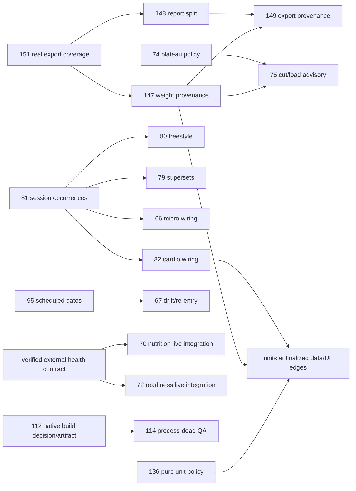

# Iron Log Zero-Backlog Epic — Execution Plan

> **For the executor:** GLM 5.3 Flash is the conductor, not the implementation worker. Use the installed coding harnesses described here, the repo AGENTS.md, and the canonical development contract. This is a planning artifact, NOT execution authorization.

**Goal:** Resolve every one of the 20 open issues in the frozen inventory with implemented, independently reviewed and exercised behavior; close them only after separately authorized integration and evidence-backed verification.

**Architecture:** Keep the existing local-first Expo/SQLite app. Extract only the small pure policies and explicit contracts needed for parallel development; serialize shared schema, active-session state and final integration, not the whole backlog. Reviewed immutable anchors unblock dependent work before master merge.

**Tech stack:** Expo SDK 54, React Native, Expo Router, TypeScript, Drizzle/SQLite, Jest/better-sqlite3, four locales, Maestro/device-mcp Android QA. SDK migration is a product decision, not assumed.

**Status:** PLAN ONLY. No development lane started, no issue/PR/comment created, no merge/push/closure authorized by this document.

---

## 1. Verified starting point and scope boundary

- Repository: `BenedettiLucca/iron-log`; default branch **master**, not main.
- Both local HEAD and live remote master: `9c0b808d1c1e24ea9f3fbba611031cc5cfd5794b`.
- Inventory: **20 open issues**, **14 issue comments**, **0 open PRs** at collection on 2026-10-05. The full issue bodies and every comment are retained in the evidence bundle.
- Scope IDs: **64, 66, 67, 70, 72, 74, 75, 79, 80, 81, 82, 95, 112, 114, 136, 147, 148, 149, 150, 151**.
- Local checkout is dirty: `android/app/build.gradle` is deleted; `.omh/` and pre-existing planning/QA documents are untracked. Preserve them. Fresh worktrees start from the verified committed SHA; never restore/stash/reset/clean this checkout to make a build pass.
- Installed executable discovery found `agy`, `omp`, `opencode`, `cline`, `cursor-agent`, `codex`, `zcode` under `/usr/bin`. Binary presence is not authenticated availability or quota evidence.
- Current global toolchain is **Node v26.7.0 / npm 11.19.0**; repo requires **Node 22.22.2 / npm 10.9.7**. Resolve this in isolated lane environments before gates. Do not rewrite the global installation.
- Host snapshot: 31 GiB RAM, 21 GiB available; `/dev/kvm` exists and is readable/writable. This is not proof that the AVD/build pipeline works. Re-measure before heavy work.
- Existing August zero-backlog plan is historical context only: old issue count, old fleet, three-lane ceiling and old wave barriers do not govern this epic.

### Completion is not the same as lowering the counter

All 20 issues are delivery targets. A dependency waiting for credentials, Android QA, product decisions or live external evidence stays open. No silent `wontfix`, duplicates, scope reduction, fake endpoint, skipped test or speculative medical claim to manufacture zero.

If Lucca deliberately rejects a feature or changes its acceptance criteria, record his decision and the unfulfilled original requirements. That disposition needs separate explicit approval and must not be reported as implemented.

Refresh GitHub bodies/comments/state and remote SHA before execution. New issues are added to a delta queue, not quietly folded into the frozen 20-issue commitment. Reconcile any new bug found during execution before declaring the final integrated state safe; approved new scope is tracked separately.

## 2. Authority and roles

### GLM 5.3 Flash — conductor

Own inventory, dependency graph, briefs, priority, slot/resource leases, actual-model provenance, checkpoints, recovery, acceptance mapping and verified receipts. Dispatch implementation and adversarial review to installed coding agents. Do not substitute itself as an unreviewed coding worker. Preserve a machine-readable ledger on disk, not only in context.

This plan does not switch the current chat runtime or modify Hermes profiles. At execution startup, verify the actual configured orchestrator checkpoint/provider is GLM 5.3 Flash. If it is not, report the mismatch rather than claiming GLM executed the epic.

### Coding lanes

One issue/atomic slice per worktree and branch. Each has an exact base SHA, file allowlist, tests and stopping rule. Write every machine-consumed brief in English. Commits, branch publication and permissions must be explicit in the execution authorization.

### Independent reviewers

A different coding agent reviews the real SHA, full diff, contracts and runnable adversarial probes. Prefer a different actual model and harness. Self-report is not evidence. PASS requires `findings: []` for **every severity**; fixes invalidate the affected approval and require rereview. Reviewer activity consumes the same model caps as development.

### Lucca

Owns product choices, spending, production/external mutations and final promotion/issue closure. Request a decision only for the affected work; continue unrelated tasks.

### Authorization gates

| Gate | Permitted work | Never implied |
|---|---|---|
| A0 — this request | Read-only research and local plan artifacts | Coding runs, remote writes, config changes |
| A1 — execution approved | Local coding, tests, commits and remote branch publication if explicitly included | PRs, master merge, deployment, issue closure |
| A2 — integration promotion approved | Integrate verified branches into master, run branch-required CI on the exact union SHA | Release/deploy or touching user data |
| A3 — closure approved | Evidence comment and close each issue after all its ACs pass; read back exact issue state | Partial completion, skipped physical/live QA |

Default canonical delivery: **remote branches, no per-lane PRs**. If branch protection requires a PR to promote the integrated result, request a separately authorized integration PR; do not bypass protection or start producing PRs automatically. Deployment is a separate gate even if all issues close.

## 2.1 Live roster reconciliation — parent readback supersedes child snapshot

The read-only fleet appendix includes an 18:09 snapshot. Parent revalidation after the children completed found `agy models` now lists **`claude-sonnet-5-5-low`, `claude-sonnet-5-5-medium`, `claude-sonnet-5-5-high`**. Its earlier Sonnet4.6-only claim is stale. Requested Sonnet5.5 is selectable at high/medium/low; **max** is not listed, so Intelligence56/max remains a proxy, not its runtime score. No inference/quota/authenticated working turn was tested.

OpenCode `opencode models` still exits0 with empty stdout. Its MiMo route remains identity-unresolved; do not silently dispatch its configured omp combo default as MiMo. Current omp catalog exposes `omniroute/oc-executor-free` and separately `xai-oauth/grok-4.6`. The audited14-leg combo includes Agnes plus other checkpoints, **not Grok4.6**; several opaque `free` legs prevent a complete actual-checkpoint candidate set. Qualify a lane-specific authorized Agnes/Grok route or verify and constrain the combo before dispatch. Do not use the14-leg chain to silently widen the submitted model roster. Separate XAI usage was exhausted in the child snapshot; recheck reset/capacity, do not wait globally.

Cline selector is `cline-free/deepseek-v4.1-flash`, with local reasoning xhigh; AA max evidence is not the same effort. Cursor auto lacks a resolved backend; available pinned Cursor Sonnet/Codex IDs are not authorized substitutes for its requested `auto` route. Codex selector is `gpt-5.6-luna` plus max effort, not a guessed `-max` suffix.

The installed ZCode binary is an Electron launcher, not a verified headless GLM route. **The user did not require GLM to run through ZCode**: the conductor may run in a user-configured Hermes/other tool-capable runtime with the exact GLM5.3Flash checkpoint verified. ZCode headless support is not an epic dependency unless that delivery mechanism is chosen. This planning session does not switch models, create profiles or configure an alternative provider.

These mismatches narrow live capacity, not the desired plan. Resolve them with explicit per-lane configuration/authorization; keep competent verified routes working. Document all failover reasons. Never treat nominal12 slots as currently available.

## 3. Benchmark evidence and honest routing

### Sources

1. [Artificial Analysis models](https://artificialanalysis.ai/models) and exact model pages.
2. [Artificial Analysis Coding Agents](https://artificialanalysis.ai/agents/coding-agents): Index **v1.5**, comprising DeepSWE v1.1, Terminal-Bench 4.0 and SWE-Atlas-QnA; do not mix its scale with v1.4.
3. [Benchmark Heaven charts](https://benchmarkheaven.com/charts), documented [API](https://github.com/fstandhartinger/model-market-comparison/blob/main/API.md), `/api/meta`, `/api/dataset`, `/api/benchmark-scores`.
4. Local measured harness screening: `/home/lucca/Experiments/harness-eval-2026-09-23/RESULTADO-FINAL.md` (28–30 September, 8 screening cases, 176 total sessions across configurations).

Benchmark Heaven metadata: dataset generated `2026-10-05T10:19:17.061Z`, revision `ad45244b57db58d5dcccc9c539360a4566d5ad2b`, 890 catalog models. Dataset generation is **not** measurement date: each observation retains its own source date, harness, effort and provenance.

### Routing evidence table

| Exact benchmark configuration | General Intelligence (dataset) | Independently measured coding/terminal evidence | Meaning for this epic |
|---|---:|---|---|
| Gemini 3.8 Flash **high** | 40.9 (primary page rounds to 41) | AA Coding Agent v1.5 + **Antigravity SDK v0.1.12**: 0.4186315529449987; fetched Oct 5 | Strongest directly supported primary model/harness assignment for repo implementation among the submitted roster; installed version still needs qualification |
| Claude Sonnet 5.5 **max with default fallback** | 56; high variant 46.8 | No exact Sonnet5.5 coding observations returned by benchmark-scores API for max/high | Best general reasoning proxy in roster, **not proven best coder**; architect/reviewer and bounded complex-data pilot, provisional routing only; verify effective effort and fallback behavior |
| Grok 4.6 **high** | 44.3 | AA Coding Index legacy 76.8; AA Terminal-Bench **4.0** 0.212121212121212 (historical source capture) | Candidate second backend for bounded code, only if omp route actually reaches this checkpoint/effort; not a measured omp result |
| DeepSeek V4.1 Flash **max reasoning** | 39.5 | AA Terminal-Bench **4.0** 0.267676767676768; no exact Cline combination in this collected evidence | Terminal/debugging candidate with a competence trial; do not transfer max reasoning evidence to non-reasoning Cline mode |
| MiMo V2.6 Flash **default** | 37.9 | Local **OpenCode + MiMo V2.6 Flash free**: 69% screening, 207K tokens/session, 126s | Small specified edits/tests/i18n; harness-relevant local evidence, not proof on large Iron Log state migrations |
| GPT 5.6 Luna **max** | 37.3 | AA Coding Agent v1.5 + **Codex**: 0.4322468668029613; fetched Oct5 | Credible emergency implementation/review route, **fallback only** by user instruction; not the primary just because one index is higher |
| Agnes 3.0 Flash | Unknown | No matching catalog result in fetched roster evidence | Preserve this exact supplied identity; do not rename to another model. Qualification required; only low-risk bounded tasks until measured |
| Cursor **auto** | Not a model | No checkpoint-specific score until actual backend is known | Reserve capacity only with identity-aware accounting; small isolated tasks initially; no invented global ranking |
| GLM 5.3 Flash (conductor) | 41.8 | AA Terminal-Bench4.0 0.328282828282828; no orchestration-specific measurement | User-selected conductor; these scores do not certify scheduling correctness |

AA Terminal-Bench4.0 fractions above come from individual measured observations, not TB2.1, tbench self-reports or Vals runs. The underlying retained capture is dated Sept10; its protocol note references a later methodology capture. Preserve that provenance inconsistency and treat it as supporting historical evidence, not a fresh run. Do not average different boards or compare directly with the local screening percentages.

Sonnet's max headline explicitly includes default fallback; do not attribute all performance to a pure pinned no-fallback Sonnet deployment. If AGY exposes only another effort, its status is a new unqualified configuration. `max`, `high` and non-reasoning are not cosmetic labels.

The local omp + `oc-executor-free` result was **81%**, **346K tokens/session**, **99s**. It measures the historical combo/harness, not Agnes3.0Flash or Grok4.6 individually, nor a possibly changed current combo. Preserve it as historical efficiency evidence; qualify the live route before relying on it. Do not inherit old Sonnet4.6, MiMoPro or GLM non-Flash scores.

### Competence qualification — useful work, not a separate benchmark project

After A1, give each new/unverified combination one bounded real slice: a production-importing export test, undo budget test, pure unit conversion or i18n contract test. Independent review and mutation/fault injection decide qualification; record first-pass success, accepted diff, rework, wall time, tokens and effective checkpoint. No fabricated quality formula from incomparable scores. Start a competent proven route on the critical path while these trials run.

A passing slice qualifies only that task class. Migration/state-machine work needs its own representative transaction/recovery slice. Update the ordered preferences based on accepted first-pass delivery and time-to-reviewed-result, not token speed alone.

### Ranked fallback chains by task class

These are **execution preferences informed by the evidence**, not a scientifically measured total ordering. Unqualified candidates are eligible only for their bounded trial and cannot automatically accept high-risk work.

| Class | Preferred order (skip unavailable, busy or unqualified candidates immediately) |
|---|---|
| C — critical schema/persistence/session integration | AGY Gemini high → AGY Sonnet5.5 (qualified complex-data slice) → omp Grok4.6 (qualified/pinned) → Cline DeepSeek (qualified) → OpenCode MiMo (qualified) → Cursor known/qualified backend → **Codex Luna max** |
| R — independent architecture/invariant review | AGY Sonnet5.5 (reasoning proxy, review trial) → AGY Gemini high → Cline DeepSeek → omp qualified known backend → OpenCode MiMo for bounded review → Cursor known/qualified → **Codex** |
| T — focused tests/export/undo/pure policy | omp qualified backend → OpenCode MiMo → Cline DeepSeek → AGY Gemini → AGY Sonnet → Cursor known/qualified → **Codex** |
| U — UI/i18n/presentation, contract already fixed | AGY Gemini → Cline DeepSeek (qualified) → OpenCode MiMo → omp qualified backend → AGY Sonnet → Cursor known/qualified → **Codex** |
| N — Android/build/notifications | AGY Gemini → Cline DeepSeek max (terminal proxy; native trial) → AGY Sonnet → omp qualified → Cursor known/qualified → OpenCode MiMo bounded → **Codex** |

For a review, first remove the implementing coding agent from the chain. Remove the actual author model when a competent distinct model is available. If no independent competent reviewer is available, leave the slice review-pending and dispatch unrelated eligible development; use Codex only after documenting exhausted primary options. Never downgrade a gate to keep utilization high.

## 4. Model caps, quota and maximum safe concurrency

User roster for this epic **overrides historical fleet names**: Sonnet **5.5**, not4.6; OpenCode **MiMo V2.6 Flash**, not Bunny; GLM is the conductor.

- AGY Gemini and AGY Claude have independent quota/availability buckets; track them separately. A Gemini quota failure does not automatically block Claude, or vice versa. Inspect actual provider errors if a higher-level account cap affects both.
- Maximum **two concurrent sessions per actual model**, counting coding, review, probes and any harness-created child/model calls. All effort variants/aliases of that checkpoint share the cap. Do not allow autonomous recursive agent spawning to evade it.
- Also cap each requested primary harness/route entry at two sessions: AGY-G2, AGY-S2, omp2, OpenCode2, Cline2, Cursor2. This preserves a conservative **12 primary session ceiling**, not a promise of 12 active models. Codex has at most2 and opens only conditionally; it is not a permanently reserved reviewer.
- The conductor is not an extra coding lane; if it delegates coding to GLM, that would change the requested roster and must not happen silently.
- A slot is acquired atomically before a process starts and released only after process/model execution really ends. A timeout notice does not prove death: stop/reap or verify the exited process tree before transferring its worktree/leases.

### Combo and auto are not loopholes

`oc-executor-free` and Cursor auto are route identities, not benchmarkable models. Log the actual checkpoint per call, including internal reroutes. Prefer a verified lane-specific pin **within the authorized roster**, without mutating global OmniRoute settings.

If a route cannot be pinned but its complete candidate set is known, reserve a conservative model slot for **every candidate** for the duration of the session; release only after it ends. This permits parallelism without breaking the actual-model cap. If candidates or fallback checkpoints are unknown, mark route `identity_unresolved` and ineligible for unrestricted dispatch; use other primary routes while resolving it. An unavailable/unknown route is never replaced with a secretly different model.

Cursor auto may collide with AGY Claude or Codex's model. Count across harnesses. If identity cannot be proven or candidate-set reservation cannot enforce ≤2, Cursor's extra capacity is theoretical, not usable. Same rule applies to AGY default model fallback. Disable or transparently account for any unapproved fallback.

### Resource leases independent from model slots

Conservative initial policy, tune from actual telemetry:

- Full coverage/export gates: **one heavy-gate job** at a time.
- Gradle/native bundle builds: **one builder**; can overlap small code/test tasks, not another memory-heavy export/coverage run without measured headroom.
- Android AVD/Maestro/device-mcp: **one QA owner for the dedicated synthetic device**; no other lane may install/reset/click it.
- Focused Jest: start with2 concurrent jobs and at most2 workers each; isolate transform/coverage caches; raise only with measurements.
- Agents may keep editing independent files while host jobs queue. Begin with up to6 eligible coding/review sessions; ramp to8/10/12 only after measuring process RSS, CPU, disk and review queue, never solely because RAM seems available.
- Pause *new heavy jobs* when MemAvailable falls below8GiB or swapping/latency spikes. This8GiB threshold is a proposed safety budget, not a benchmark finding. Preserve active edits/checkpoints. Resume after health recovers.

Do not block a model slot while a deterministic gate is running if the agent has already exited and its report is saved. If the agent still holds a live conversation, it still counts. Do not run multiple servers/Metro processes on the same port or use a mutable shared node_modules/SQLite/Jest cache across lanes.

## 5. Work-conserving scheduler and failure recovery

### State machine

`SPEC_PENDING → READY → RUNNING → CHECKPOINTED/GATES_PENDING → REVIEW_PENDING → FIX_REQUIRED → REVIEW_PENDING → BRANCH_VERIFIED → UNION_PENDING → NATIVE_OR_LIVE_PENDING → PROMOTION_PENDING → CLOSED_VERIFIED`.

Side states: `BLOCKED_PRODUCT`, `BLOCKED_EXTERNAL`, `BLOCKED_ENV`, `COOLDOWN_ROUTE`, `IDENTITY_UNRESOLVED`. None counts as done. A child package being reviewed or branch-ready may satisfy a **specific reviewed contract dependency**, but not the final issue's acceptance.

### Scheduling policy

1. Drain real completion events, quota/auth failures and owner answers; update source-of-truth ledger.
2. Choose eligible tasks by critical-path unlocks, correctness/data integrity, ready age and then stable priority. Prefer finishing a review bottleneck over accumulating more unreviewed changes; avoid starving P3 forever.
3. Match **all free eligible slots to ready tasks** as a batch, maximizing number of assignments first, then preference rank/critical-path value. A greedy dispatch of the first ticket to the only multi-skilled agent can leave another exclusive task unnecessarily idle.
4. Acquire model, route, worktree, file/invariant and host-job leases atomically. Failure to acquire requeues this task only.
5. Dispatch from its ordered qualified candidate list. Slot busy or quota unavailable → next candidate now, not wait for preferred reset. Fallback Codex may take a task only when no competent primary route is presently available for that task.
6. On each completion/slot release, refill immediately. Waves are **priority views**, not synchronization barriers.
7. When ready queue is empty, choose genuinely useful independent review, regression, migration fixture, synthetic QA or external contract discovery packages whose prerequisites are met. Do not invent work or duplicate a locked seam simply to keep a process alive.
8. If all remaining tasks require a missing owner decision/credential/device capability and no safe work is eligible, emit the exact blocker. “Never idle” means no avoidable idleness; it cannot mean bypassing a safety gate or claiming progress that does not exist.

### Time budgets and checkpoints

Slice work into independently testable units of approximately30–60min agent work, with smaller RED/GREEN/review steps inside. Estimates are scheduling budgets, not completion promises. At75% of the runner budget, request a checkpoint: stop new scope, run focused gates, commit only coherent passing work if authorized, save dirty files and next-step handoff. Hard expiry ends/reaps the process tree, not merely the chat.

Failures:

- **Quota / 429 / explicit reset:** mark affected bucket cooling until the reported reset; preserve WIP and route it immediately to next eligible model. Do not assume Gemini and Claude reset together. No repeated minute-by-minute inference probes.
- **401/auth failure:** mark capability blocked, request masked/UI login via approved mechanism; other providers continue. Never print tokens.
- **Missing model / changed checkpoint:** fail closed on provenance; do not silently rename the supplied checkpoint.
- **Budget expiry with progress:** continuation brief on the same stopped worktree, exact WIP SHA and dirty-file ledger; never replay original brief from scratch.
- **No progress:** inspect exit/signal, stdout/stderr and real diff before blaming model; healthy process/tool activity is different from quota death or permission blockage.
- **Failed tests:** failing contract is a bug to fix, not a reason to weaken the test or reclassify as flaky. Record pre-existing failures separately and reproduce them on pristine base.
- **Model change during a session:** reconcile all candidate/model reservations before further calls; if unobservable, the route is unsafe for strict actual-model accounting.

### Recovery receipt

Persist task/issue, branch, base/WIP HEAD, dirty paths, test exits, logs, actual runtime checkpoint/harness/effort, timestamps, quota reset, outstanding ACs, leases and next action. A replacement first validates WIP against ACs; it does not blindly preserve it. Resume after restart by reading GitHub/git/ledger and checking PIDs, not by trusting stale `RUNNING` flags.

## 6. Parallel architecture and shared-file ownership

Do not create a framework for20 tickets. Reuse existing code and add small domain modules only where they permit independent tests and a clear seam.

**SCHEMA owner:** `src/db/schema.ts`, `drizzle/*.sql`, `drizzle/meta/*`, `drizzle/migrations.js`, `__tests__/fixtures/database.ts`. One writer at a time; additive/versioned migrations per coherent change, not one giant speculative migration. `generate` alone is insufficient: verify SQL, journal, snapshot and manual Expo loader map/import. Test actual disk SQL fresh database and upgrade from preceding schema.

**SESSION seam owner:** start/recovery/occurrence identity/undo/rest/finish routes and lifecycle. Pure feature policies can develop separately behind a reviewed contract; only one integration writer wires shared session files. Sequential seam patch windows do not freeze all feature work.

**EXPORT seam owner:** Notion, summary report interface, CSV and Alexandria export format. #151 builds real coverage first; #147/#148 define contracts; #149 and units/cardio consumers work against those anchors, then integrate without concurrent edits to the same production file/test.

**SETTINGS + I18N owner:** userSettings persistence and existing four-locale dictionaries. Feature lanes submit namespaced key patches to this owner; do not let six lanes reformat dictionaries concurrently. New isolated feature test files need no global lock.

**PLATFORM owner:** package.json/package-lock, Expo config, native build files, QA scripts and CI environment. Freeze any dependency change until #112 choice is approved. Non-native pure modules/tests continue on SDK54. If a full SDK upgrade is selected, every earlier qualifying result touching runtime is revalidated against the new anchor.

**HOME + HISTORY seam:** drift, archive, freestyle entry, nutrition/readiness cards, scheduled-date semantics and units share screens; distinct components/services are parallel, wiring patches serialized.

Lock **invariants**, not only filenames: e.g. independent files can both change occurrence identity or date interpretation. Reviewed contract SHAs are dependencies; incompatible contract changes requeue downstream integration/review. A schema writer lock is held only for its schema package, not the entire duration of a feature/UI issue.

## 7. Proposed workstreams, critical path and first dispatch

The per-issue appendix and machine ledger provide authoritative package IDs, file paths and tests. The following is the macro view.

### Stream A — trustworthy reports/data

`#151 real Notion tests → #147 provenance contract + finish → #149 all export consumers`.

`#148 log/assessment split` develops from #151 tests and a frozen report contract; shares only a short export wiring window with #147/#149. `#136 pure conversions` starts immediately; its UI/export wiring consumes the stabilized report/provenance contract and is last at shared formatting edges.

### Stream B — session composition

`#81 session-owned occurrences/snapshot + recovery/undo → #80 freestyle and #79 supersets`.

`#66 micro shell` and `#82 cardio policy/model` develop independent pure/UI slices against approved contracts, but their session shell wiring follows the occurrence/superset/rest semantics relevant to them. Never let micro mode bypass persistence or superset rest.

### Stream C — schedule and deterministic guidance

`#95 scheduled date versus actual execution → #67 lane classification/drift/re-entry`.

`#74 plateau detector` starts from existing valid measured sets, independent of #72 and external health. `#75 cut/load signal` consumes reviewed #74 output and real measured-weight provenance from #147; advice copy/thresholds need owner approval. No clinical risk prediction claimed.

### Stream D — health context

External endpoint/auth/schema discovery is first and can run while all local work proceeds. `#70 nutrition adapter/UI` and `#72 readiness` share a small read-only client boundary; #72's health signals are not a hard dependency on nutrition or on #67 being visually wired. Synthetic fixtures are tests, never evidence of live integration.

### Stream E — native qualification and residuals

`#112 platform decision + native artifact → #114 killed-process notification`.

`#64 archive`: the historical comment claims implementation commit `9bd505f`, but parent verification found no such object in the local graph, no `is_archived`/archive hooks in current source, and migrations stop at0025. **Implement archive plus QA on the verified remote base**, unless execution discovers and independently qualifies the missing published branch; a comment is not proof of delivered code. `#150 undo budget`: independent focused measurement first, then compatible with #81's occurrence seam.

### Logical dependency picture



Arrows represent consuming a particular reviewed contract or final integration prerequisite, **not** “wait until that entire issue closes”. Pure micro/cardio/drift/cut/readiness tests and component development may start earlier behind approved interfaces.

### First dispatch after minimal A1 preflight

Preflight reads/toolchain/model identities must finish for a route before it starts; no global model-smoke barrier.

| Route/slot | First useful package | Why independent |
|---|---|---|
| AGY Gemini1 | #81 occurrence/snapshot contract + first persistence RED/GREEN slice | Critical unlock; dedicated session/schema window |
| AGY Gemini2 | #112 native-state audit/build qualification **after platform choice**; otherwise #95 pure date contract | Native blocker removal or independent deterministic contract |
| AGY Sonnet1 | Independent review of first schema/occurrence contract | General reasoning proxy qualified on a bounded invariant review |
| AGY Sonnet2 | #147 provenance design/test slice, no schema writing while #81 schema lock held | Contract and tests separated from schema integration |
| omp1 | #151 production-importing Notion coverage | Valuable qualification on bounded real module |
| omp2 | #150 query-count/currentName measurement | Separate hook tests, no #81 seam wiring yet |
| OpenCode1 | #136 unit conversion tests/helpers | Pure data-edge module, no screen formatting yet |
| OpenCode2 | #74 deterministic plateau test/policy slice | Independent read-only historical analysis |
| Cline1 | #70/#72 endpoint/auth/schema discovery, only authorized read-only source lookup | External blockers discovered early |
| Cline2 | #148 report contract + isolated utility tests | No Notion/shared summary wiring while locked |
| Cursor1–2 | #64 archive Maestro scenario / micro or cardio pure bounded slice **only if identity/caps verified** | Distinct tests/components; otherwise immediately give these tasks to another competent free route |

This is a candidate maximal matching, **not** a command to launch12 jobs on an unmeasured host. Start up to the highest-unlock6 **eligible** sessions; fewer if route identities are unresolved. Ramp on telemetry. Review slots rotate back into development when no review is ready; no model is dedicated solely to review for the whole epic. If route quota fails, its task follows the class fallback and its original slot takes another eligible task only after availability recovers.

## 8. Owner decisions — explicit proposals, not silent strategy

Resolve together at execution kickoff; local independent work continues if answers arrive later.

1. **#112:** recommended least-change path: qualify the existing native app/dev build on SDK54 first, avoiding a three-major SDK jump purely for Expo Go. Confirm whether it actually needs expo-dev-client or already has a viable native development pipeline. Counter-case: choose SDK57 if supported native requirements/security justify it; then a dedicated platform migration and full requalification is required. No automatic EAS spend.
2. **#81/#79:** recommend removing an occurrence from the active queue while preserving already logged sets/history, with undo restoring membership/position. Groups of one dissolve. No destructive set deletion unless Lucca explicitly chooses it; supersets belong to occurrences, not global exercise IDs.
3. **#147:** recommend explicit measured/carried/absent report provenance with stable source timestamp and carried-report snapshot, while `sessions.bodyWeight` (SQLite `body_weight`) remains null when not measured and no synthetic bodyMetrics row is inserted. Preserve restore/import semantics; do not derive historical source from a mutable future query.
4. **#66:** decide whether side support belongs to v1, default rest suppression and completion behavior; proposal compact flow + optional side + explicit finish, not accidental auto-finalization. Demonstrate actual tap savings with the same synthetic protocol.
5. **#67:** decide lane classification metadata, gap thresholds and advisory-only re-entry; don't infer all short sessions are accessory or all long sessions are main.
6. **#72/#75:** approve explicit heuristic thresholds, missing-data behavior and non-clinical wording. Proposal informational context, no automatic load change and no “objectively ready/injury risk probability” assertion. Two signals missing is not two red flags. No medical validation inferred from engineering tests.
7. **#95:** choose precise reschedule semantics for completed sessions versus planned occurrences. Actual timestamps/log remain immutable; scheduled local date is distinct. Don't rewrite actual history to make adherence look green.
8. **#82/#136:** approve canonical cardio distance/time/speed units, PR direction/validity and metric↔imperial rounding. Proposal meters/seconds plus derived speed; no invented strength tonnage/e1RM from cardio.
9. **#70/#72:** supply/approve read-only health endpoint and auth mechanism, reachability and data handling. Do not install a new state library because an old issue mentioned Zustand (not in current dependencies).
10. **#64:** implement against current source, not the comment’s missing commit; confirm explicit archived selection versus default quick-pick. If a missing remote implementation is recovered, review it against the current base before reusing it. The owner decision must not block unrelated work.

## 9. Gates, evidence and rollback

### Per package RED → GREEN → review

1. Read exact issue+all comments, AGENTS.md chain and current base files.
2. Write a focused test importing actual production module, not a duplicated helper/DDL.
3. Exercise RED for the intended failure; record command/exits (pre-existing unimplemented feature may need a test contract before wiring).
4. Minimal implementation within allowlist. Run focused suite and invariant edge cases.
5. Fault/mutation injection where a new test could falsely pass: remove target production behavior in a disposable review checkout; require failure; restore/retest. Never mutate the implementation worktree for a review probe.
6. Commit coherent slice, full diff check, independent real-SHA review and no findings. A contract-only review cannot approve future unimplemented runtime behavior.
7. Publish remote branch only if authorized; `git ls-remote` must match reviewed local HEAD. No lane PR.

### Host commands (run under verified Node22/npm10.9.7)

```bash
node --version
npm --version
git status --short --branch
git diff --check
npm run typecheck
npm run lint
npm test -- --runTestsByPath <exact-approved-test-files> --watchAll=false --maxWorkers=2 --cacheDirectory=<lane-private-cache>
npm run audit:high
```

Angle-bracket values above are brief-generation placeholders, **not commands to execute literally**. Fill absolute isolated paths/file list from the per-issue package. Record CLI versions; inspect CI workflow before freezing flags.

At final branch/union acceptance:

```bash
npm run audit:high
npm run typecheck
npm run lint -- --max-warnings=0
npx jest --clearCache
npm run test:coverage -- --watchAll=false --testPathIgnorePatterns '/node_modules/' 'services/session-lifecycle'
npx jest __tests__/services/session-lifecycle.test.ts --runInBand --watchAll=false
npm run export:android
npm run verify:android-export
git diff --check
```

`npm run verify` chains typecheck, lint, combined coverage and exports, but **is not the exact CI flow**. The authoritative `.github/workflows/quality.yml` enforces zero lint warnings, clears Jest cache, excludes session-lifecycle from app coverage and runs that suite separately with `--runInBand`; execute the exact split above for final union acceptance. Isolate caches/coverage/dist. Do not accept a combined-pass result as a substitute for the required workflow. Record skips and never invent expected suite counts; compare actual baseline and final results. Run the full quality workflow, including branch-required remote CI at its exact head after authorized promotion.

### Migrations/import/export

Use `npx drizzle-kit generate` only for actual approved schema change. Review all generated SQL/journal/snapshot, manually maintain Expo migrations.js, update real fixture DDL and migration tests. Test fresh database, previous populated database, interrupted/repeated initialization, foreign keys, soft-delete and restore/import fidelity. Additive migrations are not automatically safely reversible: rollback app code may require compatibility with the expanded DB; never down-migrate or overwrite user DB to recover.

### Native gate

Only the QA owner, explicit synthetic AVD serial, no user-device wipe:

```bash
scripts/qa.sh status
scripts/qa.sh boot
scripts/qa.sh build
scripts/qa.sh install
scripts/qa.sh app
scripts/qa.sh smoke
scripts/qa.sh logs
scripts/qa.sh snap
```

Current scripts support status/build/boot/install/app/smoke/logs/snap, **not doctor or receipt**. `smoke` runs only `.maestro/smoke-app-launch.yaml`, not every flow. Run each added feature flow explicitly with `maestro test .maestro/<approved-feature-flow>.yaml` and retain a separate JSON/Markdown evidence receipt; do not call nonexistent script actions. Record APK hash/build SHA, device serial, expected/observed/verdict, Maestro logs and targeted screenshots. Native app build must contain the reviewed source, not a stale cached APK. For UI/visible behavior, host-only green is **not completion**.

#114: schedule an OS local notification, verify scheduling evidence, remove the app from recents/kill the process in the actual native build, wait until the actual trigger time, prove notification delivery with PID absent, tap and verify correct session navigation. **Do not equate Android force-stop with ordinary process death**: force-stop suppresses scheduled work until explicit launch and is a different OS state. Cover permission denied, skip/finish cancellation and unrelated notification preservation. Physical-device criteria stay pending until the target device is exercised; AVD is not a substitute for a claimed physical result.

### External live gate

#70/#72 require an actual authorized read-only endpoint/auth and confirmed schema/timezone/freshness. Contract fixtures can prove adapter behavior; they cannot prove Alexandria live connectivity. No credentials or actual health payloads in logs/evidence bundles. If a synthetic account isn't available, arrange explicitly approved privacy-preserving aggregate verification; don't silently fetch real personal health data.

### Rollback per domain

- Report/provenance: preserve old reader compatibility; no false measured rows to “repair” exports; restoration/import test before promotion.
- Session composition: revert code only on a compatible anchor; preserve new occurrences/sets; no database purge or reconstructing user logs from guesses.
- Platform: reviewed lockfile/native build anchor; no `npm audit fix --force`, no global toolchain changes, no signing-secret commits.
- Health/drift/risk: advisory paths fail unavailable and never block an existing workout; no silently green context for missing data.
- Units: reverting preference/display leaves canonical DB untouched; converters don't double-convert restored/imported data.

## 10. Definition of done and issue closure ledger

For each issue, retain a row linking each original acceptance bullet to its exact test/receipt/SHA. Branch-ready requires all relevant lane gates and independent review; issue-ready additionally requires union, device/live/product criteria and authorized promoted state.

Final issue closure requires:

- Approved intended scope delivered; no outstanding original AC hidden in another ticket.
- Test imports actual production module and detects the regression; migration and failure cases where relevant.
- Independent review bound to the **final** union/source SHA, PASS, empty findings.
- Full host gates and branch-required remote CI pass on that SHA, not a predecessor.
- AVD/physical/native killed-process/live integration evidence for the issue's actual criteria.
- All new commits published and integrated through the authorized path; no unpushed WIP counted as shipped.
- Evidence comment/closure explicitly authorized; exact GitHub issue readback confirms `closed`, reason and expected comment.

Epic closure requires coverage of all frozen20 issue IDs, all mapped packages terminal and verified, source base/deltas reconciled, master at approved union SHA, no unintended local modifications and every remaining blocker surfaced. A weekly status counter is not a closure receipt.

### Reporting without spending Lucca's attention

Persist machine ledger on each state transition. Brief human progress report on meaningful completed batches or owner blocker: implemented/verified/QA pending/closed counts **separately**, critical path, route failures, decisions needed and evidence links. An urgent security/data-loss concern interrupts; don't stream every token, heartbeat or transient tool warning.

### Minimal machine receipt contract

```json
{
  "issue": 147,
  "package": "147-core",
  "state": "REVIEW_PENDING",
  "base_sha": "<verified-base>",
  "head_sha": "<real-head>",
  "branch": "epic/zero-backlog/i147-core",
  "worktree": "<absolute-isolated-worktree>",
  "requested_model": "<exact-user-roster-name>",
  "actual_models": [],
  "harness": "<binary-and-version>",
  "effort": "<verified-setting-or-unknown>",
  "candidate_reservations": [],
  "gates": [],
  "review": {"reviewed_sha": null, "verdict": null, "findings": null},
  "remote_sha": null,
  "remaining_acceptance": [],
  "blocker": null
}
```

This is a **schema example, not an execution receipt**. Initialize every issue/package as planned; never prepopulate PASS, real SHAs, runtime identity or closed status. Include reviewer provenance and native/live evidence in the actual receipts.

## 11. Attached execution materials

- `ISSUE-PACKAGES.md`: all20 issues, atomic packages, exact paths, residual scope, tests, ownership/dependencies, rollout/rollback.
- `FLEET-PREFLIGHT.md`: installed harness capability/catalog audit; unresolved IDs remain unresolved, commands marked as templates where necessary.
- `execution-ledger.json`: machine-readable frozen issue inventory, package DAG, preferred/fallback classes, locks and acceptance state.
- `GLM-HANDOFF.md`: compact English execution brief that prevents plan-only artifacts from being interpreted as authorization.
- `evidence/`: frozen issue/API/benchmark sources and local benchmark summary. The download archive preserves these past scratch cleanup.

**Next step requires Lucca's A1 approval and owner choices. This document alone does not grant it.**
